# The History of IT System

| Domain          | Fragile    | Robust      | Anti-Fragile |
| --------------- | ---------- | ----------- | ------------ |
| IT Culture      | Cowboys    | ITIL        | DevOps       |
| IT Architecture | Monolithic | Distributed | Cloud Native |

## Anti-Fragile

### Auto scaling(자동 확장성)
클라우드 컴퓨팅 환경에서 자원의 수요에 따라 시스템의 용량을 자동으로 조정하는 기능을 의미한다. 
특히 애플리케이션이나 서비스가 사용자 수의 변화에 따라 성능을 유지하고 비용을 최적화하는 데 중요한 역할을 한다.

### Microservices
클라우드 네이티브 아키텍처, 클라우드 네이티브 애플리케이션의 핵심.
기존 시스템들이 하나의 거대한 형태로 구축되어 서비스 되었다고 하면, 마이크로 서비스라는 것은 전체 서비스를 구축하고 있는 개별적인 모듈이나 기능을 독립적으로 개발하고 배포하고 운영할 수 있도록 세분화된 서비라고 볼 수 있다.

### Chaos engineering
시스템이 급격하고 예측하지 못한 상황이라도 견딜 수 있고 신뢰성을 쌓기 위해 운영 중인 소프트웨어 시스템에 실험을 하는 방법이라든가 규칙.
시스템의 어떤 변동이나 예견된 불확실성이나 예견되지 않은 불확실성에 대해서도 안정적인 서비스를 제공할 수 있도록 구축되어야 한다는 것을 의미

### Continuous deployments
- CI/CD : 지속적인 통합, 지속적인 배포
- 클라우드 네이티브 애플리케이션은 수십 수백개의 마이크로 서비스로 도메인이 분리되어 개발된다. 여러개의 애플리케이션을 구성하는 서비스들을 하나하나 빌드하고, 테스트하고, 서버에 배포하는 등의 작업을 수동으로 한다면 이러한 작업 자체가 하나의 커다란 업무이자 작업의 로드가 많이 소요되는 부분이 되어버림.
- 따라서 마이크로 서비스에서는 위와 같은 작업을 자동화하는 시스템을 구축한다. 하나의 작업에서 다른 작업으로 연계되는 과정을 파이프 라인으로 연결시켜 놓게 되면 작은 변화뿐만 아니라 전체적인 시스템의 업그레이드 작업에서도 빠르게 적용할 수 있다.

# Cloud Native Architecture의 특징
## 확장 가능한 아키텍처
**시스템의 수평적 확장에 유연**
	- 일반적으로 시스템을 양적으로 늘리기 위해서는 하드웨어의 비용이 증가하게 된다. 그러나 클라우드 네이티브 아키텍처에서는 클라우드 서비스를 제공업체로부터 가상의 서버, 스토리지, 네트워크 등을 임대하여 이러한 비용을 최소화할 수 있습니다. 필요하지 않을 경우 자원을 반납함으로써, 사용량에 따라 효율적으로 비용을 관리할 수 있습니다.
**확장된 서버로 시스템의 부하 분산, 가용성 보장**
**시스템 또는 서비스 애플리케이션 단위의 패키지(컨테이너 기반 패키지)**
	- 기존의 서버 가상화 방식과 더불어 컨테이너 방식의 가상화도 같이 사용하게 됨.
**모니터링**
	- 시스템의 성능 지표(ex : CPU 사용률, 메모리 사용량, 네트워크 트래픽 등)을 지속적으로 모니터링.
	- 클라우드 네이티브에 구축된 가상 서버와 리소스들은 다양한 모니터링 도구를 이용해 현재 사용되고 있는 시스템의 상황 및 리소스의 사용량 등을 확인할 수 있다.

>💡시스템 확장을 의미하는 스케일링
>- `scale-up` : 하드웨어의 사양을 높이는 작업
>- `scale-out` : 같은 사양의 서버 즉 인스턴스를 여러 개에 배치함으로써 동시에 더 많은 사용자의 요청을 처리할 수 있도록 하는 것.

## 탄력적 아키텍처
**서비스 생성 - 통합 - 배포, 비즈니스 환경 변화에 대응 시간 단축**
	- 애플리케이션을 구성하는 각 기능을 하나의 분리된 서비스로 개발하고, 이렇게 분리되어 개발된 서비스들을 통합하고 배포하기까지의 작업을 CI/CD라는 자동화 파이프라인을 통해 처리함으로써 시스템 환경에 적용되는 시간을 단축할 수 있게 되었다.
**분할된 서비스 구조**
	- 마이크로 서비스는 작게 분리된 독립적인 서비스이다. 
	- 전체 애플리케이션을 구성하고 있는 도메인의 특성에 따라 서비스의 경계를 잘 구분하고 거기에 맞게 서비스를 개발해야 한다.
**무상태 통신 프로토콜**
	- 서로 분리된 서비스들 간에 원활한 통신을 위해 각각의 서비스들은 종속성을 최소화하고, 상태를 갖지 않는 서비스를 제공하려 노력해야한다.
**서비스의 추가와 삭제 자동으로 감지**
	- 마이크로 서비스들은 자신들이 배포될 때 자신들의 위치가 어디에 있는지 등록을 해야 다른 서비스들이나 외부에 연결되어 있는 타 시스템에서도 해당 서비를 검색하고 사용할 수 있게 된다. 
	- 마이크로 서비스들의 존재는 `Discovery Service`라는 곳에 등록되고 삭제되는 작업을 하게 된다.
**변경된 서비스 요청에 따라 사용자 요청 처리(동적처리)

## 장애 격리(Fault isolation)
**특정 서비스에 오류가 발생해도 다른 서비스에 영향을 주지 않음**
	- 마이크로 서비스들은 하나의 독립적인 작은 단위의 애플리케이션이라 볼 수 있다.
	- 따라서 하나의 마이크로 서비스에서 생기는 문제점이나 오류사항은 다른 마이크로 서비스들에 미치는 영향을 최소화해야 한다.
	- 어떤 특정 부분에 대해서 수정을 한다 하더라도 전체 서비스를 다시 배포해야 되는 것이 아닌 특정 서비스만 배포할 수 있기 때문에 다른 시스템에 영향을 주지 않을 수 있게 된다.

# Cloud Native Application
> 클라우드 네이티브 아키텍처에 의해 설계되고 구현되는 애플리케이션. 클라우드 네이티브 아키텍처의 특징이나 Anti-Fragile과 같은 특징을 가지고 구현되는 것.

1. MSA로 개발된다.
2. CI/CD
	- 이렇게 개발된 마이크로 서비스들은 CI/CD 시스템에 의해 자동으로 통합, 빌드, 테스트, 배포 과정을 거친다.
3. DevOps(Developement + Operations)
	- 마이크로 서비스에 문제가 발생하였을 경우 바로바로 수정해서 다시 배포하는 과정을 반복할 수 있는 형태로한다.
	- DevOps란 처음 시스템이 기획되고, 구현되고, 테스트・배포되는 과정을 시스템이 종료될 때까지 무한 반복해줌으로써 고객이 원하는 최상의 결과물을 만드는데 그 목적을 두고 있다.
4. Containers
	- 하나의 애플리케이션을 구성하는 마이크로 서비스들을 클라우드 환경에 배포하고 사용하기 위해서는 컨테이너 가상화 기술을 사용하게 된다.

### CI/CD
**지속적인 통합, CI(Continuous Integration)**
	1. 하나의 어플리케이션을 여러 팀이나 개발자들이 함께 개발하고 있는 경우 결과물을 통합하기 위한 형상관리.
	2. 통합된 코드를 빌드하고 테스트하는 과정 자체.
	- ex) Jenkis, Team CI, Travis CI <- Git과 같은 형상관리 시스템과 연동해서 사용하게 됨.
	- CI 시스템의 파이프라인을 잘 연동하게 되면 개발자가 어떤 코드를 완성한 다음에 Git과 같은 형상관리 시스템에 해당 코드를 업로드, commit 함과 동시에 빌드, 테스트, 실행을 해서 다르 쪽의 코드와 문제가 발생하는지 여부를 바로 확인해 볼 수 있다.
**지속적인 배포**
	Git과 같은 소스 저장소에서 업로드된 코드를 가지고 와서 패키지화 된 형태의 결과물을 실행 환경에 어떻게 배포하는지에 따라 달라진다.
	1. Continuous Delivery(지속적인 전달) : 패키지화 되어 있는 결과물을 실행 환경에 수작업으로 배포하는 과정
	2. Continuous Deployment(지속적인 배포) : 운영자라든가 어떤 관리자의 개입 없이 실행 환경까지 완벽하게 자동화되어 있는 배포
	3. Pipe line
**카나리 배포와 블루그린 배포**
	카나리 배포
	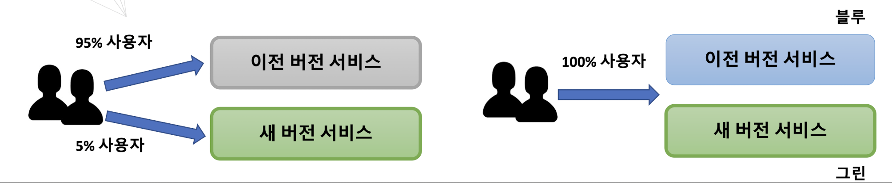
	블루그린 배포 : 이전 버전의 사용자 트래픽을 이전 버전과 거의 동일한 새 버전으로 점진적으로 이전시키는 방법

실행 환경에 서비스를 배포할 때는 무작정 기존 코드를 버리고 새로 작성된 코드를 바로 올리지는 않는다.가장 중요한 것은 시스템의 정상적인 운영이고 그 다음으로는 시스템의 다운 타임을 최소화하는 것이라 볼 수 있다. 변경된 시스템을 무조건 새로 반영하기보다는 기존 시스템과 같이 운영해 줌으로써 사용자에게 발생할 수 있는 이질감이라든가 문제점이라든가 이런 것들을 최소화하는 것이 필요하다.

## DevOps : Development + Operations
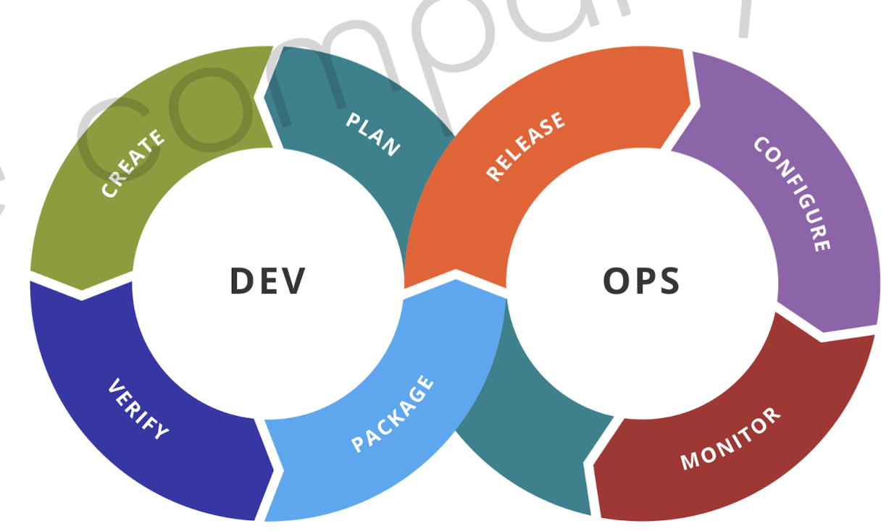
- 개발 조직과 운영 조직의 통합
- 이러한 통합으로 고객의 요구사항을 빠르게 반영하고 만족도 높은 결과물을 제시하는 것에 목적을 둔다.
- 자주 테스트하고, 피드백 받고, 업데이트하는 과정을 거쳐 전체 개발 일정이 완료될 때까지 지속적으로 끈임 없이 진행해 나가는 것.
- 클라우드 네이티브 애플리케이션은 DevOps 환경에 맞춰서 서비스의 구조를 작은 단위로 분할할 수 잇게 함으로써 더 자주 통합, 테스트, 배포할 수 있는 구조가 될 수 있다.

## Container 가상화
- 기존의 하드웨어 가상화 또는 서버 가상화에 비해 적은 리소스를 사용하여 가상화 서비스를 구축할 수 있다.
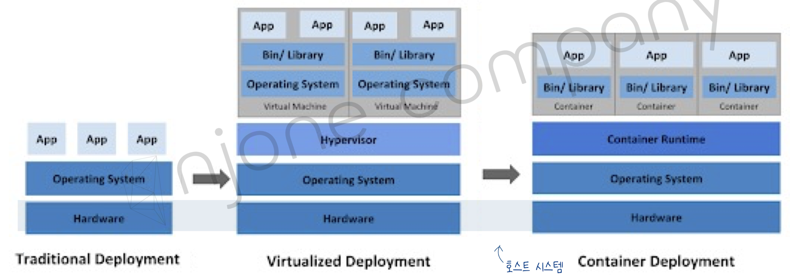
- Virtualized Deployment
	- 하나의 가상머신은 독릭적인 운영체제를 가지고 실행될 수 있다. → 각각의 가상 머신의 어플리케이션을 운영할 수 있다. 가상 머신에서 작동되는 어플리케이션은 호스트 운영체제에 많은 부하를 주게되고 시스템 확장에 한계가 있을 수 밖에 없다.
- Container Deployment
	- 컨테이너 가상화 기술을 기반으로 해서 시스템을 구축할 수 있다. 컨테이너 가상화에서는 공통적인 라이브러리나 리소스 같은 것들을 공유해서 사용하게 된다. 각자 필요한 부분에 대해서만 독립적인 영역에 실행할 수 있는 구조이다. 따라서 기존의 하드웨어 가상화 기술보다는 더 적은 리소스를 사용하게 될 수 있다. 컨테이너 가상화 위에서 작동되는 서비스들은 가볍고 빠르게 운영할 수 있다.

## 12 Factors(https://12factor.net)
>클라우드 네이티브 어플리케이션을 구축함에 있어 고려해봐야 될 12가지 항목

1. Base Code
	- 자체 레포지토리에 저장된 각 마이크로 서비스에 대한 단일 코드 베이스. 버전 제어하기 위한 목적이고, 형상관리를 위한 코드를 한 곳에서 배포하는게 주 목적이다.
2. Dependency Isolation
	- 종속성. 각 마이크로 서비스는 자체 종속성을 가지고 패키지 되어 있어서 전체 시스템에 영향을 주지 않은 상태에서 변경되고 내용을 수정할 수 있어야 한다.
3. Configurations
	- 코드 안에 하드코딩 되어 있는 어떤 구성 설정 정보가 아니라 코드 외부에서 구성 관리 도구를 통해서 마이크로 서비스에 필요한 작업들을 제어하는 것. 
4. Linkable Backing Services
	- 서비스 지원. 보조 서비스(ex : db, 캐시, 메시징 서비스, 브로커)등을 이용해 마이크로 서비스가 가져야 될 어떤 기능들을 추가로 지원할 수 있는 것을 얘기함. 응용 프로그램 자체에서 필요한 백엔드 시스템 리소스를 분리하게 됨으로써 서로 상호 가능한 서비스 자체를 코드 디펜던시(의존성)없이 독립적으로 작업할 수 있게 된다. 이로인해 마이크로 서비스 아키텍처의 유연성과 확장성을 더욱 강화한다.
5. Stages Of Creation(Build, Release and Run)
	- 빌드와 릴리즈와 실행 환경을 각각 분리. 처음 개발 서버에서 만들어진 코드를 나중에 배포하기 위해서 실행 단계까지 옮기는 이 과정을 엄격하게 분리해야 한다. 각각은 고유한 아이디로 태그를 가지고 있어야 되고 이전 상태로 돌아가는 롤백 기능을 지원해야 되며 CI/CD 시스템을 완벽하게 이용해서 자동화된 시스템을 구축하는 것이 좋다.
6. Stateless Processes
	- 독립성과 일치하는 항목. 각각의 마이크로 서비스는 실행 중인 다른 서비스와 분리된 채 자체 프로세스에서 운영될 수 있어야 한다. 필요한 자원이 있을 경우 캐시나 데이터 저장소와 같은 형태를 이용해서 외부와 데이터 교환을 하면서 데이터 동기화를 하는 방식으로 진행한다. 
7. Port Binding
	- 각각의 마이크로 서비스는 자체 포트에서 노출되는 인터페이스 및 기능과 함께 자체에 포함되어 있는 기능이 있어야 된다. 이렇게 다른 마이크로 서비스와의 격리를 가능하게 한다.
8. Concurrency
	- 동시성. 하나의 서비스가 여러가지 인스턴스에 동일한 형태로 복사가 돼서 운영됨으로써 부하 분산을 이뤄낼 수 있다. 따라서 이렇게 동일한 서비스가 여러 pc, 여러 인스턴스에 나눠서 서비스가 되고 있기 때문에 동시성을 가지고 있어야 된다.
9. Disposability
	- 서비스 인스턴스 자체가 삭제가 가능해야 된다. 또한, 확장성의 기회를 높여야 되고 정상적으로 종료할 수 있는 상태가 되어야 한다.
10. Development & Production Parity(Dev/Prod Parity)
	- 개발 단계와 프로덕션 단계를 구분해 줄 수 있어야 한다. 운영 프로그램의 수명 주기 전반에 걸쳐서 서비스를 직접 엑세스하는 기능을 방지해서 환경 자체를 최대한 다른 쪽에 있는 작업과 중복되지 않고 다른 쪽의 작업과 종속적이지 않은 상태로 서비스를 유지할 수 있어야 된다.
11. Logs
	- 로깅 시스템. 마이크로 서비스에 의해서 생성된 로그를 이벤트 스트림으로 처리해야 된다. 즉, 하나의 시스템 안에서 구성되고 있는 로그를 출력하는 로직은 기존에 있었던 어플리케이션 로직과 분리가 돼서 애플리케이션 자체가 실행되지 않는 상태라 하더라도 로그만은 정상적으로 작동할 수 있는 상태여야 한다.
	- 이러한 로그 또는 이벤트 집계를 사용하기 위해서는 별도의 추가적인 서비스 아니면 모니터링 도구를 사용할 수 있다(ex : 마이크로소프트의 Azure 모니터링 도구, 스프렁크사의 마이닝 로그 관리 도구 ELK)
12. Admin Processes For Eventual Processes
	- 현재 운영되고 있는 모든 마이크로 서비스들이 어떤 상태로 사용되고 있으며 리소스가 어떻게 현재 쓰고 있는지에 대해서 파악하기 위한 적절한 관리 도구가 있어야 된다. 이러한 작업에는 리포팅할 수 있는 기술이 포함되어 있어야 되고, 데이터 정리 및 데이터를 분석하는 기능이 포함될 수 있다.
### \+ 3
1. API first
	- 모든 마이크로 서비스에 대해서는 API 형태로 서비스가 제공될 것이다. 그리고 API를 구축함에 있어서 사용자 측에서 어떤 형태를 쓸 것인가를 먼저 고민해서 개발해야 된다.
2. Telemetry
	- 모든 지표는 수치화, 시각화해서 관리할 수 있는 항목이여야 한다.
3. Authentication and authorization
	- 마이크로 서비스는 서로 간에 분리되어 있는 형태로 개발된다 하더라도 우리가 구현하고 있는 마이크로 서비스는 적절한 인증을 가지고 있는 리소스, 인증을 가지고 있는 서비스라던가 외부 시스템에서 데이터를 전달하고 교환하는 작업이 가능해져야 된다.

# Monolithic vs MSA
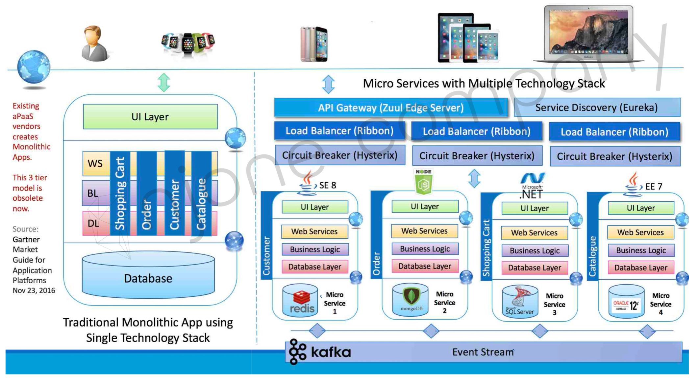

## Monolith Architecture
- 모든 업무 로직이 하나의 애플리케이션 형태로 패키지 되어 서비스 - 의존성↑
- 애플리케이션에 사용하는 데이터가 한 곳에 모여 참조되어 서비스되는 형태
- 일부 기능만 수정해도 전체 애플리케이션 빌드, 배포

## Microservices
> In short, the microservice architectural style is an approach to developint a `single application` as a suite of `small services`, each running in its own process and communicating with lightweight mechanisms, on an HTTP resource API ...contd
> These services are built around `business capabilities` and `independently deplyable` by fully `automated deplyment` machinery ...contd
> There is a bare minimum of `centralized management` of thes services, which may be written in `different programming languages` and use `different data storage` technologies.     
>                                            - James Lewis and Martin Fowler -
- 애플리케이션을 구성하는 각각의 구성 요소 및 서비스의 내용을 분리해서 개발하고 운영하는 방식.
- 모놀리식에 비해 유지보수나 변경사항을 적용하는데 훨씬 유리
- HTTP 통신을 이용해서 리소스 API에 통신할 수 있는 작은 규모의 여러 서비스들의 묶음이 모여서 하나의 애플리케이션을 구성.
- 이런 서비스들은 비즈니스 기능을 중심으로 구축되어야하고, 완전하게 자동화된 배포 시스템을 사용해야 된다.
- 각각의 서비스들은 중앙 집중식 관리가 되어야하고, 서로 다른 프로그래밍 언어와 서로 다른 데이터 저장 기술을 사용할 수 있다.
- 기존의 모노리식과 마이크로 서비스 개발 방식의 가장 큰 차이점은 하나의 서비스를 구성하고 있는 크기이다. 그 서비스의 크기가 도메인의 특성, 특징을 고려해서 경계가 구분되어야 하고, 구분된 서비스들은 독립적인 언어와 데이터베이스를 사용할 수 있다.
- 즉, 마이크로 서비스에서는 프로그래밍 개발 언어와 데이터 베이스를 전체 어플리케이션에서 통일하는 것이 아니라 각각의 서비스 별로 특색에 맞게 최적화되어 있는 언어와 데이터베이스 사용을 권장하고 있다.
- In 2002, Amazon founder and CEO jeff Bezo's Email to Emplyees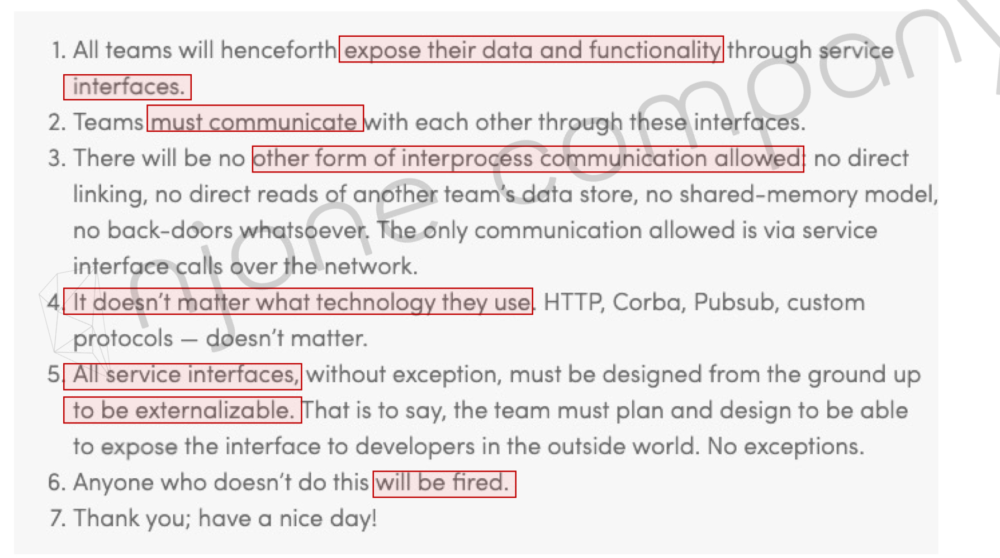

### Microservice의 특징
1. Challenges
2. Small Well Chosen Deplyoable Units
3. Bounded Context
4. RESTful
	- 서로 상태에 대해 REST API 방식으로 통신하는 것을 권장
	- REST API는 HTTP 프로토콜을 기반으로 해서 JSON 포멧을 이용한다. 그리고 경량 데이터 포멧이기 때문에 서버의 리소스나 서버가 가지고 있는 상태를 표시하기에 최적화되어 있는 포멧이다. 
5. Configuration Management
	- 마이크로 서비스들이 가지고 있는 어떤 환경에 대한 정보나 설정에 대한 정보는 코드 내에 가지고 있지 않고, 외부에 있는 시스템을 통해서 관리한다.
	- IP 주소처럼 하드코딩되는 몇가지 정보들이 있다. 이런 것들을 프로그램 안에 하드코딩하게 되면 수정시 적용할 경우 빌드,배포를 다시 하여야 한다. 하지만 단순 IP 정보 변경으로 다시 배포하기 보다는 이러한 환경설정 정보를 외부에 두어서 관리하면 배포없이 바로 적용하여 더 유지보수에 좋다.
6. Cloud Enabled
7. Dynamic Scale Up And Scale Down
	- 서비스를 제공하는 인스턴스들은 부하 분산 처리나 스케일 업, 스케일 다운 등을 동적으로 처리할 수 있도록 구성되어야 한다.
	  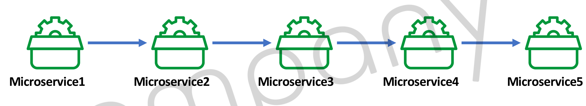
	  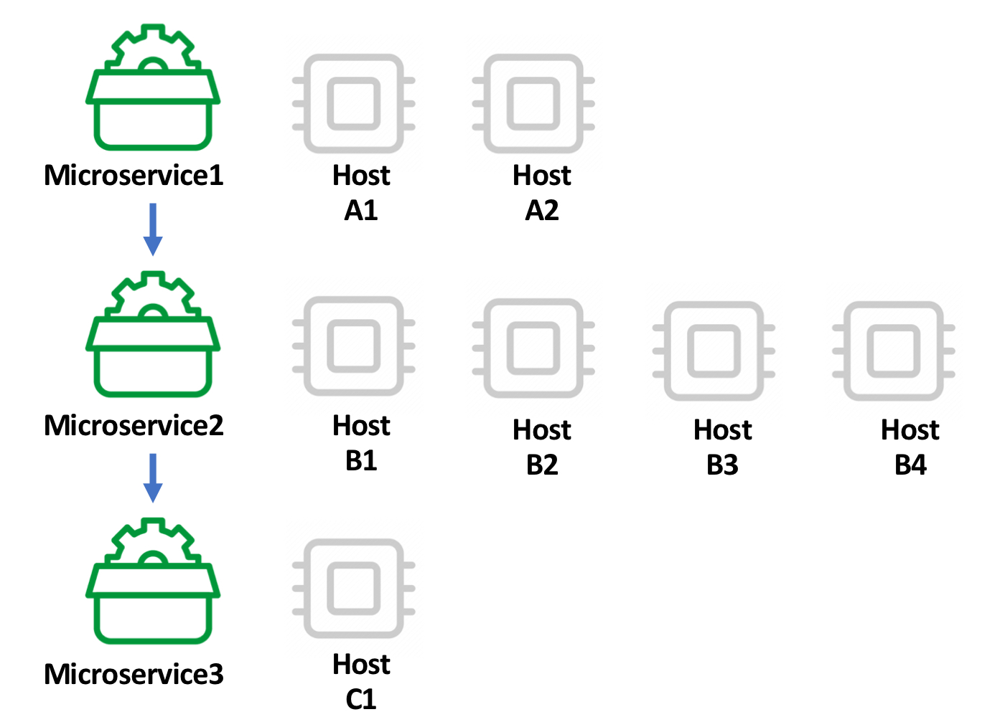
8. CI/CD
9. Visibility
	- 마이크로 서비스르르 시각화해서 관리할 수 있어야된다. 마이크로 서비스를 지원할 수 있는 백킹 서비스라든가 서브시 메쉬, 컴피규레이션과 게이트웨이 같은 모든 것은 클라우드 상태에서 운영할 것이고, 서비스와 서비스 사이에 호출을 할 때는 REST 방식으로 데이터를 호출할 것이다.

### SOA vs MSA
서비스를 지향한다는 점은 공통점이다.
	- SOA - 재사용을 통한 비용 절감
	- MSA - 서비스 간의 결합도를 낮추어 변화에 능동적으로 대응

#### SOA(Service Orented Architecture)
- 비즈니스 측면에서의 서비스 재사용성
- ESB(Enterprise Service Bus)라는 서비스 채널 이용 → 서비스 공유, 재사용
- 공통의 서비스를 ESB에 모아 사업 측면에서 공통 서비스 형식으로 서비스 제공

#### MSA(Microservice Architecture)
- 한 가지 작은 서비스에 집중
- 서비스를 공유하지 않고 독립적으로 실행
- 각 독립된 서비스가 노출된 REST API를 사용

#### SOA vs Micro Services Example
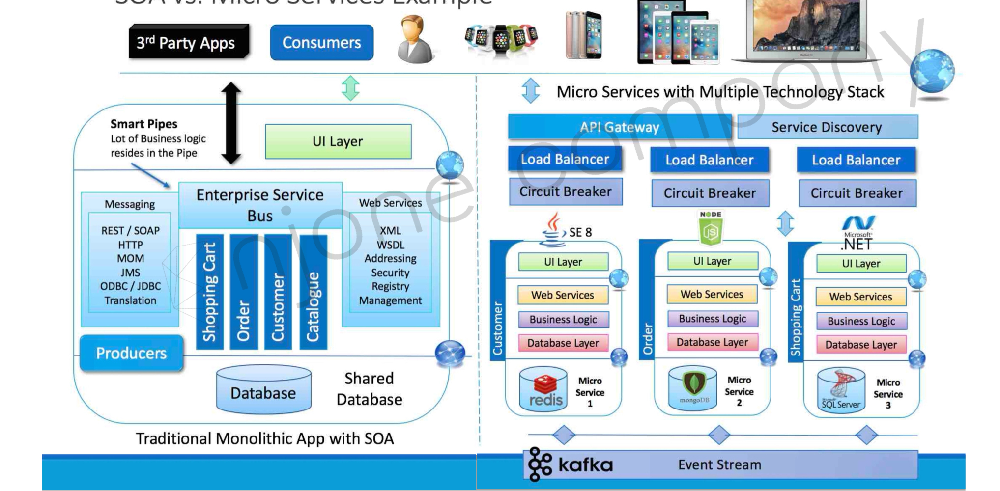
- SOA
	- 각각의 서비스들은 ESB라는 엔터프라이즈 서비스 버스에 모여지게 된다. 이렇게 모여진 서비스들이 외부에 공개 된다.
- MSA
	- 서로 분리된 서비스들은 독립적인 개발 프로세스를 가지고 있다
	- 비즈니스 로직과 데이터베이스에 독립적으로 각각의 서비스를 사용할 수 있도록 지원한다.
	- 데이터를 외부에 공개할 때는 REST API를 통해서 공개하는 것을 권장한다.
	- 데이터는 이벤트 스트림 방식과 같은 메시징 서비스를 이용해서 데이터 동기화를 할 수 있다.
	- 'Customer'서비스는 자바 언어로 구현되어 있고, db는 Redis라는 NoSQL을 사용하고 있다. 'Order'라는 서비스는 Node.js로 개발되었고 db는 MongoDB를 사용하고 있다. 'Shopping Cart'라는 서비스는 .NET을 사용하고 MS SQL을 사용했다. 
	- 각각의 db 안에 저장된 데이터들은 kafka라는 메시징 서비스를 이용해서 서로 간에 필요한 데이터를 동기화하고 있다.
	- 하나의 데이터베이스에 어떠한 자료가 변경되면 이것을 카프카로 전달한다. 카프카는 전달받은 데이터가 관심있다고 등록 했던 객체(서브스크라이버)들한테 해당 데이터를 배달해준다. 이런 방식으로 마이크로 서비스 안에 저장되어 있는 데이터들이 다 분리된 db에 저장되어 있지만 같이 동기화 시킬 수 있는 방법인 메시징 서비스를 통해서 처리가 가능하다. 
	- 서비스 간의 통신 자체가 REST API 방식이라든가 카프카와 같은 메시징 시스템을 통해서 처리하는게 MSA의 주된 방식이다.

### RESTful Web Service
>"A way to grade your API according to the constraints of REST" - Leonard Richardson - 

**Level 0**
	- 기존의 리소스로 단순하게 웹서비스 상태로써 제공하기 위해 URL만 매핑한 형태
	- ex
		- http://server/getPosts
		- http://server/deletePosts
		- http://server/doThis
**Level 1**
	- 웹으로 공개하고자 하는 리소스에 대해 의미있고 적절한 URL로 표현
	- 적절한 패턴을 가지고 작성되었지만 아직까지는 HTTP의 메소드별 서비스를 구분해서 사용하지는 않음. 즉, 서비스의 형태와 작업의 종류에 맞춰서 적절한 HTTP 메소드를 지정하고 있지 않음.
	- ex
		- http://server/accounts
		- http://server/accounts/10
**Level 2**
	- Level1 + HTTP Methods
	- GET(리소스의 상태가 변경할 수 없는 상태. 읽기 용도), POST(새로운 리소스를 추가), PUT(기존 리소스의 상태를 변경), DELETE(리소스를 삭제)등의 서비스 상태를 표현하는 메소드 사용.
	- HTTP 메소드를 이용해서 리소스의 상태를 구분해서 서비스하게 되면 비슷한 이름의 URI라 하더라도 HTTP 메소드에 따라서 다른 형태의 서비스를 제공할 수 있게 된다.
**Level 3**
	- Level2 + HATEOAS
	- DATA + NEXT POSSIBLE ACTIONS

**RESTful Web Service의 특징**
	- Consumer first : 개발자 중심의 설계 방식보다는 해당 API를 사용하는 다른 시스템 개발자 입장에서 간단하고 명려하고 직관적인 API를 설계
	- Make best use of HTTP : REST API를 설계함에 있어서 HTTP의 메소드와 리퀘스트, 리스폰스의 타입, 헤더 값 등과 같은 HTTP의 장점을 최대한 살려서 개발하는게 필요하다
	- Request methods : GET, POST, PUT, DELETE
	- Response Status : 200, 404, 400, 201, 401, 500...
	- No secure info in URI : URI에는 사용자 비밀번호와 같은 크리티컬한 정보는 포함되지 않아야 한다.
	- Use plurals : prefer/ users to /user, prefer/ users/1 to /user/1
		- 제공하려는 데이터에 대해 복수 형태로 쓰는게 일반적이다.
		- 복수형의 URI 안에 포함되어 있는 특정한 값을 지칭하기 위해서는 별도의 추가적인 엔드포인트의 리소스 요청 값을 전달하면 된다.
	- User nouns for resources
		- 모든 리소스는 동사보다는 명사 형태로 표시하는게 좋다.
		- 간단하게 어떤 리소스를 사용하지 우리가 API URI만 봐도 파악할 수 있도록 제공해 주는게 좋다.
	- For exceptions : define a consistent approach
		- 일관된 엔드 포인트를 사용하는 것이 좋다. 엔트포인트에 진입점을 단일화 시켜주는 엔드도 포함되어있다. 이런 작업을 하기 위해서는 API Gateway를 사용해서 처리할 수 있다.
		- ex : /search, PUT /gists/{id}/star, DELETE /gists/{id}/star

### MSA 표준 구성요소
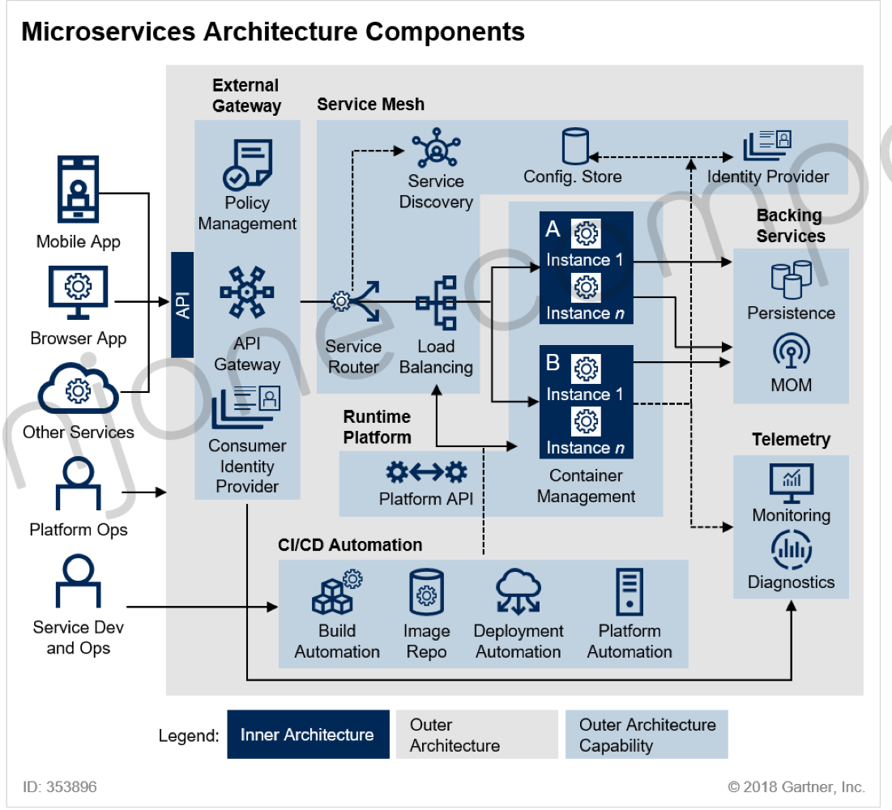
MSA에 관련된 표준 기술은 없지만, Linux Foundation의 산하인 클라우드 네이티브 컴퓨팅 파운데이션(CNCF, Cloud Native Computing Foundation)에서 각 시스템과 시스템을 구성하고 있는 서비스 별로 CNCF의 솔루션이 널리 사용되고 있는 기술을 소개하고 있다.
1. 클라이언트나 다른 마이크로 서비스들이 API Gateway라는 진입점을 통해서 필요한 서비스의 요청을 하게된다.
2. API Gateway로 수집된 클라이언트들의 요청은 서비스 라우터한테 어디로 가야되는지 물어보고, 필요한 마이크로 서비스가 어디에 저장되어 있는지 서비스 디스커버리(등록 서비스)에 물어본다.
3. 진한 남색이 마이크로 서비스들이다. A, B는 인스턴스들이 나눠져 있다. 어디로 향해야 될지 마이크로 서비스를 검색 했다면 그림처럼 분산된 인스턴스들이면 Load Balancing으로 어떠한 서비스로 보내줄 것인지 결정을 하게 된다. 일반적으로 서비스 라우터와 로드 발란싱을 하나의 시스템으로 묶어서 사용하는 경우도 있다.
4. 마이크로 서비스 안에서 사용하고 있는 환경 설정 정보는 config. store처럼 컴퓨레이션 서비스를 통해서 외부 시스템에 저장을 시켜서 사용하는게 일반적이다.
5. A, B와 같은 마이크로 서비스들은 Contatiner Management인 컨테이너 가상화 기술을 통해 구성되어 있다. Java를 이용한 스프링 프레임워크, Node.js, Python등 다양한 형태의 언어로 구현될 수 있다.
6. 완성된 애플리케이션은 배포를 위해 CI/CD라는 오토메이션 기술을 사용할 수 있다. CI/CD를 통해서 외부에 있는 시스템에 배포를 하고자 할 때 관리자라던가 DevOps 관련된 사용자들(Service Dev and Ops)이 사용할 수 있게 API가 공개되어 있어야 한다.
7. Backing Services는 마이크로 서비스에 저장되어 있는 다양한 스토리지들을 모아서 사용할 수 있는 방법이다. MOM(Message-Oriented Middleware)로 메시징 처리 시스템을 통해서 하나의 서비스와 다른 서비스를 연결할 수 있다.
8. Telemetry 기능은 마이크로 서비스의 모니터링 기능과 진단 기능을 가지고 있다. 기존에 있었던 서비스들이 이러한 구조와 같이 연결돼서 서비스를 구축하고 있다고 볼 수 있다.

#### Service Mesh Capabilites
>Service Mesh : 마이크로 서비스 아키텍처를 적용한 시스템의 내부 통신. 서비스 메쉬를 통해서 서비스 간의 통신을 추상화하고 안전하고 빠르고 신뢰성 있게 만들어 주는 인프라 스트럭처의 레이어라고 보면 된다. 
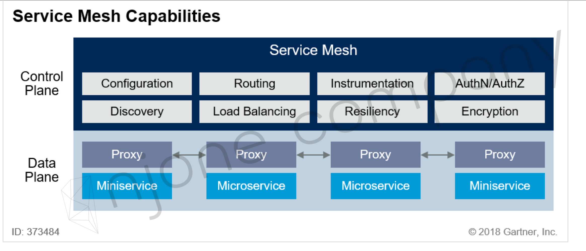

- MSA 인프라 → 미들웨어
	- 프록시 역할, 인증, 권한 부여, 암호화, 서비스 검색, 요청 라우팅, 로드 밸런싱
	- 자가 치유 복구 서비스
- 서비스간의 통신과 관련된 기능 자동화

서비스 메쉬는 URI경로라던가 호스트 헤더, API 버전 또는 기타 응용 프로그램들의 규칙을 기반으로 하는 네트워크 레이어이다. 
서비스 메쉬의 구체적인 경량화 프록시를 통해서 다양한 라우팅 기능이라던가 샤켓 브레이크 같은 공통 기능을 설정할 수 있다. 
서비스 메쉬에는 설정 정보라든가 라우팅이라든가 아니면 인증에 관련된 정보, 로드 밸런싱에 관련된 기능, 서비스에 대한 검색, 암호화 등의 서비스를 통해서 마이크로 서비스의 개발과 운영을 지원하고 있다.
서비스 메쉬는 하나의 제품이나 서비스를 지칭하는 것이 아니라 추상적이 개념이다. 서비스 메쉬라는 계층에서 다양한 기능과 서비스를 제공함으로써 안정적이고 효율적인 마이크로 서비스 운영을 지원하는데 그 목적이 있다.
복잡한 내부 네트워크를 제어하고 추적하고 관련된 로직을 추가함으로써 안정성, 신뢰성, 탄력성, 표준성, 가시성, 보완성 등을 확보할 수 있다.

#### CNCF(Cloud Native Computing Foundation)
- Cloud Native Interative Landsacpe
- https://landscape.cncf.io/

#### MSA 기반 기술
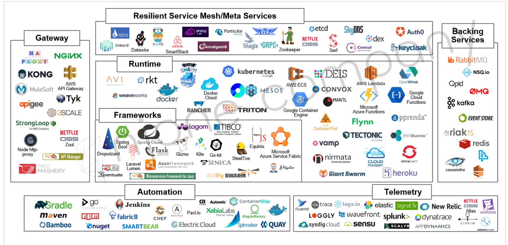

## Everything shoud be a microservice?
전부 msa로 만들 필요는 없다 다음 항목을 고민해보고 프로젝트에 많는 구조를 사용하면 된다.
Q1) Multiple Rates of Change
Q2) Independent Lif Cycles
Q3) Independent Scalability
Q4) Isolated Failure
Q5) Simplify Interactions with External Dependencies
Q6) Polyglot Technology
	- Polyglot : 여러가지 프로그램 언어, 스토리지 기술들을 쓸 수 있게 지원되는 패러다임

## Monolith vs Front & Back vs Microservice Architecture
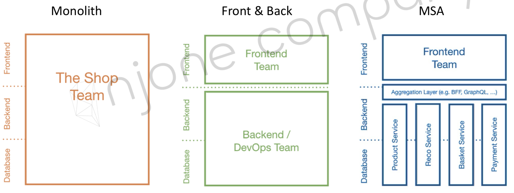

# [Spring Cloud](https://spring.io/projects/spring-cloud)

- Spring boot + Spring Cloud
	- 스프링 클라우드를 사용하기 위해서는 스프링 부트가 필수이다. 호환되는 버전을 잘 맞춰야한다.

## Sping Cloud 구성과 서비스
- Centralized configuration management
	- Spring Cloud Config Server
	- 환경 설정 관리를 위해서는 스프링 클라우드 컨피그 서버가 필요하다. 다양한 마이크로 서비스에서 사용할 수 있는 어떠한 정보를 클라우드 컨피그라는 서버를 통해 외부 저장소에 환경 설정 정보를 저장할 수 있다.
	- 게이트 웨이의 IP, 서버가 가지고 있어야 될 토큰 등에 대한 기본 정보를 한 곳의 저장소(Git)에 모아두고 나머지 마이크로 서비스에 해당 데이터 값을 참조해서 사용하는 방식이다. 그렇게 되면 환경 설정 관리 중 변경 내용이 생기더라도 다시 빌드하고 재배포할 필요없이 외부 저장소에 있는 자료만 수정하면된다.
- Location transparency
	- Naming Server(Eureka)
	- 서비스 등록과 위치정보 확인, 검색 등 서비스를 위해서는 넷플릿스의 유레카 서버를 사용. 
- Load Distribution(Load Balancing)
	- Ribbon(Client Side)
	- Spring Cloud Gateway
	- 버에 들어왔던 요청 정보를 분산하기 위한 용도(로드 밸런싱)로써 게이트웨이 기능으로 리본, Spring cloud Gateway 사용. - 마이크로 서비스뿐만 아니라 게이트웨이 서비스도 네이밍 서버에 등록해놓고 위치를 검색하는 용도로 사용할 예정
- Easier REST Clients
	- FeignClient
	- 각각의 마이크로 서비스 간의 통신을 위해서는 REST 템플릿이나 FeignClient를 이용해 데이터 통신을 할 예정
- Visibility and monitoring
	- Zipkin Distributed Tracing
	- Netflix API gateway
- Fault Tolerance
	- Hystrix
	- 장애가 발생했을 경우 빠르게 복구하기 위한 회복성 패턴은 넷플릭스에 Hystrix라는 제품 사용.

