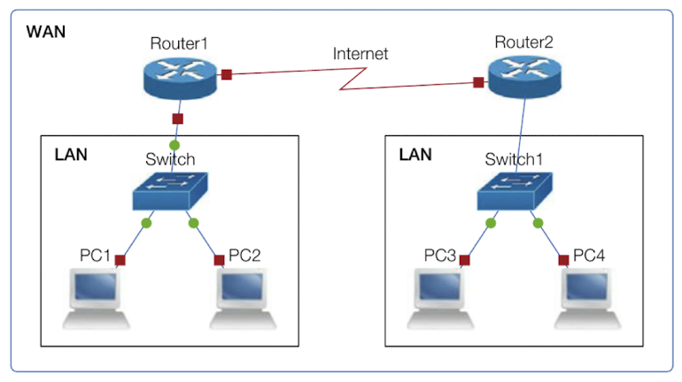
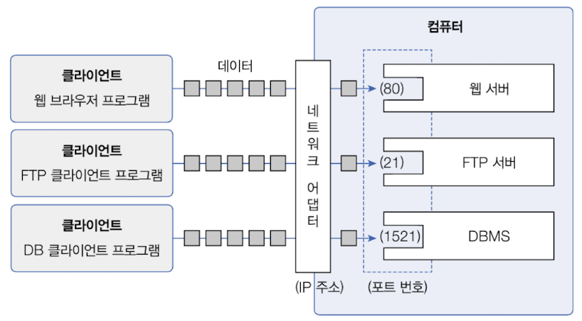
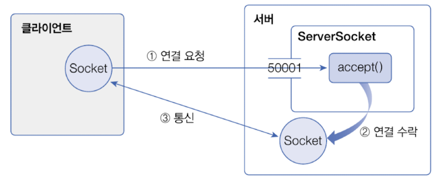
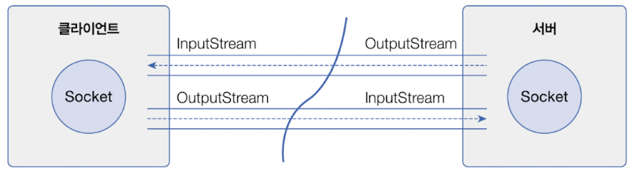
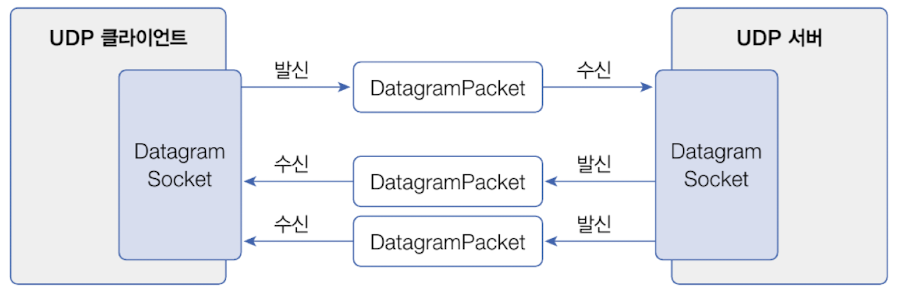
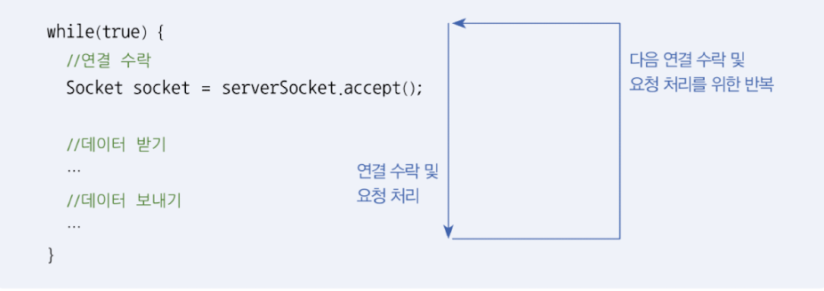
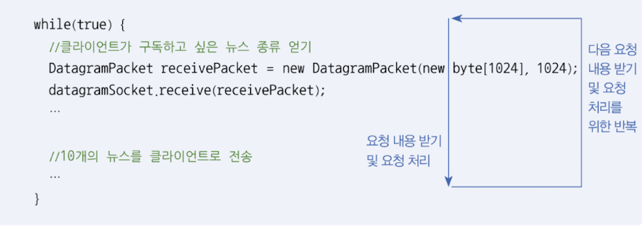
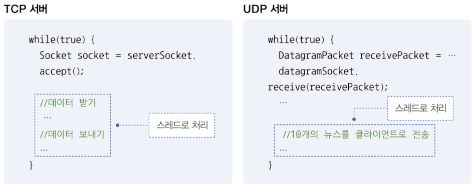
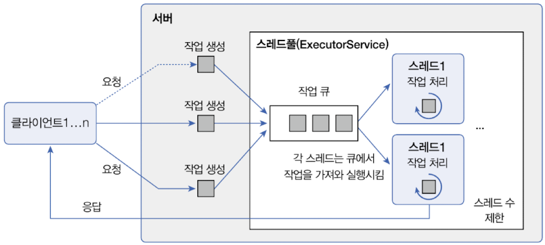
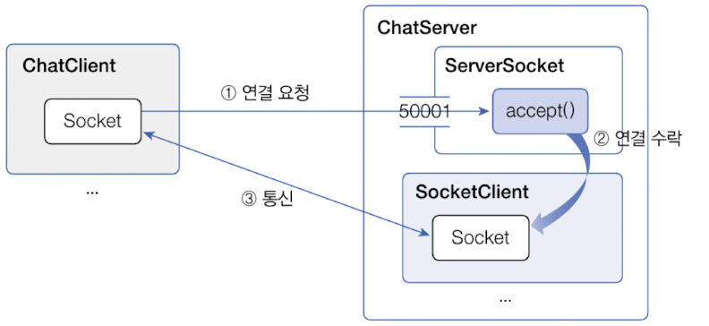

# 네트워크 기초
> 네트워크(network) 여러 컴퓨터들을 통신 회선으로 연결한 것을 말한다. LAN(Local Area Network)은 가정, 회사, 건물, 특정 영역에 존재하는 컴퓨터를 연결한 것이고, WAN(Wide Area Network)는 LAN을 연결한 것이다. WAN이 우리가 흔히 말하는 인터넷(Internet)이다.



## 서버와 클라이언트
>네트워크에서 유무선으로 컴퓨터가 연결되어 있다면 실제로 데이터를 주고받는 행위는 프로그램들이 한다.
- 서버(server) : 서비스를 제공하는 프로그램
- 클라이언트(client) : 서비스를 요청하는 프로그램
인터넷에서 두 프로그램이 통신하기 위해서는 먼저 클라이언트가 서비스를 요청하고, 서버는 처리 결과를 응답으로 제공해준다.


## IP 주소
> IP(Internet Protocol)은 컴퓨터의 고유한 주소이다. IP 주소는 네트워크 어댐터(LAN카드)마다 할당된다. IP 주소는 xxx.xxx.xxx.xxx의 형식으로 출력되는 xxx는 0 - 255 사이의 부호없는 정수이다.

연결할 상대방 컴퓨터의 IP 주소를 모르면 프로그램들은 서로 통신할 수 없다. DNS(Domain Name System)을 통해 컴퓨터의 IP 주소를 검색할 수 있다.
웹 브라우저는 웹 서버와 통신하는 클라이언트로, 사용자가 입력한 도메인 이름으로 DNS에서 IP 주소를 검색해 찾은 다음 웹 서버와 연결해서 웹 페이지를 받는다.


## Port 번호
>Port는 운영체제가 관리하는 서버 프로그램의 연결 번호이다. 

한 대의 컴퓨터에는 다양한 서버 프로그램들이 실행될 수 있다. 예를 들어 웹 서버, DBMS, FTP 서버 등 하나의 IP 주소를 갖는 컴퓨터에 동시에 실행될 수 있다. 이 경우 IP는 컴퓨터의 네트워크 어댑터까지만 갈 수 있는 정보이기 때문에, 컴퓨터 내부에서 실행하는 서버를 선택하기 위해서는 추가적인 Port 번호가 필요하다.

서버는 시작할 때 특정 Port 번호에 바인딩한다. 예를 들어 웹 서버는 80번으로, DBMS는 1521번으로 바인딩할 수 있다. 따라서 클라이언트가 웹 서버, DBMS와 통신하려면 각각의 포트 번호로 요청을 해야 한다.


클라이언트도 서버에서 보낸 정보를 받기 위해서는 Port 번호가 필요하다. 이 때는 서버와 같이 고정적인 Port 번호에 바인딩하는 것이 아니라 운영체제가 자동으로 부여하는 번호를 사용한다. 이 번호는 클라이언트가 서버로 요청할 때 함께 전송되어 서버가 클라이언트로 데이터를 보낼 때 사용된다. 

프로그램에서 사용할 수 있는 전체 Port 번호의 범위는 0 - 65535로, 목적에 따라 세 가지 범위로 나뉜다.

| 구분명                                | 범위            | 설명                                               |
| ---------------------------------- | ------------- | ------------------------------------------------ |
| Well Know Port Numbers             | 0 - 1023      | 국제인터넷주소관리기구(ICANN)가 특정<br>애플리케이션용으로 미리 예약한 Port  |
| Registered Port Numbers            | 1024 - 49151  | 회사에서 등록해서 사용할 수 있는 Port                          |
| Dynamic Or Private Port<br>Numbers | 49152 - 65535 | 운영체제가 부여하는 동적 Port 또는 개인적인<br>목적으로 사용할 수 있는 Port |


# IP 주소 얻기
> java는 IP 주소를 `java.net` 패키지의 `InetAddress`로 표현한다.

`InetAddress`를 이용하면 로컬 컴퓨터의 IP 주소를 얻을 수 있고, 도메인 이름으로 DNS에서 검색한 후 IP 주소를 가져올 수도 있다.
```java
//로컬 컴퓨터의 InetAddress 얻기
InetAddress ia = InetAddress.getLocalHost();
//도메인을 알고있는 경우
InetAddress ia = InetAddress.getByName(String domainName);
InetAddress[] iaArr = InetAddress.getAllByName(String domainName);
```
- `.getByName()` : DNS에서 도메인 이름으로 등록된 단 하나의 IP 주소를 가져옴.
- `.getAllByName()` : 등록된 모든 IP 주소를 배열로 가져옴. - 하나의 도메인에 여러 IP가 등록된 이유는 클라이언트가 많이 연결되었을 경우 서버 부하를 나누기 위해서이다.

```java
//InetAddress 객체에서 IP 주소 얻기
String ip = InetAddress.getHostAddress();
```

다음은 로컬 컴퓨터 IP와 네이버 웹 사이트의 IP 정보를 출력하는 예제이다.
`InetAddressExample.java`
```java
package ch19.sec02;  
  
import java.net.InetAddress;  
import java.net.UnknownHostException;  
  
public class InetAddressExample {  
    public static void main(String[] args) {  
        try {  
            InetAddress local = InetAddress.getLocalHost();  
            System.out.println("내 컴퓨터 IP 주소: " + local.getHostAddress());  
  
            InetAddress[] iaArr = InetAddress.getAllByName("www.naver.com");  
            for (InetAddress remote : iaArr) {  
                System.out.println("www.naver.com IP 주소 : " + remote.getHostAddress());  
            }  
        } catch (UnknownHostException e) {  
            throw new RuntimeException(e);  
        }  
  
    }  
}
```


# TCP 네트워킹
>IP 주소로 프로그램들이 통신할 때는 약속된 데이터 전송 규약이 있다. 이것을 전송용 프로토콜(protocol)이라고 부른다. 인터넷에서 전송용 프로토콜은 TCP(Transmission Control Protocol)와 UDP(User Datagram Protocol)가 있다.

**TCP**
- 연결형 프로토콜 
	- 상대방이 연결된 상태에서 데이터를 주고 받음.
	- 클라이언트가 연결 요청을 하고 서버가 연결을 수락하면 통신 회선이 고정되고, 데이터는 고정 회선을 통해 전달됨.
- 따라서, TCP는 보낸 데이터가 순서대로 전달되며 손실이 발생하지 않음.
- TCP는 IP와 함께 사용하기 때문에 TCP/IP라고도 한다.
- TCP는 웹 브라우저가 웹 서버에 연결할 때 사용되며 이메일 전송, 파일 전송, DB 연동에도 사용된다.

자바는 TCP 네트워킹을 위해 `java.net` 패키지에서 `ServerSocket`과 `Socket`클래스를 제공하고 있다. 
- `ServerSocket` : 클라이언트의 연결을 수락하는 서버 쪽 클래스
- `Socket` : 클라이언트에서 연결 요청할 때와 클라이어트와 서버 양쪽에서 데이터를 주고 받을 때 사용되는 클래스


`ServerSocket`을 생성할 때는 바인딩 할 Port 번호를 지정해야 한다. 
서버가 실행되면 클라이언트는 `Socket`을 이용해서 서버의 IP 주소와 Port 번호로 연결 요청을 할 수 있다. `ServerSocket`은 `accept()` 메소드로 연결 수락을 하고 통신용 `Socket`을 생성한다. 그리고 나서 클라이언트와 서버는 양쪽의 `Socket`을 이용해서 데이터를 주고받게 된다.


## TCP 서버
TCP 서버 프로그램을 개발하려면 우선 `ServerSocket` 객체를 생성해야 한다.
```java
// 생성하면서 50001번 Port에 바인딩
ServerSocket serverSocket = new ServerSocket(50001);
// 생성 후 Port 바인딩
ServerSocket serverSocket = new ServerSocket();
serverSocket.bind(new InetSoketAddress(50001));
// 여러 개의 IP가 할당되어 특정 IP에서만 서비스를 하고 싶은경우
ServerSocket serverSocket = new ServerSocket();
serverSocket.bind(new InetSoketAddress("xxx.xxx.xxx.xxx", 50001));
```
만약 Port가 이미 다른 프로그램에서 사용 중이라면 `BindException`이 발생한다. 이 경우 다른 Port로 바인딩하거나 Port를 사용 중인 프로그램을 종료하고 다시 실행하면 된다.

`ServerSocket`이 생성되었다면 연결 요청을 수락하기 위해 `accept()` 메소드를 실행해야 한다.
`accept()`는 클라이언트가 연결 요청하기 전까지 블로킹된다. 블로킹이란 실행을 멈춘 상태가 된다는 뜻이다. 클라이언트의 연결 요청이 들어오면 블로킹이 해제되고 통신용 `Socket`을 리턴한다.
```java
Socket socket = serverSocket.accept();
// 리턴된 Socket을 통해 연결된 클라이언트의 IP 주소와 Port 번호 얻기.
InetSocketAddres isa = (InetSocketAddress) socket.getRemoteSocketAddress();
String clientIp = isa.getHostName();
String portNo = isa.getPort();
```

서버를 종료하려면 `ServerSocket`의 `close()` 메소드를 호출해서 Port 번호를 언바인딩시켜야 한다. 그래야 다른 프로그램에서 해당 Port 번호를 재사용할 수 있다.
```java
serverSocket.close();
```

다음은 반복적으로 `accept()` 메소드를 호출해서 클라이언트의 연결 요청을 계속 수락하는 TCP 서버의 가장 기본적인 코드이다.
`ServerExample.java`
```java
package ch19.sec03;  
  
import java.io.IOException;  
import java.net.InetSocketAddress;  
import java.net.ServerSocket;  
import java.net.Socket;  
import java.util.Scanner;  
  
public class ServerExample {  
    private static ServerSocket serverSocket = null;  
  
    public static void main(String[] args) {  
        System.out.println("------------------------------------------------------------");  
        System.out.println("서버를 종료하려면 q 또는 Q를 입력하고 Enter 키를 입력하세요.");  
        System.out.println("------------------------------------------------------------");  
  
        //TCP 서버 시작  
        startServer();  
  
        //키보드 입력  
        Scanner scanner = new Scanner(System.in);  
        while (true){  
            String key = scanner.nextLine();  
            if (key.toLowerCase().equals("q")) {  
                break;  
            }  
        }  
        scanner.close();  
  
        //TCP 서버 종료  
        stopServer();  
    }  
  
    private static void stopServer() {  
        //ServerSocket을 닫고 Port 언바인딩  
        try {  
            serverSocket.close();  
            System.out.println("[서버] 종료됨");  
        } catch (IOException e) {  
        }  
    }  
  
    private static void startServer() {  
        //작업 스레드 정의  
        Thread thread = new Thread() {  
            @Override  
            public void run() {  
                //ServerSocket 생성 및 Port 바인딩  
                try {  
                    serverSocket = new ServerSocket(50001);  
                    System.out.println("[서버] 시작됨");  
  
                    while (true) {  
                        System.out.println("\n[서버] 연결 요청을 기다림\n");  
                        //연결 수락  
                        Socket socket = serverSocket.accept();  
  
                        //연결된 클라이언트 정보 얻기  
                        InetSocketAddress isa = (InetSocketAddress) socket.getRemoteSocketAddress();  
                        System.out.println("[서버] " + isa.getHostName() + "의 연결 요청을 수락함");  
  
                        //연결 끊기  
                        socket.close();  
                        System.out.println("[서버] " + isa.getHostName() + "의 연결을 끊음");  
                    }  
                } catch (IOException e) {  
                    System.out.println("[서버] " + e.getMessage());  
                }  
            }  
        };  
        //스레드 시작  
        thread.start();  
    }  
}
```
`[실행결과]`
```
------------------------------------------------------------
서버를 종료하려면 q 또는 Q를 입력하고 Enter 키를 입력하세요.
------------------------------------------------------------
[서버] 시작됨

[서버] 연결 요청을 기다림

q
[서버] 종료됨
[서버] Socket closed
```


## TCP 클라이언트
클라이언트가 서버에 연결 요청을 하려면 `Socket` 객체를 생성할 때 생성자 매개값으로 서버 IP 주소와 Port 번호를 제공하면 된다. 로컬 컴퓨터에서 실행하는 서버로 연결 요청을 할 경우에는 IP 주소 대신 localhost를 사용할 수 있다.
```java
//1. 생성과 동시에 연결 요청
Socket socket = new Socket("IP", 50001);
//IP 주소 대신 도메인 이름 사용
Socket socket = new Socket(new InetSocketAddress("domainName", 50001));
//2. 생성 후 연결 요청
socket = new Socket();
socket.connect(new InetSocketAddress("domainName", 50001));
```

연결 요청 시 두 가지 예외가 발생할 수 있다.
- `UnknownHostException` : IP 주소가 잘못 표기 되었을 경우
- `IOException` : 제공된 IP와 Port 번호로 연결할 수 없을 경우
따라서 두 가지 예외를 모두 처리해야 한다.
```java
try{
	Socket socket = new Socket("IP", 50001);
}catch(UnknownHostException e){
	//IP 표기 방법이 잘못되었을 경우
}catch(IOException e){
	//IP와 Port로 서버에 연결할 수 없는 경우
}
```

서버와 연결된 후에 클라이언트에서 연결을 끊고 싶다면 `close()`메소드를 호출하면된다.

다음은 이전 예제인 `ServerExample`에 연결 요청하는 TCP 클라이언트의 가장 기본적인 코드이다.
`ClientExample.java`
```java
package ch19.sec03;  
  
import java.io.IOException;  
import java.net.Socket;  
import java.net.UnknownHostException;  
  
public class ClientExample {  
    public static void main(String[] args) {  
        try {  
            //Socket 생성과 동시에 localhost의 50001 Port로 연결 요청  
            Socket socket = new Socket("localhost", 50001);  
  
            System.out.println("[클라이언트] 연결 성공");  
  
            //Socket 닫기  
            socket.close();  
            System.out.println("[클라이언트] 연결 끊음");  
        } catch (UnknownHostException e) {  
            //IP 표기 방법이 잘못되었을 경우  
        } catch (IOException e) {  
            //해당 포트의 서버에 연결할 수 없는 경우  
        }  
    }  
}
```


## 입출력 스트림으로 데이터 주고 받기
클라이언트가 연결 요청(`connect()`)을 하고 서버가 연결 수락(`accept()`)했다면, 양쪽의 `Socket`
객체로부터 각각 입력 스트림(InputStream)과 출력 스트림(OutputStream)을 얻을 수 있다.


```java
//Socket으로부터 InputStream과 OutputStream 얻기
InputStream is = socket.getInputStream();
OutputStream os = socket.getOutputStream();
```

상대방에게 데이터를 보낼 때 보낼 데이터를 byte[] 배열로 생성하고, 이것을 매개값으로 해서 `OUtputStream`의 `write()` 메소드를 호출하면 된다.
```java
String data = "보낼 데이터";
byte[] bytes = data.getBytes("UTF-8");
OutputStream os = socket.getOutputStream();
os.write(bytes);
os.flush();
//보조 스트림인 DataOutputStream을 연결해서 사용하면 더 간편하다.
DataOutputStream dos = new DataOutputStream(socket.getOutputSteam());
dos.writeUTF(data);
dos.flush();
```

데이터를 받기 위해서는 받은 데이터를 저장할 byte[] 배열을 생성하고, 이것을 매개값으로 해서 `InputStream`의 `read()`메소드를 호출하면 된다. `read()` 메소드는 읽은 데이터를 byte[] 배열에 저장하고 읽은 바이트 수를 리턴한다.
```java
byte[] bytes = new byte[1024];
InputStream is = socket.getInputStream();
int num = is.read(bytes);
String data = new String(bytes, 0, num, "UTF-8");
//보조 스트림 DataInputStream 사용
DataInputStream dis = new DataInputStream(socket.getInputStream());
String data = dis.readUTF();
```

다음은 TCP 클라이언트가 보낸 메시지를 다시 돌려보내는 에코(메아리) TCP 서버를 구현한 예제이다.
`EchoServer.java`
```java
package ch19.sec03;  
  
import java.io.*;  
import java.net.InetSocketAddress;  
import java.net.ServerSocket;  
import java.net.Socket;  
import java.util.Scanner;  
  
public class EchoServer {  
    private static ServerSocket serverSocket = null;  
  
    public static void main(String[] args) {  
        System.out.println("------------------------------------------------------------");  
        System.out.println("서버를 종료하려면 q 또는 Q를 입력하고 Enter 키를 입력하세요.");  
        System.out.println("------------------------------------------------------------");  
  
        //TCP 서버 시작  
        startServer();   
  
        //키보드 입력  
        Scanner scanner = new Scanner(System.in);  
        while (true){  
            String key = scanner.nextLine();  
            if (key.toLowerCase().equals("q")) {  
                break;  
            }  
        }  
        scanner.close();  
  
        //TCP 서버 종료  
        stopServer();  
    }  
  
    private static void stopServer() {  
        //ServerSocket을 닫고 Port 언바인딩  
        try {  
            serverSocket.close();  
            System.out.println("[서버] 종료됨");  
        } catch (IOException e) {  
        }  
    }  
  
    private static void startServer() {  
        //작업 스레드 정의  
        Thread thread = new Thread() {  
            @Override  
            public void run() {  
                //ServerSocket 생성 및 Port 바인딩  
                try {  
                    serverSocket = new ServerSocket(50002);  
                    System.out.println("[서버] 시작됨");  
  
                    while (true) {  
                        System.out.println("\n[서버] 연결 요청을 기다림\n");  
                        //연결 수락  
                        Socket socket = serverSocket.accept();  
  
                        //연결된 클라이언트 정보 얻기  
                        InetSocketAddress isa = (InetSocketAddress) socket.getRemoteSocketAddress();  
                        System.out.println("[서버] " + isa.getHostName() + "의 연결 요청을 수락함");  
  
                        //------------------------------------------------------------  
                        /*//데이터 받기  
                        InputStream is = socket.getInputStream();                        byte[] bytes = new byte[1024];                        int readByteCount = is.read(bytes);                        String message = new String(bytes, 0, readByteCount, "UTF-8");  
                        //데이터 보내기  
                        OutputStream os = socket.getOutputStream();                        bytes = message.getBytes("UTF-8");                        os.write(bytes);                        os.flush();                        System.out.println("[서버] 받은 데이터를 다시 보냄: " + message);*/  
                        //------------------------------------------------------------                        //데이터 받기  
                        DataInputStream dis = new DataInputStream(socket.getInputStream());  
                        String message = dis.readUTF();  
  
                        //데이터 보내기  
                        DataOutputStream dos = new DataOutputStream(socket.getOutputStream());  
                        dos.writeUTF(message);  
                        dos.flush();  
                        System.out.println("[서버 받은 데이터를 다시 보냄: " + message);  
                        //------------------------------------------------------------  
  
                        //연결 끊기  
                        socket.close();  
                        System.out.println("[서버] " + isa.getHostName() + "의 연결을 끊음");  
                    }  
                } catch (IOException e) {  
                    System.out.println("[서버] " + e.getMessage());  
                }  
            }  
        };  
        //스레드 시작  
        thread.start();  
    }  
}
```
`EchoClient.java`
```java
package ch19.sec03;  
  
import java.io.*;  
import java.net.Socket;  
  
public class EchoClient {  
    public static void main(String[] args) {  
        //Socket 생성과 동시에 localhost의 5001 포트로 연결 요청  
        try {  
            Socket socket = new Socket("localhost", 50002);  
            System.out.println("[클라이언트] 연결 성공");  
  
            //------------------------------------------------------------  
            /*//데이터 보내기  
            String sendMessage = "나는 자바가 좋아~~";  
            OutputStream os = socket.getOutputStream();            byte[] bytes = sendMessage.getBytes("UTF-8");            os.write(bytes);            os.flush();            System.out.println("[클라이언트] 데이터 보냄: " + sendMessage);  
  
            //데이터 받기  
            InputStream is = socket.getInputStream();            bytes = new byte[1024];            int readByteCount = is.read(bytes);            String receiveMessage = new String(bytes, 0, readByteCount, "UTF-8");            System.out.println("[클라이언트] 데이터 받음: " + receiveMessage);*/  
            //------------------------------------------------------------            //데이터 보내기  
            String sendMessage = "나는 자바가 좋아~~";  
            DataOutputStream dos = new DataOutputStream(socket.getOutputStream());  
            dos.writeUTF(sendMessage);  
            dos.flush();  
            System.out.println("[클라이언트] 데이터 보냄: " + sendMessage);  
  
            //데이터 받기  
            DataInputStream dis = new DataInputStream(socket.getInputStream());  
            String receiveMessage = dis.readUTF();  
            System.out.println("[클라이언트] 데이터 받음: " + receiveMessage);  
            //------------------------------------------------------------  
  
            //연결 끊기  
            socket.close();  
            System.out.println("[클라이언트] 연결 끊음");  
        } catch (Exception e) {  
        }  
  
    }  
}
```


# UDP 네트워킹
>UDP(User Datagram Protocol)는 발신자가 일방적으로 수신자에게 데이터를 보내는 방식으로, TCP처럼 연결 요청 및 수락 과정이 없기 때문에 TCP보다 데이터 전송 속도가 상대적으로 빠르다.

UDP는 TCP처럼 고정 회선이 아니라 여러 회선을 통해 데이터가 전송되기 때문에 특정 회선의 속도에 따라 데이터가 순서대로 전달되지 않거나 잘못된 회선으로 인해 데이터 손실이 발생할 수 있다.
따라서, 데이터 전달의 신뢰성보다 속도가 중요하다면 UDP를 사용하고, 데이터 전달의 신뢰성이 중요하다면 TCP를 사용해야 한다.

자바는 UDP 네트워킹을 위해 `java.net`패키지에서 `DatagramSocket`과 `DatagreamPacket`클래스를 제공하고 있다. 
- `DatagramSocket` : 발신점과 수신점
- `DatagramPacket` : 주고 받는 데이터



## UDP 서버
UDP 서버를 위한 `DatagramSocket`객체를 생성할 때에는 다음과 같이 바인딩할 Port 번호를 생성자 매개값으로 제공해야 한다.
```java
DatagramSocket datagramSocket = new DatagramSocket(50001);
```

UDP 서버는 클라이언트가 보낸 `DatagramPocket`을 항상 받을 준비를 해야 한다. 이 역할은 `receive()`메소드가 한다. `receive()` 메소드는 데이터를 수신할 때까지 블로킹되고, 데이터가 수신되면 매개값으로 주어진 `DatagramPacket`에 저장된다.
```java
DatagramPacket receivePacket = new DatagramPacket(new byte[1024], 1024);
```
- `DatagramPacket(`
		① 수신된 데이터를 저장할 배열, 
		② 수신할 수 있는 최대 바이트 수 - 보통 첫 번째 매개값인 바이트 배열의 크기를 줌.
	`)`
```java
datagramSocket.receive(receivePacket);
//receive()가 실행된 후 수신된 데이터와 바이트 수를 얻는 방법
byte[] bytes = receivePacket.getData();
int num = receivePacket.getLength();
//읽는 데이터가 문자열인 경우
String data = new String(bytes, 0, num, "UTF-8");
```

UDP 서버가 클라이언트에게 처리 내용을 보내려면 클라이언트 IP 주소와 Port 번호가 필요하다. 이것들은 `receive()`로 받은 `DatagramPacket`에서 얻을 수 있다.
```java
SocketAddress socketAddress = receivePacket.getSocketAddress();
```
- `DatagramPacket(`
		① 바이트 배열,
		② 시작 인덱스,
		③ 보낼 바이트 수,
		④ SocketAddress 객체
  `)`
```java
//DatagramPacket을 클라이언트로 보낼 때
datagramSocket.send(sendPacket);
//UDP 서버 종료시
datagramSocket.close();
```

다음은 UDP 클라이언트가 구독하고 싶은 뉴스 10개를 전송하는 UDP 서버이다.
`NewsServer.java`
```java
package ch19.sec04;  
  
import java.net.DatagramPacket;  
import java.net.DatagramSocket;  
import java.net.SocketAddress;  
import java.net.SocketException;  
import java.util.Scanner;  
  
public class NewsServer extends Thread {  
    private static DatagramSocket datagramSocket = null;  
  
    public static void main(String[] args) {  
        System.out.println("------------------------------------------------------------");  
        System.out.println("서버를 종료하려면 q 또는 Q를 입력하고 Enter 키를 입력하세요.");  
        System.out.println("------------------------------------------------------------");  
  
        //UDP 서버 시작  
        startServer();  
  
        //키보드 입력  
        Scanner scanner = new Scanner(System.in);  
        while(true){  
            String key = scanner.nextLine();  
            if (key.toLowerCase().equals("q")) {  
                break;  
            }  
        }  
        scanner.close();  
  
        //TCP 서버 종료  
        stopServer();  
    }  
  
    private static void stopServer() {  
        //DatagramSocket을 닫고 Port 언바인딩  
        datagramSocket.close();  
        System.out.println("[서버] 종료됨 ");  
    }  
  
    private static void startServer() {  
        //작업 스레드 정의  
        Thread thread = new Thread() {  
            @Override  
            public void run() {  
                try {  
                    //DatagramSocket 생성 및 Port 바인딩  
                    datagramSocket = new DatagramSocket(50003);  
                    System.out.println("[서버] 시작됨");  
  
                    while (true) {  
                        //클라이언트가 구독하고 싶은 뉴스 주제 얻기  
                        DatagramPacket receivePacket = new DatagramPacket(new byte[1024], 1024);  
                        datagramSocket.receive(receivePacket);  
                        String newsKind = new String(receivePacket.getData(), 0, receivePacket.getLength(), "UTF-8");  
  
                        //클라이언트의 IP와 Port 얻기  
                        SocketAddress socketAddress = receivePacket.getSocketAddress();  
  
                        //10개의 뉴스를 클라이언트로 전송  
                        for (int i = 1; i <= 10; i++) {  
                            String data = newsKind + ": 뉴스" + i;  
                            byte[] bytes = data.getBytes("UTF-8");  
                            DatagramPacket sendPacket = new DatagramPacket(bytes, 0, bytes.length, socketAddress);  
                            datagramSocket.send(sendPacket);  
                        }  
                    }  
                } catch (Exception e) {  
                    System.out.println("[서버] " + e.getMessage());  
                }  
            }  
        };  
        thread.start();  
    }  
  
}
```


## UDP 클라이언트
> UDP 클라이언트 서버에 요청 내용을 보내고 그 결과를 받는 역할을 한다.

UDP 클라이언트를 위한 `DatagramSocket` 객체는 기본 생성자로 한다. Port 번호는 자동으로 부여되기 때문에 따로 지정할 필요가 없다.
```java
DatagramSocket datagramSocket = new DatagramSocket();
```

요청 내용을 보내기 위한 `DatagramPacket` 생성 방법
```java
String data = "요청 내용";
byte[] bytes = data.getBytes("UTF-8");
DatagramPacket sendPacket = new DatagramPacket(
	bytes, bytes.length, new InetSocketAddress("localhost", 50001)
);
```
- `DatagramPacket` 매개값
```java
new DatagramPacket(
	①바이트 배열, 
	②바이트 수, 
	③UDP 서버의 IP와 Port정보를 가지고 있는 InetSocketAddress객체
)
```
생성된 `DatagramPacket`을 매개값으로해서 `DatagramSocket`의 `send()` 메소드를 호출하면 UDP 서버로 `DatagramPacket`이 전송된다.
```java
datagramSocket.send(sendPacket);
```
\
UDP 서버에서 처리 결과가 언제 올지 모르므로 항상 받을 준비를 하기 위해 `receive()`메소드를 호출한다. `receive()` 메소드는 데이터를 수신할 때까지 블로킹되고, 데이터가 수신되면 매개값으로 주어진 `DatagramPacket`에 저장한다. 이 부분은 UDP 서버와 동일하다.

더 이상 UDP 서버와 통신할 필요가 없다면 `DatagramSocket`을 닫기 위해 `close()` 메소드를 호출한다.
```java
datagramSocket.close();
```

다은은 이전 예제인 NewsServer로 구독하고 싶은 뉴스 주제를 보내고 관련 뉴스 10개를 받는 UDP 클라이언트이다.
`NewsClient.java`
```java
package ch19.sec04;  
  
import java.net.DatagramPacket;  
import java.net.DatagramSocket;  
import java.net.InetSocketAddress;  
import java.net.SocketException;  
  
public class NewsClient {  
    public static void main(String[] args) {  
        try {  
            //DatagramSocket 생성  
            DatagramSocket datagramSocket = new DatagramSocket();  
  
            //구독하고 싶은 뉴스 주제 보내기  
            String data = "정치";  
            byte[] bytes = data.getBytes("UTF-8");  
            DatagramPacket sendPacket = new DatagramPacket(bytes, bytes.length, new InetSocketAddress("localhost", 50001));  
            datagramSocket.send(sendPacket);  
  
            while (true) {  
                //뉴스 받기  
                DatagramPacket receivePacket = new DatagramPacket(new byte[1024], 1024);  
                datagramSocket.receive(receivePacket);  
  
                //문자열로 변환  
                String news = new String(receivePacket.getData(), 0, receivePacket.getLength(), "UTF-8");  
                System.out.println("news = " + news);  
  
                //10번째 뉴스를 받으면 while 문 종료  
                if (news.contains("뉴스10")) {  
                    break;  
                }  
            }  
  
            //DatagramSocket 닫기  
            datagramSocket.close();  
        } catch (Exception e) {  
        }  
  
  
    }  
}
```
`[실행결과]`
```
//NewsServer
------------------------------------------------------------
서버를 종료하려면 q 또는 Q를 입력하고 Enter 키를 입력하세요.
------------------------------------------------------------
[서버] 시작됨

//NesClient
news = 정치: 뉴스1
news = 정치: 뉴스2
news = 정치: 뉴스3
news = 정치: 뉴스4
news = 정치: 뉴스5
news = 정치: 뉴스6
news = 정치: 뉴스7
news = 정치: 뉴스8
news = 정치: 뉴스9
news = 정치: 뉴스10
```


# 서버의 동시 요청 처리
일반적으로 서버는 다수의 클라이언트와 통신을 한다. 서버는 클라이언트틀로부터 동시에 요청을 받아서 처리하고, 처리 결과를 개별 클라이언트로 보내줘야 한다.

위에 TCP 네트워킹과 UDP 네트워킹에서 다룬 서버 예제는 먼저 연결한 클라이언트의 요청을 처리한 수 다음 클라이언트의 요청을 처리하도록 되어 있다.

- `EchoServer.java` 동작방식


- `NewsServer.java` 동작방식


이와 같은 방식은 먼저 연결한 클라이언트의 요청 처리 시간이 길어질수록 다음 클라이언트의 요청 처리 작업이 지연될 수 밖에 없다. 따라서 `accept()`와 `receive()`를 제외한 요청 처리 코드를 별도의 스레드에서 작업하는 것이 좋다.


스레드를 처리할 때 주의할 점은 클라이언트의 폭증으로 인한 서버의 과도한 스레드 생성을 방지해야 한다는 것이다. 그래서 스레드풀을 사용하는 것이 바람직하다. 


스레드풀은 작업 처리 스레드 수를 제한해서 사용하기 때문에 갑작스런 클라이언트 폭증이 발생해도 크게 문제가 되지 않는다. 다만 작업 큐의 대기 작업이 증가되어 클라이언트에서 응답을 늦게 받을 수 있다.


## TCP EchoServer 동시 요청 처리
`EchoServer.java`
```java
package ch19.sec03;  
  
import java.io.*;  
import java.net.InetSocketAddress;  
import java.net.ServerSocket;  
import java.net.Socket;  
import java.util.Scanner;  
import java.util.concurrent.ExecutorService;  
import java.util.concurrent.Executors;  
  
public class EchoServer {  
    private static ServerSocket serverSocket = null;  
    // 10개의 스레드로 요청을 처리하는 스레드풀 생성  
    private static ExecutorService executorService = Executors.newFixedThreadPool(10);  
  
    public static void main(String[] args) {  
        System.out.println("------------------------------------------------------------");  
        System.out.println("서버를 종료하려면 q 또는 Q를 입력하고 Enter 키를 입력하세요.");  
        System.out.println("------------------------------------------------------------");  
  
        //TCP 서버 시작  
        startServer();  
  
        //키보드 입력  
        Scanner scanner = new Scanner(System.in);  
        while (true){  
            String key = scanner.nextLine();  
            if (key.toLowerCase().equals("q")) {  
                break;  
            }  
        }  
        scanner.close();  
  
        //TCP 서버 종료  
        stopServer();  
    }  
  
    private static void stopServer() {  
        try {  
            //ServerSocket을 닫고 Port 언바인딩  
            serverSocket.close();  
            executorService.shutdownNow();  // 스레드풀 종료  
            System.out.println("[서버] 종료됨");  
        } catch (IOException e) {  
        }  
    }  
  
    private static void startServer() {  
        //작업 스레드 정의  
        Thread thread = new Thread() {  
            @Override  
            public void run() {  
                //ServerSocket 생성 및 Port 바인딩  
                try {  
                    serverSocket = new ServerSocket(50002);  
                    System.out.println("[서버] 시작됨");  
  
                    while (true) {  
                        System.out.println("\n[서버] 연결 요청을 기다림\n");  
                        //연결 수락  
                        Socket socket = serverSocket.accept();  
  
                        executorService.execute(()->{  
                            try {  
                                //연결된 클라이언트 정보 얻기  
                                InetSocketAddress isa = (InetSocketAddress) socket.getRemoteSocketAddress();  
                                System.out.println("[서버] " + isa.getHostName() + "의 연결 요청을 수락함");  
  
                                //------------------------------------------------------------  
                                /*//데이터 받기  
                                InputStream is = socket.getInputStream();                                byte[] bytes = new byte[1024];                                int readByteCount = is.read(bytes);                                String message = new String(bytes, 0, readByteCount, "UTF-8");  
                                //데이터 보내기  
                                OutputStream os = socket.getOutputStream();                                bytes = message.getBytes("UTF-8");                                os.write(bytes);                                os.flush();                                System.out.println("[서버] 받은 데이터를 다시 보냄: " + message);*/  
                                //------------------------------------------------------------                                //데이터 받기  
                                DataInputStream dis = new DataInputStream(socket.getInputStream());  
                                String message = null;  
  
                                    message = dis.readUTF();  
  
  
                                //데이터 보내기  
                                DataOutputStream dos = new DataOutputStream(socket.getOutputStream());  
                                dos.writeUTF(message);  
                                dos.flush();  
                                System.out.println("[서버 받은 데이터를 다시 보냄: " + message);  
                                //------------------------------------------------------------  
  
                                //연결 끊기  
                                socket.close();  
                                System.out.println("[서버] " + isa.getHostName() + "의 연결을 끊음");  
                            } catch (IOException e) {  
                                throw new RuntimeException(e);  
                            }  
                        });  
  
                    }  
                } catch (IOException e) {  
                    System.out.println("[서버] " + e.getMessage());  
                }  
            }  
        };  
        //스레드 시작  
        thread.start();  
    }  
}
```


## UDP NewsServer 동시 요청 처리
`NewsServer.java`
```java
package ch19.sec04;  
  
import java.net.DatagramPacket;  
import java.net.DatagramSocket;  
import java.net.SocketAddress;  
import java.net.SocketException;  
import java.util.Scanner;  
import java.util.concurrent.ExecutorService;  
import java.util.concurrent.Executors;  
  
public class NewsServer extends Thread {  
    private static DatagramSocket datagramSocket = null;  
    //10개의 스레드로 요청을 처리하는 스레드풀 생성  
    private static ExecutorService executorService = Executors.newFixedThreadPool(10);  
  
    public static void main(String[] args) {  
        System.out.println("------------------------------------------------------------");  
        System.out.println("서버를 종료하려면 q 또는 Q를 입력하고 Enter 키를 입력하세요.");  
        System.out.println("------------------------------------------------------------");  
  
        //UDP 서버 시작  
        startServer();  
  
        //키보드 입력  
        Scanner scanner = new Scanner(System.in);  
        while(true){  
            String key = scanner.nextLine();  
            if (key.toLowerCase().equals("q")) {  
                break;  
            }  
        }  
        scanner.close();  
  
        //TCP 서버 종료  
        stopServer();  
    }  
  
    private static void stopServer() {  
        //DatagramSocket을 닫고 Port 언바인딩  
        datagramSocket.close();  
        System.out.println("[서버] 종료됨 ");  
    }  
  
    private static void startServer() {  
        //작업 스레드 정의  
        Thread thread = new Thread() {  
            @Override  
            public void run() {  
                try {  
                    //DatagramSocket 생성 및 Port 바인딩  
                    datagramSocket = new DatagramSocket(50001);  
                    System.out.println("[서버] 시작됨");  
  
                    while (true) {  
                        //클라이언트가 구독하고 싶은 뉴스 주제 얻기  
                        DatagramPacket receivePacket = new DatagramPacket(new byte[1024], 1024);  
                        datagramSocket.receive(receivePacket);  
  
                        //작업 큐에 처리 작업 넣기  
                        //Runnable은 함수형 인터페이스이므로 람다식으로 표현 가능  
                        executorService.execute(() ->{  
                            try{  
                                String newsKind = new String(receivePacket.getData(), 0, receivePacket.getLength(), "UTF-8");  
  
                                //클라이언트의 IP와 Port 얻기  
                                SocketAddress socketAddress = receivePacket.getSocketAddress();  
  
                                //10개의 뉴스를 클라이언트로 전송  
                                for (int i = 1; i <= 10; i++) {  
                                    String data = newsKind + ": 뉴스" + i;  
                                    byte[] bytes = data.getBytes("UTF-8");  
                                    DatagramPacket sendPacket = new DatagramPacket(bytes, 0, bytes.length, socketAddress);  
                                    datagramSocket.send(sendPacket);  
                                }  
                            }catch (Exception e){}  
                        });  
  
                    }  
                } catch (Exception e) {  
                    System.out.println("[서버] " + e.getMessage());  
                }  
            }  
        };  
        thread.start();  
    }  
  
}
```


# JSON 데이터 형식
>네트워크 통신에서 가장 많이 사용되는 데이터 형식은 JSON(JavaScript Object Notation)이다.

| 구분    | 예시                                        | 설명                                                                               |
| ----- | ----------------------------------------- | -------------------------------------------------------------------------------- |
| 객체 표기 | {<br>"속성명":속성값,<br>"속성명":속성값,<br>...<br>} | 속성명:반드시"로 감싸야 함<br>속성값으로 가능한 것<br>-"문자열", 숫자, true/false<br>-객체{...}<br>-배열[...] |
| 배열 표기 | [항목, 항목, ...]                             | 항목으로 가능한 것<br>-"문자열", 숫자, true/false<br>-객체{...}<br>-배열[...]                     |

두 개 이상의 속성이 있는 경우에는 `객체 {}`로 표기하고, 두 개 이상의 값이 있는 경우에는 `배열 []`로 표기한다.


JSON을 문자열로 직접 작성할 수 있지만 대부분은 라이브러리를 이용해서 생성한다. 
> https://github.com/stleary/JSON-java

`Click here if you just want the latest relese jar file` 링크를 클릭하여 jar파일을 받는다. -> 해당 프로젝트에 library에 추가

JSON 표기법과 관련된 클래스이다.

| 클래스        | 용도                         |
| ---------- | -------------------------- |
| JSONObject | JSON 객체 표기를 생성하거나 파싱할 때 사용 |
| JSONArray  | JSON 배열 표기를 생성하거나 파싱할 때 사용 |


`CreateJsonExample.java`
```java
package ch19.sec06;  
  
import org.json.JSONArray;  
import org.json.JSONObject;  
  
import java.io.FileWriter;  
import java.io.IOException;  
import java.io.Writer;  
import java.nio.charset.Charset;  
  
public class CreateJsonExample {  
    public static void main(String[] args) throws IOException {  
        //JSON 객체 생성  
        JSONObject root = new JSONObject();  
  
        //속성 추가  
        root.put("id", "winter");  
        root.put("name", "한겨울");  
        root.put("age", 25);  
        root.put("student", true);  
  
        //객체 속성 추가  
        JSONObject tel = new JSONObject();  
        tel.put("home", "02-123-1234");  
        tel.put("mobile", "010-123-1234");  
        root.put("tel", tel);  
  
        //배열 속성 추가  
        JSONArray skill = new JSONArray();  
        skill.put("java");  
        skill.put("c");  
        skill.put("c++");  
        root.put("skill", skill);  
  
        //JSON 얻기  
        String json = root.toString();  
  
        //콘솔에 출력  
        System.out.println(json);  
  
        //파일로 저장  
        Writer writer = new FileWriter("/Users/g.u./Temp/member.json", Charset.forName("UTF-8"));  
        writer.write(json);  
        writer.flush();  
        writer.close();  
    }  
}
```
`[실행결과]`
```
{"student":true,"skill":["java","c","c++"],"name":"한겨울","tel":{"mobile":"010-123-1234","home":"02-123-1234"},"id":"winter","age":25}
```

JSON에서 속성 순서는 중요하지 않기 때문에 추가한 순서대로 작성되지 않아도 상관없다. 줄바꿈 처리가 되지 않아 네트워크 전송량을 줄여주기에 더 좋다.

다음은 `member.json` 파일을 읽고 JSON을 파싱하는 방법이다.
`ParseJsonExample.java`
```java
package ch19.sec06;  
  
import org.json.JSONArray;  
import org.json.JSONObject;  
  
import java.io.BufferedReader;  
import java.io.FileReader;  
import java.io.IOException;  
import java.nio.charset.Charset;  
  
public class ParseJsonExample {  
    public static void main(String[] args) throws IOException {  
        //파일로부터 JSON 읽기  
        BufferedReader br = new BufferedReader(new FileReader("/Users/g.u./Temp/member.json", Charset.forName("UTF-8")));  
        String json = br.readLine();  
        br.close();  
          
        //JSON 파싱  
        JSONObject root = new JSONObject(json);  
  
        //속성 정보 읽기  
        System.out.println("id = " + root.getString("id"));  
        System.out.println("name = " + root.getString("name"));  
        System.out.println("age = " + root.getInt("age"));  
        System.out.println("student = " + root.getBoolean("student"));  
  
        //객체 속성 정보 읽기  
        JSONObject tel = root.getJSONObject("tel");  
        System.out.println("home = " + tel.getString("home"));  
        System.out.println("mobile = " + tel.getString("mobile"));  
  
        //배열 속성 정보 읽기  
        JSONArray skill = root.getJSONArray("skill");  
        System.out.print("skill = ");  
        for (int i = 0; i < skill.length(); i++) {  
            System.out.print(skill.get(i) + ", ");  
        }  
    }  
}
```
`[실행결과]`
```
id = winter
name = 한겨울
age = 25
student = true
home = 02-123-1234
mobile = 010-123-1234
skill = java, c, c++, 
```


# TCP 채팅 프로그램


| 클래스           | 용도                                                                                    |
| ------------- | ------------------------------------------------------------------------------------- |
| ChatServer    | -채팅 서버 실행 클래스<br>-ServerSocket을 생성하고 50001에 바인딩<br>-ChatClient 연결 수락 후 SocketClient생성 |
| SocketCilient | -ChatClient와 1:1로 통신                                                                  |
| ChatClient    | -채팅 클라이언트 실행 클래스<br>-ChatServer에 연결 요청<br>-SocketClient와 1:1로 통신                      |

## 채팅 서버
>`ChatServer`는 채팅 서버 실행 클래스로 클라이언트의 연결 요청을 수락하고 통신용 `SocetClient`를 생성하는 역할을 한다.

`ChatServer.java`
```java
package ch19.sec07;  
  
import org.json.JSONObject;  
  
import java.io.IOException;  
import java.net.ServerSocket;  
import java.net.Socket;  
import java.util.*;  
import java.util.concurrent.ExecutorService;  
import java.util.concurrent.Executors;  
  
public class ChatServer {  
    //필드  
    ServerSocket serverSocket;  
    ExecutorService threadPool = Executors.newFixedThreadPool(100);  
    Map<String, SocketClient> chatRoom = Collections.synchronizedMap(new HashMap<>());  
      
    //메소드: 서버 시작  
    public void start() throws IOException {  
        serverSocket = new ServerSocket(50002);  
        System.out.println("[서버] 시작됨");  
          
        Thread thread = new Thread(() ->{  
            try {  
                while (true) {  
                    Socket socket = serverSocket.accept();  
                    SocketClient sc = new SocketClient(this, socket);  
                }  
            }catch (IOException e){}  
        });  
        thread.start();  
    }  
      
    //메소드: 클라이언트 연결 시 SocketClient 생성 및 추가  
    public void addSocketClient(SocketClient socketClient){  
        String key = socketClient.chatName + "@" + socketClient.clientIp;  
        chatRoom.put(key, socketClient);  
        System.out.println("입장: " + key);  
        System.out.println("현재 채팅자 수: " + chatRoom.size() + "\n");  
    }  
  
    //메소드: 클라이언트 연결 종료 시 SocketClient 제거  
    public void removeSocketClient(SocketClient socketClient) {  
        String key = socketClient.chatName + "@" + socketClient.clientIp;  
        chatRoom.remove(key);  
        System.out.println("나감: " + key);  
        System.out.println("현재 채팅자 수: " + chatRoom.size() + "\n");  
    }  
      
    //메소드: 모든 클라ㅣ언트에게 메시지 보냄  
    public void sendToAll(SocketClient sender, String message){  
        JSONObject root = new JSONObject();  
        root.put("clientIp", sender.clientIp);  
        root.put("chatName", sender.chatName);  
        root.put("message", message);  
        String json = root.toString();  
  
        Collection<SocketClient> socketClients = chatRoom.values();  
        for (SocketClient sc : socketClients) {  
            if (sc == sender) continue;  
            sc.send(json);  
        }  
    }  
  
    //메소드: 서버 종료  
    public void stop(){  
        try{  
            serverSocket.close();  
            threadPool.shutdownNow();  
            chatRoom.values().stream().forEach(sc -> sc.close());  
            System.out.println("[서버] 종료됨");  
        }catch (IOException e1){}  
    }  
  
    //메소드: 메인  
    public static void main(String[] args) {  
        try {  
            ChatServer chatServer = new ChatServer();  
            chatServer.start();  
  
            System.out.println("----------------------------------------------------");  
            System.out.println("서버를 종료하려면 q를 입력하고 Enter");  
            System.out.println("----------------------------------------------------");  
  
            Scanner scanner = new Scanner(System.in);  
            while (true) {  
                String key = scanner.nextLine();  
                if (key.equals("q")) break;  
            }  
            scanner.close();  
            chatServer.stop();  
        } catch (IOException e) {  
            System.out.println("[서버] " + e.getMessage());  
        }  
    }  
}
```
`SocketClient.java`
```java
package ch19.sec07;  
  
import org.json.JSONObject;  
  
import java.io.DataInputStream;  
import java.io.DataOutputStream;  
import java.io.IOException;  
import java.net.InetSocketAddress;  
import java.net.Socket;  
  
public class SocketClient {  
    //필드  
    ChatServer chatServer;  
    Socket socket;  
    DataInputStream dis;  
    DataOutputStream dos;  
    String clientIp;  
    String chatName;  
  
    public SocketClient(ChatServer chatServer, Socket socket) {  
        try{  
            this.chatServer = chatServer;  
            this.socket = socket;  
            this.dis = new DataInputStream(socket.getInputStream());  
            this.dos = new DataOutputStream(socket.getOutputStream());  
            InetSocketAddress isa = (InetSocketAddress) socket.getRemoteSocketAddress();  
            this.clientIp = isa.getHostName();  
            receive();  
        }catch (IOException e){}  
    }  
  
    //메소드: JSON 받기  
    private void receive() {  
        chatServer.threadPool.execute(()->{  
            try{  
                while (true) {  
                    String receiveJson = dis.readUTF();  
  
                    JSONObject jsonObject = new JSONObject(receiveJson);  
                    String command = jsonObject.getString("command");  
  
                    switch (command) {  
                        case "incoming" :  
                            this.chatName = jsonObject.getString("data");  
                            chatServer.sendToAll(this, "들어오셨습니다.");  
                            chatServer.addSocketClient(this);  
                            break;  
                        case "message":  
                            String message = jsonObject.getString("data");  
                            chatServer.sendToAll(this, message);  
                            break;  
                    }  
                }  
            }catch (IOException e){  
                chatServer.sendToAll(this, "나가셨습니다");  
                chatServer.removeSocketClient(this);  
            }  
        });  
    }  
  
    //메소드: JSON 보내기  
    public void send(String json) {  
        try {  
            dos.writeUTF(json);  
            dos.flush();  
        }catch (IOException e){}  
    }  
  
    //메소드: 연결 종료  
    public void close(){  
        try {  
            socket.close();  
        }catch (Exception e){}  
    }  
}
```


## 채팅 클라이언트
> 채팅 클라이언트는 `ChatClient` 단일 클래스이다. `ChatClient`는 채팅 서버로 연결을 요청하고, 연결된 후에는 제일 먼저 대화명을 보낸다. 그리고 난 다음 서버와 메시지를 주고 받는다.

`ChatClient.java`
```java
package ch19.sec07;  
  
import org.json.JSONObject;  
  
import java.io.DataInputStream;  
import java.io.DataOutputStream;  
import java.io.IOException;  
import java.net.Socket;  
import java.util.Scanner;  
  
public class ChatClient {  
    //필드  
    Socket socket;  
    DataInputStream dis;  
    DataOutputStream dos;  
    String chatName;  
  
    //메소드: 서버 연결  
    public void connet() throws IOException{  
        socket = new Socket("localhost", 50002);  
        dis = new DataInputStream(socket.getInputStream());  
        dos = new DataOutputStream(socket.getOutputStream());  
        System.out.println("[클라이언트] 서버에 연결됨");  
    }  
  
    //메소드: JSON 받기  
    public void receive(){  
        Thread thread = new Thread(()->{  
            try {  
                while (true) {  
                    String json = dis.readUTF();  
                    JSONObject root = new JSONObject(json);  
                    String clientIp = root.getString("clientIp");  
                    String chatName = root.getString("chatName");  
                    String message = root.getString("message");  
                    System.out.println("<" + chatName + "@" + clientIp + "> " + message);  
                }  
            } catch (Exception e1) {  
                System.out.println("[클라이언트] 서버 연결 끊김");  
                System.exit(0);  
            }  
        });  
        thread.start();  
    }  
  
    //메소드: JSON 보내기  
    public void send(String json) throws IOException {  
        dos.writeUTF(json);  
        dos.flush();  
    }  
  
    //메소드: 서버 연결 종료  
    public void unconnect() throws IOException {  
        socket.close();  
    }  
  
    //메소드: 메인  
    public static void main(String[] args) {  
        try {  
            ChatClient chatClient = new ChatClient();  
            chatClient.connet();  
  
            Scanner scanner = new Scanner(System.in);  
            System.out.println("대화명 입력: ");  
            chatClient.chatName = scanner.nextLine();  
  
            JSONObject jsonObject = new JSONObject();  
            jsonObject.put("command", "incoming");  
            jsonObject.put("data", chatClient.chatName);  
            String json = jsonObject.toString();  
            chatClient.send(json);  
  
            chatClient.receive();  
  
            System.out.println("-----------------------------------------------");  
            System.out.println("보낼 메시지를 입력하고 Enter");  
            System.out.println("채팅을 종료하려면 q를 입력하고 Enter");  
            System.out.println("-----------------------------------------------");  
            while (true) {  
                String message = scanner.nextLine();  
                if (message.toLowerCase().equals("q")) {  
                    break;  
                } else {  
                    jsonObject = new JSONObject();  
                    jsonObject.put("command", "message");  
                    jsonObject.put("data", message);  
                    json = jsonObject.toString();  
                    chatClient.send(json);  
                }  
            }  
            scanner.close();  
            chatClient.unconnect();  
        } catch (IOException e) {  
            System.out.println("[클라이언트] 서버 연결 안됨");  
        }  
    }  
}
```
`[실행결과]`
```
//ChatServer
[서버] 시작됨
----------------------------------------------------
서버를 종료하려면 q를 입력하고 Enter
----------------------------------------------------

입장: winter@localhost
현재 채팅자 수: 1

입장: spring@localhost
현재 채팅자 수: 2

나감: spring@localhost
현재 채팅자 수: 1

나감: winter@localhost
현재 채팅자 수: 0

//ChatClient - winter
[클라이언트] 서버에 연결됨
대화명 입력: 
winter
-----------------------------------------------
보낼 메시지를 입력하고 Enter
채팅을 종료하려면 q를 입력하고 Enter
-----------------------------------------------
<spring@localhost> 들어오셨습니다.
안녕하세요
<spring@localhost> 안녕하세요
오늘은 일요일이에요
<spring@localhost> 내일은 월요일이라니...
<spring@localhost> 나가셨습니다
q
[클라이언트] 서버 연결 끊김

//ChatClient - spring
[클라이언트] 서버에 연결됨
대화명 입력: 
spring
-----------------------------------------------
보낼 메시지를 입력하고 Enter
채팅을 종료하려면 q를 입력하고 Enter
-----------------------------------------------
<winter@localhost> 안녕하세요
안녕하세요
<winter@localhost> 오늘은 일요일이에요
내일은 월요일이라니...
q
[클라이언트] 서버 연결 끊김
```


