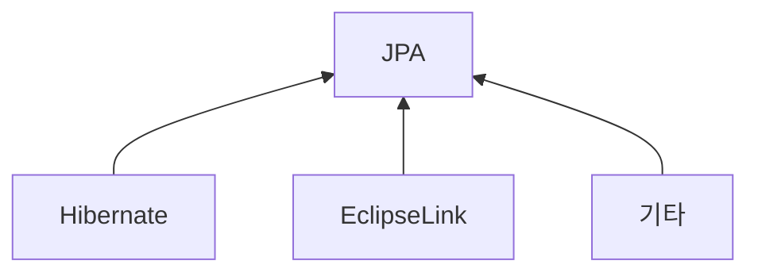
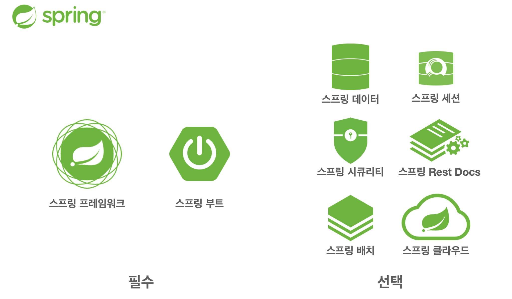
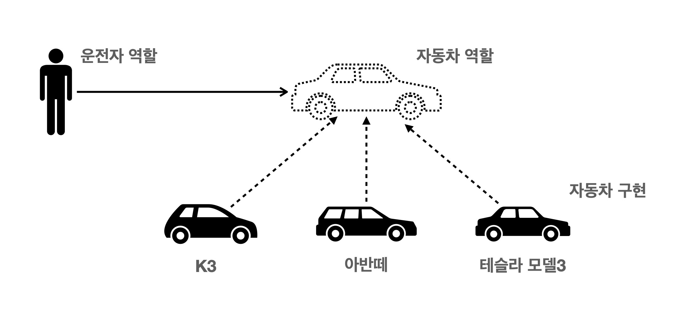
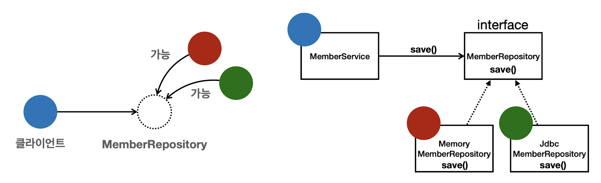

# 스프링의 역사
옛날 옛적에....
Spring 이전에 EJB(Enterprise Java Beans)가 있었다. - 지옥이였다.....(영한쌤왈)

EJB의 대체제로 Spring 등장!!
\+ EJB 엔티티빈 대체제로 하이버네이트(JPA) 등장!!

**JPA 구현체들**


- 2002년 로드 존슨 책 출간 - BeanFactory, ApplicationContext, POJO, 제어의 역전, 의존관계 주입 등의 내용

# 스프링이란
## 스프링 생태계


### 스프링 프레임워크
- 핵심 기술 : 스프링 DI 컨테이너, AOP, 이벤트, 기타
- 웹 기술 : 스프링 MVC, 스프링 WebFlux
- 데이터 접근 기술 : 트랜잭션, JDBC, ORM 지원, XML 지원
- 기술 통합: 캐시, 이메일, 원격접근, 스케줄링
- 테스트 : 스프링 기반 테스트 지원
- 언어 : 코틀린, 그루비
- 최근 스프링 부트를 통해서 스프링 프레임워크의 기술들을 편리하게 사용

### 스프링 부트
- 스프링을 편리하게 사용할 수 있도록 지원
- 단독으로 실행할 수 있는 스프링 애플리케이션을 쉽게 생성
- Tomcat 같은 웹 서버를 내장해서 별도의 웹 서버를 설치하지 않아도 됨
- 손쉬운 빌드 구성을 위한 starter 종속성 제공
- 스프링과 3rd party(외부) 라이브러리 자동 구성(버전 최적화 등)
- 메트릭, 상태 확인, 외부 구성 같은 프로덕션 준비 기능 제공
- 관례에 의한 간결한 설정

### `스프링`의 의미
`스프링`이라는 단어는 문맥에 따라 다르게 사용된다.
- 스프링 DI 컨테이너 기술
- 스프링 프레임워크
- 스프링 부트, 스프링 프레임워크 등을 모두 포함한 스프링 생태계

# 스프링은 왜 만들어졌을까?
## 스프링의 핵심 개념, 컨셉
- 스프링은 자바 언어 기반의 프레임워크
- 자바 언어의 가장 큰 특징은 `객체 지향 언어`
- 스프링은 객체 지향 언어가 가진 강력한 특징을 살려내는 프레임워크
- 스프링은 좋은 객체 지향 애플리케이션을 개발할 수 있게 도와주는 프레임워크

## 객체 지향 프로그래밍
- 객체 지향 프로그래밍은 컴퓨터 프로그램을 명령어의 목록으로 보는 시각에서 벗어나 여러 개의 독립된 단위. 즉, **`객체`들의 모임**으로 파악하고자 하는 것이다.
- 각각의 객체는 메시지를 주고받고, 데이터를 처리할 수 있다.(**협력**)
- 객체 지향 프로그래밍은 프로그램을 **유연**하고 **변경 용이**하게 만들기 때문에 대규모 소프트웨어 개발에 많이 사용된다.

### 객체 지향의 특징
- 추상화
- 캡슐화
- 상속
- 다형성

> `유연하고 변경 용이하다.`  ⇒ `다형성`
> - 레고 블럭을 조립하듯이
> - 키보드, 마우스를 갈아 끼우듯이
> - 컴퓨터 부품 갈아 끼우듯이
> - **컴포넌트를 쉽고 유연하게 변경하면서 개발할 수 있는 방법**

### 다형성
> `역할`과 `구현`으로 구분

#### 예시 1) 운전자 - 자동차
> 모델이 바뀌어도 자동차 동작은 가능

#### 예시2) 연극
> 사람이 바뀌어도 공연은 가능


#### 역할과 구현을 분리
- 클라이언트는 대상의 역할(인터페이스)만 알면 된다.
- 클라이언트는 구현 대상의 내부 구조를 몰라도 된다.
- 클라이언트는 구현 대상의 내부 구조가 변경되어도 영향을 받지 않는다.
- 클라이언트는 구현 대상 자체를 변경해도 영향을 받지 않는다.

**자바 언어에서**
- 역할 = 인터페이스
- 구현 = 인터페이스를 구현한 클래스, 구현 객체
- 객체를 설계할 때 역할과 구현을 명확히 분리
- 객체 설계시 역할(인터페이스)을 먼저 부여하고, 그 역할을 수행하는 구현 객체 만들기

**객체의 협력이라는 관계부터 생각**
- 혼자 있는 객체는 없다.
- 클라이언트 : 요청 - 서버 : 응답
- 수 많은 객체 클라이언트와 객체 서버는 서로 협력 관계를 가진다.

#### 자바 언어에서 다형성
- `오버라이딩`
	- 오버라이딩 된 메서드가 실행됨.
- 다형성으로 인터페이스를 구현한 객체를 실행 시점에 유연하게 변경할 수 있다.
- 클래스 상속 관계도 다형성, 오버라이딩 적용

- 클라이언트는 **MemberRepository**를 보고 있지만 **MemberRepository**에는 **MemoryMemberRepository**와 **JdbcMemberRepository** 구현 가능. 클라이언트는 어떤걸 구현하지는지는 모름
- 다형성의 본질을 이해하려면 **협력**이라는 객체사이의 관계에서 시작해야함.

>**클라이언트를 변경하지 않고, 서버의 구현 기능을 유연하게 변경할 수 있다.**

### 좋은 객체 지향 설계의 5가지 원칙(SOLID)
> 클린코드로 유명한 로버트 마틴이 좋은 객체 지향 설계의 5가지 원칙을 정리
> - 단일 책임 원칙(SRP, Single Responsibility Principle)
> - 개방-폐쇄의 원칙(OCP, Open/Closed Principle)
> - 리스코프 치환 원칙(LSP, Liskov Substitution Principle)
> - 인터페이스 분리 원칙(ISP, Interface Segregation Principle)
> - 의존관계 역전 원칙(DIP, Dependency Inversion Principle)

#### 단일 책임 원칙(SRP, Single Responsibility Principle)
- 하나의 클래스는 '하나의 책임'만 가져야 한다.
- '하나의 책임'이 지칭하는 것은 모호하지만, **중요한 기준은 변경**이다. - 변경이 있을 때 파급 효과가 적으면 단일 책임 원칙을 잘 따른 것(의존성↓)
- ex) UI 변경, 객체의 생성과 사용을 분리

#### 개방-폐쇄의 원칙(OCP, Open/Closed Principle)
- 소프트웨어 요소는 확장에는 열려있으나 변경에는 닫혀 있어야 한다.
- 확장을 하려면 코드 변경이 필수불가하지 않은가..? → `다형성`을 이용한다면?
- 인터페이스를 구현한 새로운 클래스를 하나 만들어서 새로운 기능을 구현 - 역할과 구현의 분리
```java
public class MemberService{
	//private MembeRepository memberRepository = new MemoryMemberRositry();
	private MemberRepository memberRepository = new JdbcMemberRepository();
}
```
- 다형성을 사용했지만 구현 객체를 변경하려면 클라이언트 코드를 변경해야 한다. → OCP 원칙이 지켜지지 않음.
- 이 문제를 해결하기 위해서는 객체를 생성하고, 연관관계를 맺어주는 별도의 조립, 설정자가 필요하다. → Spring DI 등이 필요

#### 리스코프 치환 원칙(LSP, Liskov Substitution Principle)
- 프로그램의 객체는 프로그램의 정확성을 깨뜨리지 않으면서 하위 타입의 인스턴스로 바꿀 수 있어야 한다.
- 단순히 컴파일에 성공했다는 것이 아니라 다형성에서 하위 클래스는 인터페이스 규약을 다 지겨야 한다는 것. 
- 인터페이스를 구현한 구현체를 믿고 사용하려면 이 원칙이 필요하다.(다형성을 지원하기 위한 원칙)
- 예) 자동차 인터페이스의 엑셀은 앞으로 가라는 기능. 뒤로 가게 구현하면 LSP 위반. - 뒤로간다고 에러는 나지 않지만 인터페이스 기능에 위반

#### 인터페이스 분리 원칙(ISP, Interface Segregation Principle)
- 특정 클라이언트를 위한 인터페이스 여러 개가 범용 인터페이스 하나보다 낫다.
- 자동차 인터페이스 → 운전 인터페이스, 정비 인터페이스로 분리
- 사용자 클라이언트 → 운전자 클라이언트, 정비사 클라이언트로 분리
- 분리하면 정비 인터페이스 자체가 변해도 운전자 클라이언트에 영향을 주지 않음
- 분리로 인해 인터페이스가 명확해지고, 대체 가능성이 높아진다.

#### 의존관계 역전 원칙(DIP, Dependency Inversion Principle)
- 프로그래머는 **"추상화에 의존해야지, 구체화에 의존하면 안된다."** 라는 의존성 주입은 이 원칙을 따르는 방벙 중 하나이다.
- 즉, 구현 클래스에 의존하지 말고, 인터페이스에 의존하라는 원칙
- 위에서 얘기한 **역할에 의존하게 해야 한다**는 것과 같다. 객체도 클라이언트가 인터페이스에 의존해야 유연하게 구현체를 변경할 수 있다. 구현체에 의존하게 되면 변경이 어려워진다.
- OCP원칙에서 설명한 **MemberService**는 인터페이스에 의존함과 동시에 구현 클래스도 의존한다. → **MemberService** 클라이언트가 구현 클래스를 직접 선택 - DIP위반

**다형성만으로는 OCP, DIP 를 지킬 수 없다.**

## 스프링에서 객체 지향
스프링은 다음 기술로 **다형성 +  OCP, DIP**를 가능하게 지원한다.
- DI(Dependency Injection) : 의존관계, 의존성 주입
- DI 컨테이너 제공
클라이언트 코드의 변경 없이 기능 확장

# 정리
- 모든 설계에 **역할**과 **구현**을 분리하자.(자동차, 공연처럼)
- 애플리케이션 설계도 공연을 설계 하듯이 배역(역할)만 만들어두고, 배우(구현)는 언제든지 유연하게 병경할 수 있도록 만드는 것이 좋은 객체 지향 설계이다.
- 이상적으로는 모든 설계에 인터페이스를 부여하자.
**실무에서는 비용문제**
- 인터페이스를 도입하면 추상화라는 비용이 발생한다.
- 기능을 확장할 가능성이 없다면, 구체 클래스를 직접 사용하고, 향후 꼭 필요할 때 리펙토링해서 인터페이스를 도입하는 것도 방법이다.


