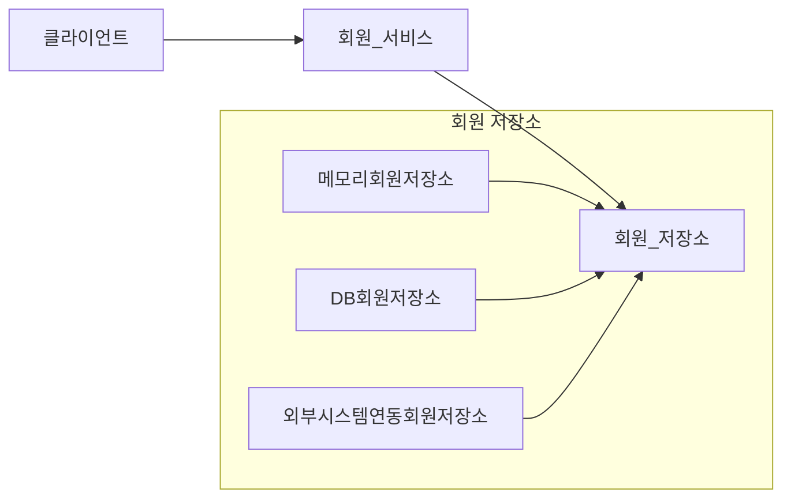
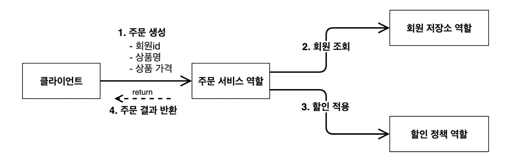
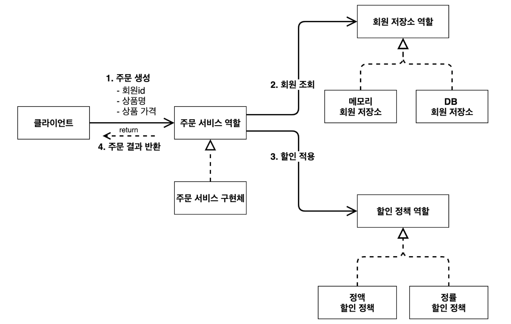
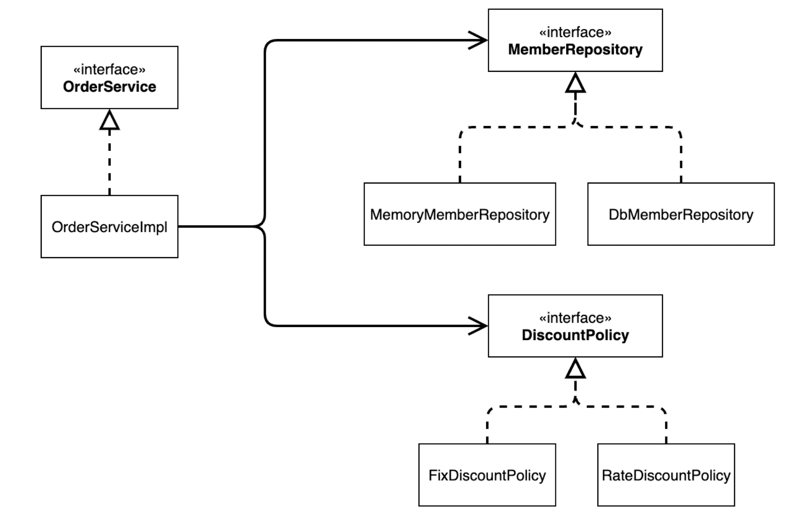
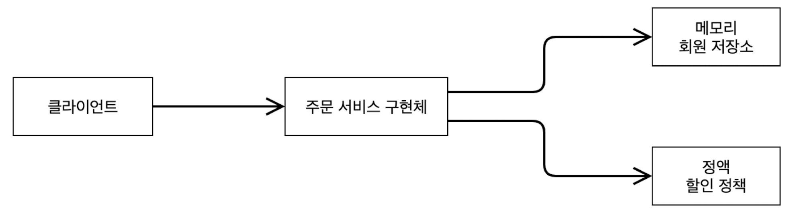
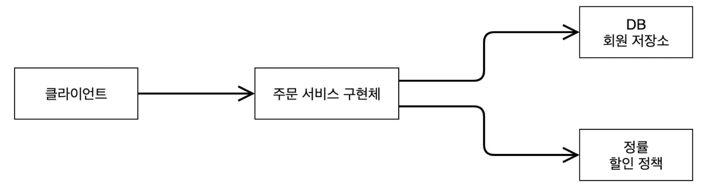

# 프로젝트 생성
[start.spring.io](https://start.spring.io)
- Project : Gradle - Groovy
- Language : Java
- Spring Boot : 3.3.4
- Project Metadata
	- Group : hello
	- Artifact : core(build 명이 됨)
	- Packaging : Jar
	- Java : 17
> 스프링 부트 3.0 이상은 
> - Java17 이상, JDK 17 이상을 사용해야 함.
> - javax 패키지 → jakarta로 변경(오라클과 자바 라이센스 문제로 변경됨)
> - H2 데이터베이스를 2.1.214 이상 버전을 사용.
> - 자세한 내용은 [https://bit.ly/springboot3 ](https://bit.ly/springboot3 )을 참고

>💡IntelliJ Gradle 대신에 자바 직접 실행
>스프링 부트 3.2 이전인 경우 적용(스프링 부트 3.2 이상은 Gradle적용)
>최근 IntelliJ 버전은 Gradle을 통해서 실행하는 것이 기본 설정이다. 하지만 이렇게 하면 실행 속도가 느리고 에러가 발생하니 자바로 바로 실행하는걸 권장
>- Preferences → Build, Execution, Deplyment → Build Tools → Gradle
>	- Build and run using : Gradle → IntelliJ IDEA
>	- Run tests using : Gradle → IntelliJ IDEA


# 비즈니스 요구사항과 설계
- 회원
	- 회원을 가입하고 조회할 수 있다.
	- 회원은 일반과 VIP 두 가지 등급이 있다.
	- 회원 데이터는 자체 DB를 구축할 수 있고, 외부 시스템과 연동할 수 있다.(미확정)
- 주문과 할인 정책
	- 회원은 상품을 주문할 수 있다.
	- 회원 등급에 따라 할인 정책을 적용할 수 있다.
	- 할인 정책은 모든 VIP는 1000원을 할인해주는 고정 금액 할인을 적용한다.(추후 변경 예정)
	- 할인 정책은 변경 가능성이 높다. 회사의 기본 할인 정책을 못정함. 

# 회원 도메인 설계
- 회원 도메인 협력 관계


- 회원 클래스 다이어그램 - 서버를 실행시키지 않고 클래스만 분석해서 표현(정적)


- 회원 객체 다이어그램 - 서버가 뜰 때 new 해서 뭘할지(동적)

- 회원 서비스 : MemberServiceImpl

# 회원 도메인 개발
## 회원 엔티티
### 회원 등급
```java
package hello.core.member;  
  
public enum Grade {  
    BASIC, VIP  
}
```

### 회원 엔티티
```java
package hello.core.member;  
  
import lombok.Getter;  
import lombok.Setter;  
  
@Getter @Setter  
public class Member {  
  
    private Long id;  
    private String name;  
    private Grade grade;  

	public Member(Long id, String name, Grade grade) {  
	    this.id = id;  
	    this.name = name;  
	    this.grade = grade;  
	}
}
```


## 회원 저장소 
> 실무에서는 인터페이스와 구현체는 다른 폴더에 저장

### 회원 저장소 인터페이스
```java
package hello.core.member;  
  
public interface MemberRepository {  
  
    void save(Member member);  
  
    Member findById(Long memberId);  
}
```

### 메모리 회원 저장소 구현체
```java
package hello.core.member;  
  
import java.util.HashMap;  
import java.util.Map;  
  
public class MemoryMemberRepository implements MemberRepository {  
  
    private static Map<Long, Member> store = new HashMap<>();  
  
    @Override  
    public void save(Member member) {  
        store.put(member.getId(), member);  
    }  
  
    @Override  
    public Member findById(Long memberId) {  
        return store.get(memberId);  
    }  
}
```

> 💡`HashMap`은 동시성 이슈가 발생할 수 있다. 이런 경우 `ConcurrentHashMap`을 사용하자


## 회원 서비스
- 기능
	- 회원가입
	- 회원조회

### 회원 서비스 인터페이스
```java
package hello.core.member;  
  
public interface MemberService {  
    void join(Member member);  
  
    Member findMember(Long memberId);  
}
```


### 회원 서비스 구현체
```java
package hello.core.member;  
  
public class MemberServiceImpl implements MemberService {  
  
    private final MemberRepository memberRepository = new MemoryMemberRepository();  
  
    @Override  
    public void join(Member member) {  
        memberRepository.save(member);  
    }  
  
    @Override  
    public Member findMember(Long memberId) {  
        return memberRepository.findById(memberId);  
    }  
}
```


## 회원 도메인 실행과 테스트
### 회원 도메인 - 회원 가입 main
```java
package hello.core;  
  
import hello.core.member.Grade;  
import hello.core.member.Member;  
import hello.core.member.MemberService;  
import hello.core.member.MemberServiceImpl;  
  
public class MemberApp {  
    public static void main(String[] args) {  
        MemberService memberService = new MemberServiceImpl();  
        Member member = new Member(1L, "memberA", Grade.VIP);  
        memberService.join(member);  
  
        Member findMember = memberService.findMember(1L);  
        System.out.println("new member = " + member.getName());  
        System.out.println("find member = " + findMember.getName());  
    }  
}
```

### 회원 도메인 - 회원 가입 테스트
```java
package hello.core.member;  
  
import org.assertj.core.api.Assertions;  
import org.junit.jupiter.api.Test;  
  
import static org.assertj.core.api.Assertions.assertThat;  
  
class MemberServiceTest {  
  
    MemberService memberService = new MemberServiceImpl();  
  
    @Test  
    void join(){  
        //given  
        Member member = new Member(1L, "mamberA", Grade.VIP);  
          
        //when  
        memberService.join(member);  
        Member findMember = memberService.findMember(1L);  
          
        //then  
        assertThat(member).isEqualTo(findMember);  
    }  
}
```

## 회원 도메인 설계의 문제점
- 다른 저장소로 변경할 때 OCP 원칙을 잘 준수하지 못함.
- DIP 지키고 있지 않음
- 의존관계가 인터페이스 뿐만 아니라 구현까지 모두 의존하는 문제점이 있다.


# 주문과 할인 도메인 설계
- 주문 도메인 협력, 역할, 책임

	1. 주문 생성 : 클라이언트는 주문 서비스에 주문 생성을 요청한다.
	2. 회원 조회 : 할인을 위해서는 회원 등급이 필요하다. 그래서 주문 서비스는 회원 저장소에서 회원을 조회한다.
	3. 할인 적용 : 주문 서비스는 회원 등급에 따른 할인 여부를 할인 정책에 위임한다.
	4. 주문 결과 반환 : 주문 서비스는 할인 결과를 포함한 주문 결과를 반환한다.

- 주문 도메인 전체


- 주문 도메인 클래스 다이어그램


- 주문 도메인 객체 다이어그램1


- 주문 도메인 객체 다이어그램2



# 주문과 할인 도메인 개발
## 할인 정책
### 할인 정책 인터페이스
```java
package hello.core.discount;  
  
import hello.core.member.Member;  
  
public interface DiscountPolicy {  
    /**  
     * @return 할인 대상 금액  
     */  
    int discount(Member member, int price);  
}
```


### 정액 할인 정책 구현체
```java
package hello.core.discount;  
  
import hello.core.member.Grade;  
import hello.core.member.Member;  
  
public class FixDiscountPolicy implements DiscountPolicy {  
      
    private int discountFixAmount = 1000; //1000원할인   
    @Override  
    public int discount(Member member, int price) {  
        if (member.getGrade() == Grade.VIP) {  // Enum 타입은 `==` 비교  
            return discountFixAmount;  
        } else {  
            return 0;  
        }   
          
    }  
}
```

## 주문
### 주문 엔티티
```java
package hello.core.order;  
  
import lombok.Getter;  
import lombok.Setter;  
  
@Getter  
@Setter  
public class Order {  
      
    private Long memberId;  
    private String itemName;  
    private int itemPrice;  
    private int discountPrice;  
  
    public Order(Long memberId, String itemName, int itemPrice, int discountPrice) {  
        this.memberId = memberId;  
        this.itemName = itemName;  
        this.itemPrice = itemPrice;  
        this.discountPrice = discountPrice;  
    }  
      
    public int calculatePrice(){  
        return itemPrice - discountPrice;  
    }  
      
    @Override  
    public String toString(){  
        return "Order{" +  
                "memberId=" + memberId +   
                ", itemName='" + itemName + '\'' +  
                ", itemPrice=" + itemPrice +  
                ", discountPrice=" + discountPrice +   
                '}';  
    }  
}
```

### 주문 서비스 인터페이스
```java
package hello.core.order;  
  
public interface OrderService {  
    Order createOrder(Long memberId, String itemName, int itemPrice);  
}
```

### 주문 서비스 구현체
```java
package hello.core.order;  
  
import hello.core.discount.DiscountPolicy;  
import hello.core.discount.FixDiscountPolicy;  
import hello.core.member.Member;  
import hello.core.member.MemberRepository;  
import hello.core.member.MemoryMemberRepository;  
  
public class OrderServiceImpl implements OrderService {  
  
    private final MemberRepository memberRepository = new MemoryMemberRepository();  
    private final DiscountPolicy discountPolicy = new FixDiscountPolicy();  
  
    @Override  
    public Order createOrder(Long memberId, String itemName, int itemPrice) {  
        Member member = memberRepository.findById(memberId);  
        int discountPrice = discountPolicy.discount(member, itemPrice);  
  
        return new Order(memberId, itemName, itemPrice, discountPrice);  
    }  
}
```

## 주문과 할인 도메인 실행과 테스트

### 주문과 할인 정책 실행
```java
package hello.core;  
  
import hello.core.member.Grade;  
import hello.core.member.Member;  
import hello.core.member.MemberService;  
import hello.core.member.MemberServiceImpl;  
import hello.core.order.Order;  
import hello.core.order.OrderService;  
import hello.core.order.OrderServiceImpl;  
  
public class OrderApp {  
    public static void main(String[] args) {  
        MemberService memberService = new MemberServiceImpl();  
        OrderService orderService = new OrderServiceImpl();  
          
        long memberId = 1L;  
        Member member = new Member(memberId, "memberA", Grade.VIP);  
        memberService.join(member);  
  
        Order order = orderService.createOrder(memberId, "itemA", 10000);  
        System.out.println("order = " + order);  
    }  
}
```
[실행결과]
```
order = Order{memberId=1, itemName='itemA', itemPrice=10000, discountPrice=1000}
```

### 주문과 할인 정책 테스트
```java
package hello.core.order;  
  
import hello.core.member.Grade;  
import hello.core.member.Member;  
import hello.core.member.MemberService;  
import hello.core.member.MemberServiceImpl;  
import org.assertj.core.api.Assertions;  
import org.junit.jupiter.api.Test;  
  
class OrderServiceTest {  
    MemberService memberService = new MemberServiceImpl();  
    OrderService orderService = new OrderServiceImpl();  
      
    @Test  
    void createOrder(){  
        long memberId = 1L;  
        Member member = new Member(memberId, "memberA", Grade.VIP);  
        memberService.join(member);  
  
        Order order = orderService.createOrder(memberId, "itemA", 10000);  
        Assertions.assertThat(order.getDiscountPrice()).isEqualTo(1000);  
    }  
}
```


>💡단위테스트 : 순수 자바로 실행 가능한 테스트. 빠름!(중요!)
>ps. `@SprintTest` : 스프링 띄우고 난 뒤에 테스트 진행


