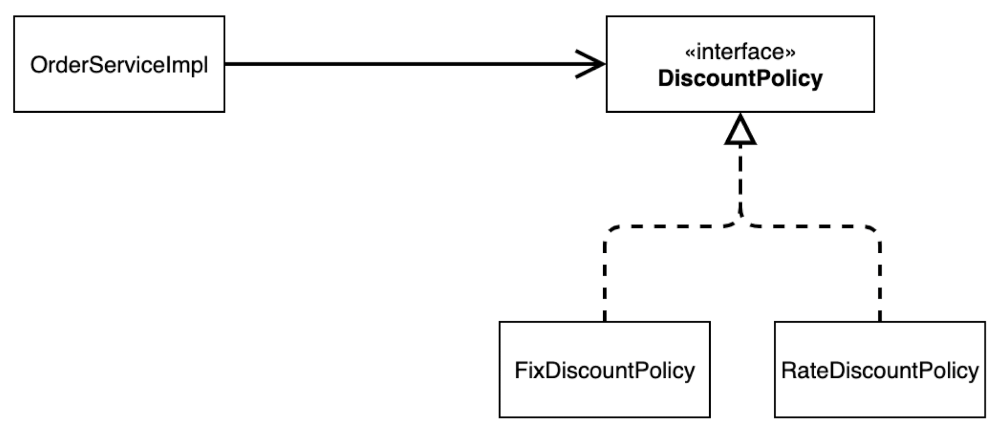
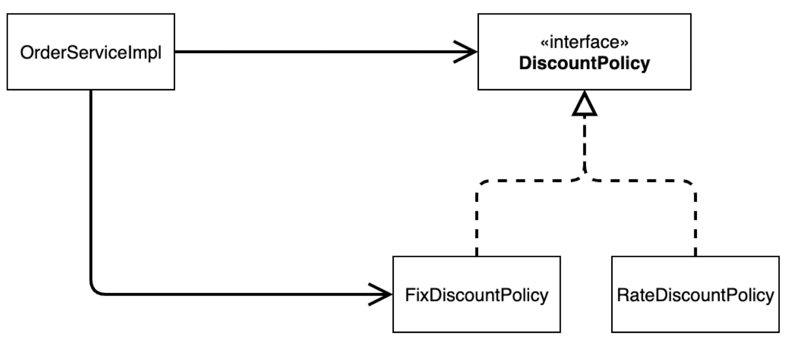
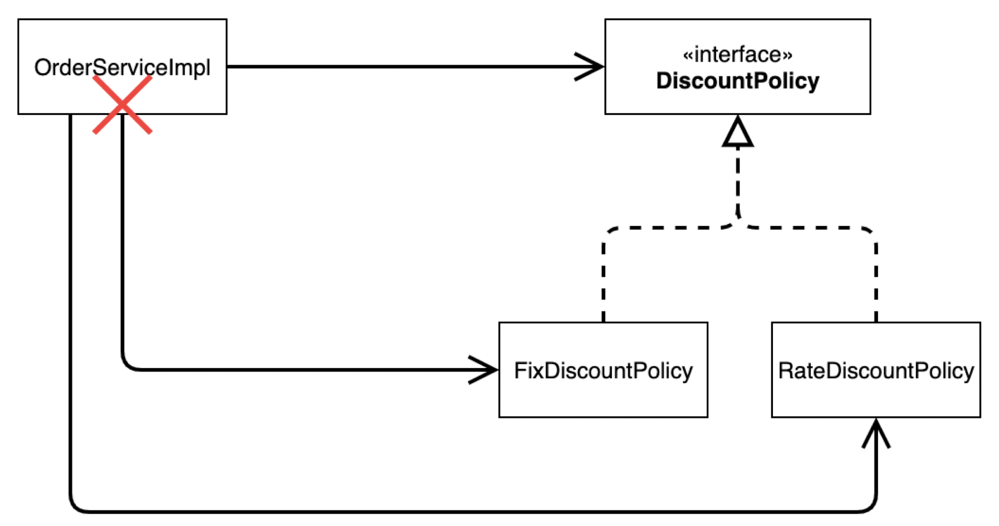
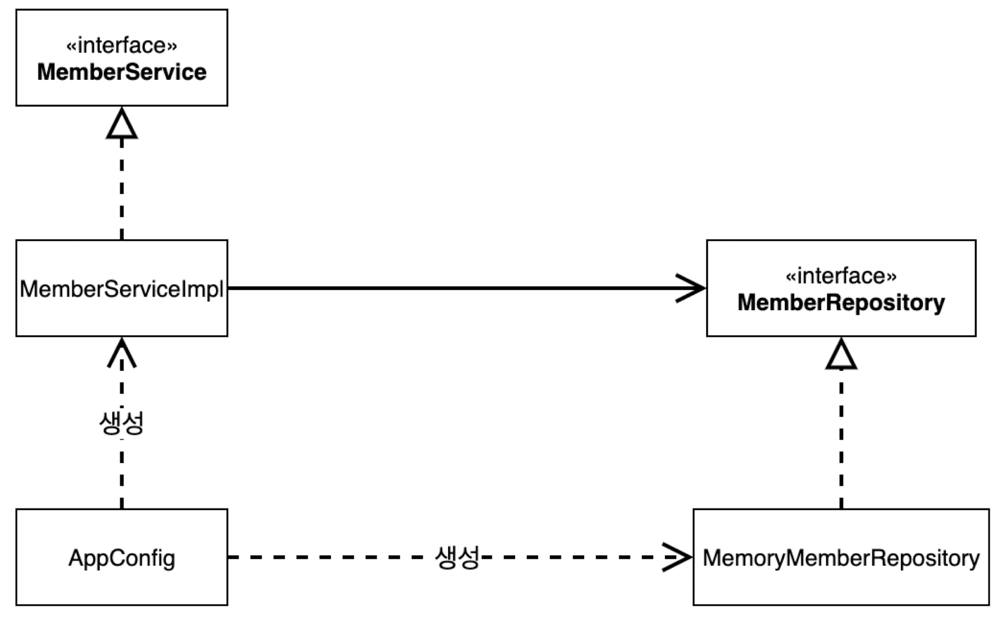
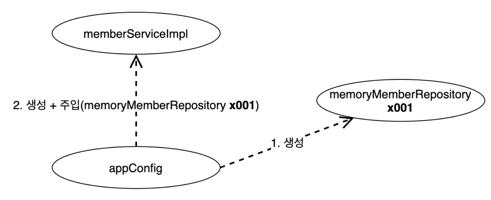
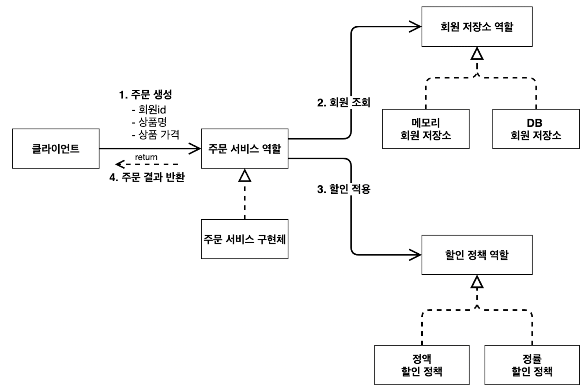
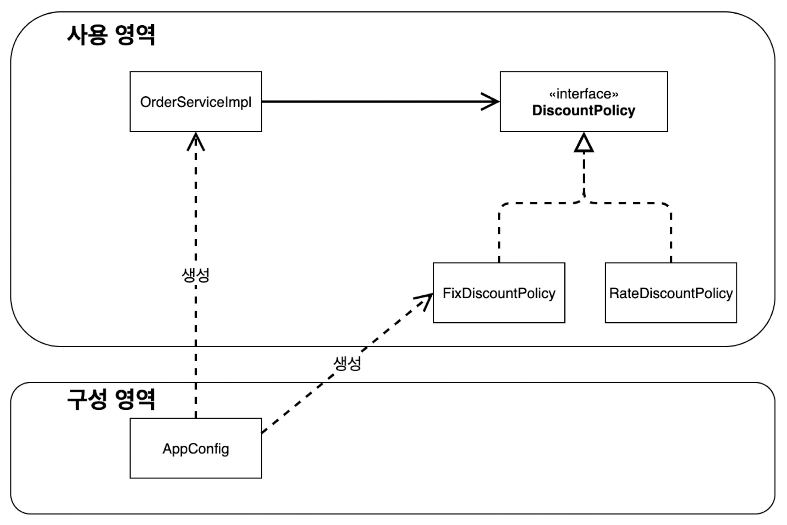
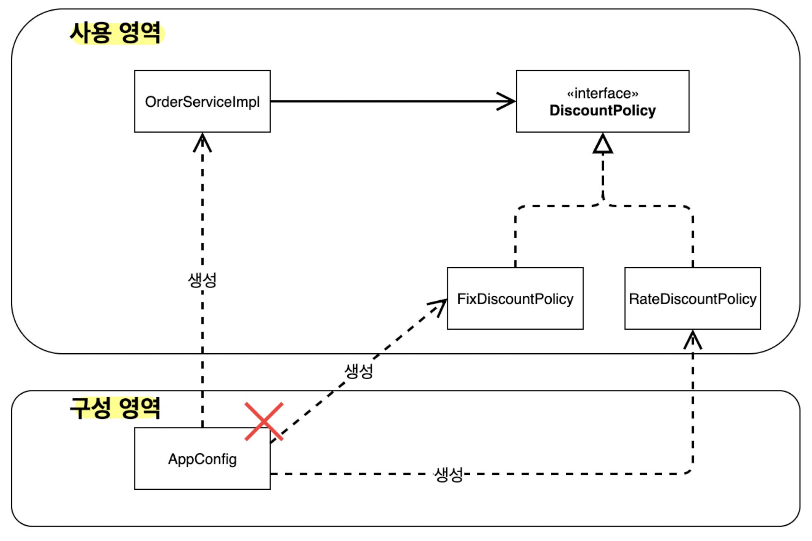
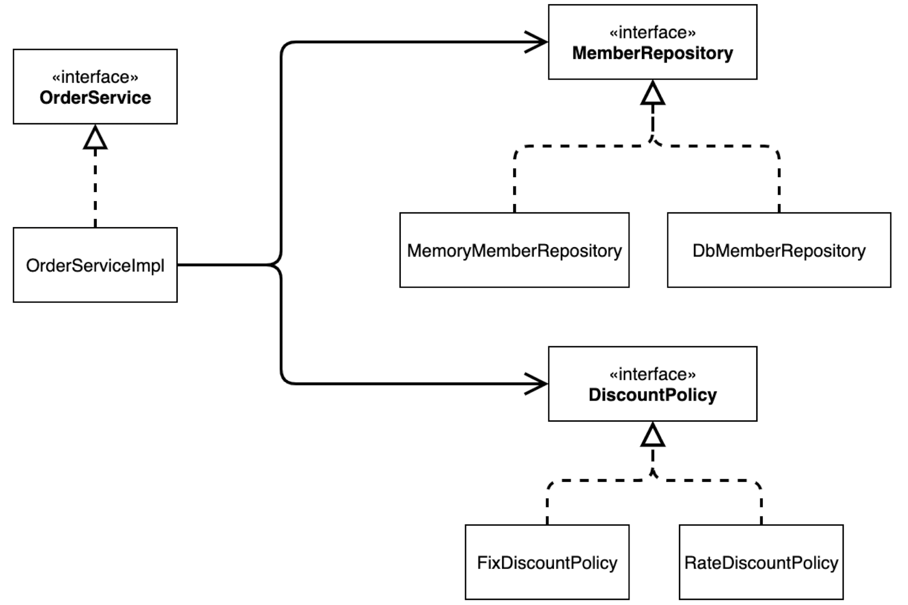
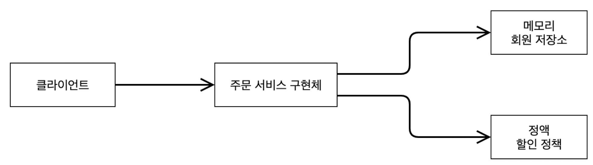

# 새로운 할인 정책 개발
- 1000원 할인 → 10% 할인(정액제 할인 → 정률제 할인)

## RestDiscountPolicy 추가



### RateDiscountPolicy 코드 추가
```java
package hello.core.discount;  
  
import hello.core.member.Grade;  
import hello.core.member.Member;  
  
public class RateDiscountPolicy implements DiscountPolicy {  
      
    private int discountPercent = 10; // 10% 할인  
    @Override  
    public int discount(Member member, int price) {  
  
        if (member.getGrade() == Grade.VIP) {  
            return price * discountPercent / 100;  
        } else {  
            return 0;  
        }   
    }  
}
```


### 테스트 작성
```java
package hello.core.discount;  
  
import hello.core.member.Grade;  
import hello.core.member.Member;  
import org.junit.jupiter.api.DisplayName;  
import org.junit.jupiter.api.Test;  
  
import static org.assertj.core.api.Assertions.assertThat;  
import static org.junit.jupiter.api.Assertions.*;  
  
class RateDiscountPolicyTest {  
  
    RateDiscountPolicy discountPolicy = new RateDiscountPolicy();  
  
    @Test  
    @DisplayName("VIP는 10% 할인이 적용되어야 한다.")  
    void vip_o(){  
        //given  
        Member member = new Member(1L, "memberVIP", Grade.VIP);  
  
        //when  
        int discount = discountPolicy.discount(member, 10000);  
  
        //then  
        assertThat(discount).isEqualTo(1000);  
    }  
  
    @Test  
    @DisplayName("VIP가 아니면 할인이 적용되지 않아야 한다.")  
    void vip_x(){  
        //given  
        Member member = new Member(2L, "memberBASIC", Grade.BASIC);  
  
        //when  
        int discount = discountPolicy.discount(member, 10000);  
  
        //then  
        assertThat(discount).isEqualTo(0);  
    }  
  
}
```

# 새로운 할인 정책 적용과 문제점
## 새로운 할인 정책을 애플리케이션에 적용
```java
public class OrderServiceImpl implements OrderService {
//    private final DiscountPolicy discountPolicy = new FixDiscountPolicy();  
    private final DiscountPolicy discountPolicy = new RateDiscountPolicy();
}
```
- 역할(DiscountPolicy)과 구현(FixDiscountPolicy, RateDiscountPolicy)을 분리했지만, OCP, DIP 원칙을 지키지 못함.
- DIP 위반 : 클래스 의존관계를 분석해 보면, 추상(인터페이스)뿐만 아니라 구체(구현) 클래스에도 의존하고 있다.
	- 추상(인터페이스) 의존 : **DiscountPolicy**
	- 구체(구현) 클래스 : **FixDiscountPolicy**, **RateDiscountPolicy**
	- 단순히 **DiscountPolicy** 인터페이스만 의존하다고 생각했지만,
		
	- 실제로는 클라이언트인 **OrderServiceImpl**이 **DiscountPolicy** 인터페이스 뿐만 아니라 **FixDiscountPolicy**인 구체 클래스도 함께 의존하고 있다. 
- OCP 위반 : 지금 코드는 기능을 확장해서 변경하면, 클라이언트 코드에 영향을 준다.
	- 할인 정책을 변경하면
		
	- **FixDiscountPolicy**를 **RateDiscountPolicy**로 변경하는 순간 **OrderServiceImple**의 소스코드도 함께 변경해야 한다. - 변경시 코드도 같이 변경해야 한다면 의존하고 있다는 것.

# 해결 방안
## 인터페이스에만 의존하도록 설계를 변경


### 인터페이스에만 의존하도록 코드 변경
```java
public class OrderServiceImpl implements OrderService {
//	private final DiscountPolicy discountPolicy = new RateDiscountPolicy(); 
	private DiscountPolicy discountPolicy;
}
```
- 인터페이스에만 의존하도록 코드를 변경했지만, 구현체가 없음 - 실제 실행해보면 NPE(NullPointException) 발생.
- 누군가가 클라이언트인 **OrderServiceImpl**에 **DiscountPolicy** 구현 객체를 대신 생성하고 주입해주어야 한다.

## 관심사의 분리
애플리케이션의 하나의 공연으로 생각해보자. 각각의 인터페이스를 배역(배우 역할)이라 생각하자. 실제 배역 맞는 배우를 선택하는 건 배우들이 하는 역할이 아니다.
배우는 본인의 역할인 배역을 수행하는 것에만 집중해야한다. 공연을 구성하고, 담당 배우를 섭외하고, 역할에 맞는 배우를 지정하는 책임을 담당하는 별도의 **공연 기획자**가 필요하다.
공연 기획자를 만들고, 배우와 공연 기획자의 책임을 확실히 분리하자.
### AppConfig 등장
애플리케이션의 전체 동작 방식을 구성(config)하기 위해, 구현 객체를 생성하고, 연결하는 책임을 가지는 별되의 설정 클래스를 만들자.

**AppConfig**
```java
package hello.core;  
  
import hello.core.discount.FixDiscountPolicy;  
import hello.core.member.MemberService;  
import hello.core.member.MemberServiceImpl;  
import hello.core.member.MemoryMemberRepository;  
import hello.core.order.OrderService;  
import hello.core.order.OrderServiceImpl;  
  
public class AppConfig {  
  
    public MemberService memberService(){  
        return new MemberServiceImpl(new MemoryMemberRepository());  
    }  
      
    public OrderService orderService(){  
        return new OrderServiceImpl(  
                new MemoryMemberRepository(),  
                new FixDiscountPolicy());  
    }  
}
```
- AppConfig는 애플리케이션의 실제 동작에 필요한 **구현 객체**를 생성한다.
	- **MemberServiceImpl**
	- **MemoryMemberRepository**
	- **OrderServiceImple**
	- **FixDiscountPolicy**
- AppConfig는 생성한 객체 인스턴스의 참조(레퍼런스)를 **생성자를 통해서 주입(연결)**해준다.
	- **MemberServiceImpl** → **MemoryMemberRepository**
	- **OrderServiceImpl** → **MemoryMemberRepository**, **FixDiscountPolicy**


### MemberServiceImpl -  생성자 주입
```java
public class MemberServiceImpl implements MemberService {  
    private final MemberRepository memberRepository;  
    public MemberServiceImpl(MemberRepository memberRepository) {  
        this.memberRepository = memberRepository;  
    }
}
```
- **MemberServiceImpl**은 **MemoryMemberRepository**를 의존하지 않는다. 단지, **MemberRepository** 인터페이스만 의존한다.
- **MemberServiceImpl** 입장에서 생성자를 통해 어떤 구현 객체가 들어올지(주입될지) 알 수 없다.
- **MemberServiceImpl**의 생성자를 통해서 어떤 구현 객체를 주입할지는 오직 외부(**AppConfig**)에서 결정된다.
- 따라서, **MemberServiceImpl**은 **의존관계에 대한 고민은 외부**에 맡기고 **실행에만 집중**하면 된다.


- 객체의 생성과 연결은 **AppConfig**가 담당한다.
- **DIP 완성** : **MemberServiceImple**은 **MemberRepository**인 추상에만 의존하면 된다. 
- **관심사의 분리** : 객체를 생성하고 연결하는 역할과 실행하는 역할이 명확히 분리되었다.

### 회원 객체 인스턴스 다이어그램

- **appConfig**객체는 **memoryMemberRepository**객체를 생성하고 그 참조값을 **memberServiceImpl**을 생성하면서 생성자로 전달한다.
- 클라이언트인 **memberServiceImpl** 입장에서 보면 의존관계를 마치 외부에서 주입해주는 것 같다고 해서 **DI(Dependency Injection), 의존관계 주입 또는 의존성 주입**이라 한다.


### OrderServiceImpl - 생성자 주입
```java
public class OrderServiceImpl implements OrderService {  
  
//    private final DiscountPolicy discountPolicy = new FixDiscountPolicy();  
    private final MemberRepository memberRepository;  
    private final DiscountPolicy discountPolicy;  
  
    public OrderServiceImpl(MemberRepository memberRepository, DiscountPolicy discountPolicy) {  
        this.memberRepository = memberRepository;  
        this.discountPolicy = discountPolicy;  
    }
}
```
- **OrderServiceImpl**은 **FixDiscountPolicy**를 의존하지 않는다. 단지, **DiscountPolicy** 인터페이스만 의존한다.
- **OrderServiceImpl** 입장에서 생성자를 통해 어떤 구현 객체가 들어올지(주입될지) 알 수 없다.
- **OrderServiceImpl**의 생성자를 통해서 어떤 구현 객체를 주입할지는 오직 외부(**AppConfig**)에서 결정한다. - **OrderServiceImpl**은 실행에만 집중.
- **OrderServiceImpl**에는 **MemoryMemberRepository**, **FixDiscountPolicy** 객체의 의존관계가 주입된다.

## AppConfig 실행
### 사용 클래스 - MemberApp
```java
package hello.core;  
  
import hello.core.member.Grade;  
import hello.core.member.Member;  
import hello.core.member.MemberService;  
import hello.core.member.MemberServiceImpl;  
  
public class MemberApp {  
    public static void main(String[] args) {  
        AppConfig appConfig = new AppConfig();  
  
        MemberService memberService = appConfig.memberService();  
        Member member = new Member(1L, "memberA", Grade.VIP);  
        memberService.join(member);  
  
        Member findMember = memberService.findMember(1L);  
        System.out.println("new member = " + member.getName());  
        System.out.println("find member = " + findMember.getName());  
    }  
}
```

### 사용 클래스 - OrderApp
```java
package hello.core;  
  
import hello.core.member.Grade;  
import hello.core.member.Member;  
import hello.core.member.MemberService;  
import hello.core.member.MemberServiceImpl;  
import hello.core.order.Order;  
import hello.core.order.OrderService;  
import hello.core.order.OrderServiceImpl;  
  
public class OrderApp {  
    public static void main(String[] args) {  
        AppConfig appConfig = new AppConfig();  
        MemberService memberService = appConfig.memberService();  
        OrderService orderService = appConfig.orderService();  
  
        long memberId = 1L;  
        Member member = new Member(memberId, "memberA", Grade.VIP);  
        memberService.join(member);  
  
        Order order = orderService.createOrder(memberId, "itemA", 10000);  
        System.out.println("order = " + order);  
    }  
}
```

### 테스트 코드 오류 수정
```java
class MemberServiceTest {  
  
    MemberService memberService;  
  
    @BeforeEach  
    public void beforeEach(){  
        AppConfig appConfig = new AppConfig();  
        memberService = appConfig.memberService();  
    }
}
```
```java
class OrderServiceTest {  
    MemberService memberService;  
    OrderService orderService;  
      
    @BeforeEach  
    public void beforeEach(){  
        AppConfig appConfig = new AppConfig();  
        memberService = appConfig.memberService();  
        orderService = appConfig.orderService();  
    }
}
```

>💡 테스트 코드에서 `@BeforeEach`는 각 테스트를 실행하기 전에 호출된다.

### AppConfig 리팩터링
AppConfig에 중복 제거 및 역할, 구현 명시

```java
package hello.core;  
  
import hello.core.discount.DiscountPolicy;  
import hello.core.discount.FixDiscountPolicy;  
import hello.core.member.MemberRepository;  
import hello.core.member.MemberService;  
import hello.core.member.MemberServiceImpl;  
import hello.core.member.MemoryMemberRepository;  
import hello.core.order.OrderService;  
import hello.core.order.OrderServiceImpl;  
  
public class AppConfig {  
  
    public MemberService memberService(){  
        return new MemberServiceImpl(memberRepository());  
    }  
  
    public OrderService orderService(){  
        return new OrderServiceImpl(  
                memberRepository(),  
                discountPolicy());  
    }  
      
    public MemberRepository memberRepository(){  
        return new MemoryMemberRepository();  
    }  
      
    public DiscountPolicy discountPolicy(){  
        return new FixDiscountPolicy();  
    }  
}
```
- **new MemoryMemberRepository()** 부분이 중복 제거되었다. **MemoryMemberRepository**를 다른 구현체로 변경할 때 한 부분만 변경하면된다.
- **AppConfig**를 보면 역할과 구현 클래스가 한눈에 들어온다. 애플리케이션 전체 구성이 어떻게 되어있는지 빠르게 파악할 수 있다.

### 정리
- AppConfig를 통해서 관심사를 확실하게 분리했다.
- AppConfig는 공연 기획자 역할
- AppConfig는 구체 클래스를 선택한다. 배역에 맞는 담당 배우를 선택하고, 애플리케이션이 어떻게 동작해야 할지 전체 구성을 책임진다.
- **OrderServiceImpl**은 기능을 실행하는 책임만 지면된다.


# 새로운 할인 정책 적용
**AppConfig**의 등장으로 애플리케이션이 크게 사용 영역과, 객체를 생성하고 구성(Configuration)하는 영역으로 분리되었다.


- 할인 정책 변경

- **FixDiscountPolicy** → **RateDiscountPolicy**로 변경해도 구성 영역만 영향을 받고, 사용 영역은 전혀 영향을 받지 않는다.

```java
public class AppConfig {
	public DiscountPolicy discountPolicy(){  
	//        return new FixDiscountPolicy();  
		return new RateDiscountPolicy();  
	}
}
```

# 객체 지향 설계 원칙 적용
여기서는 3가지 SRP, DIP, OCP를 적용했다.
## SRP 단일 책임 원칙
> 하나의 클래스는 하나의 책임만 가져야 한다.
- 클라이언트 객체는 직접 구현 객체를 생성하고, 연결하고, 실행하는 다양한 책임을 가지고 있음
- SRP 단일 책임 원칙을 따르면서 관심사를 분리함.
- 구현 객체를 생성하고 연결하는 책임은 AppConfig가 담당
- 클라이언트 객체는 실행하고 책임만 담당

## DIP 의존관계 역전 원칙
>프로그래머는 "추상화에 의존해야지, 구체화에 의존하면 안된다."
- 새로운 할인 정책을 개발하고, 적용하려니 클라이언트 코드도 함께 변경해야 했다. 기존 클라이언트 코드(OrderServiceImpl)는 DIP를 지키며 DiscountPolicy 추상화 인터페이스에 의존하는 것 같았지만, FixDiscountPolicy 구체화 구현 클래스에도 함께 의존했다.
- 클라이언트 코드가 DiscountPolicy 추상화 인터페이스에만 의존하도록 코드를 변경했다.
- 하지만 클라이언트 코드는 인터페이스만으로는 아무것도 실행할 수 없다. - NullPointException에러발생
- AppConfig가 FixCountPolicy 객체 인스턴스를 클라이언트 코드 대신 생성해서 클라이언트 코드에 의존관계를 주입했다. 

## OCP 개방폐쇄 원칙
> 소프트웨어 요소는 확장에는 열려 있으나 변경에는 닫혀 있어야 한다.
- 애플리케이션을 사용 영역과 구성 영역으로 나눔.
- AppConfig가 의존관계를 FixCountPolicy → RateDiscountPolicy로 변경해서 클라이언트 코드에 주입하므로 클라이언트 코드는 변경하지 않아도 됨.
- 소프트웨어 요소를 새롭게 확장해도 사용 영역의 변경은 닫혀 있다.(= 변경할 필요가 없다.)


# IoC, DI 컨테이너
## 제어의 역전 IoC(Inversion of Control)
> 제어의 역전이란, 객체의 생성과 제어를 개발자가 아닌 외부 시스템(프레임워크나 컨테이너)이 관리하는 방식이다. 즉, 객체의 생성과 의존성을 외부에서 처리한다.
- 기존 프로그램은 클라이언트 구현 객체가 스스로 필요한 서버 구현 객체를 생성, 연결, 실행했다. 즉, 구현 객체가 프로그램의 제어 흐름을 스스로 조종했다.
- 반면에 AppConfig가 등장한 이후에 구현 객체는 자신의 로직을 실행하는 역할만 담당한다.프로그램의 제어 흐름은 AppConfig가 가져간다. 예를 들어 OrderServiceImpl은 필요한 인터페이스들을 호출하지만, 어떤 구현 객체들이 실행될지 모른다.
- 프로그램에 대한 제어 흐름에 대한 권한은 모두 AppConfig가 가지고 있다. 
- 프로그램의 제어 흐름을 직접 제어하는 것이 아니라 외부에서 관리하는 것을 제어의 역전(IoC)라고 한다.


## 의존관계 주입 DI(Dependency Injection)
> 의존성 주입이란, IoC의 일반적인 구현 방법으로, 필요한 객체를 외부에서 주입받는 방식이다. 예를 들어, 클래스 A가 클래스 B를 필요로 할 때, A가 B를 직접 생성하는 것이 아니라, 외부에서 B를 주입받습니다.
- **OrderServiceImpl**은 **DiscountPolicy** 인터페이스에 의존한다. 실제 어떤 구현 객체가 사용될지는 모른다.
- 의존관계는 **정적인 클래스 의존관계와, 실행 시점에 결정되는 동적인 객체(인스턴스) 의존 관계** 둘을 분리해서 생각해야 한다.

### 정적인 클래스 의존관계
클래스가 사용하는 import 코드만 보고 의존관계를 쉽게 판단할 수 있다. 정적인 의존관계는 애플리케이션을 실행하지 않아도 분석할 수 있다. 
- **OrderServiceImple**은 **MemberRepository**, **DiscountPolicy**에 의존한다는 것을 알 수 있다. 이러한 클래스 의존관계 만으로는 실제 어떤 객체가 **OrderServiceImpl**에 주입 될지 알 수 없다.

**클래스 다이어그램**


### 동적인 객체 인스턴스 의존 관계
애플리케이션 실행 시점에 실제 생성된 객체 인스턴스의 참조가 연결된 의존 관계이다.
**객체 다이어그램**

- 애플리케이션 **실행 시점(런타임)** 에 외부에서 실제 구현 객체를 생성하고 클라이언트에 전달해서 클라이언트와 서버의 실제 의존관계가 연결되는 것을 **의존관계 주입**이라고 한다.
- 객체 인스턴스를 생성하고, 그 참조값을 전달해서 연결된다.
- 의존관계 주입을 사용하면 클라이언트 코드를 변경하지 않고, 클라이언트가 호출하는 대상의 타입 인스턴스를 변경할 수 있다.
- 의존관계 주입을 사용하면 정적인 클래스 의존관계를 변경하지 않고(=애플리케이션 코드를 수정하지 않고), 동적인 객체 인스턴스 의존관계를 쉽게 변경할 수 있다.

### IoC 컨테이너, DI 컨테이너
- **AppConfig**처럼 객체를 생성하고 관리하면서 의존관계를 연결해 주는 것을 **IoC컨테이너 또는 DI컨테이너**라 한다.
- 의존관계 주입에 초점을 맞추어 최근에는 주로 DI컨테이너라 한다.
- 또는 어샘블러, 오브젝트 팩토리 등으로 불리기도 한다. - AppConfig가 애플리케이션 전체에 대한 구성을 조립한다고 하여서

>💡IoC는 여러 곳에서 사용되는 단어이다. JUnit의 경우에도 제어권이 넘어가므로 IoC라고 부른다. 해서 **AppConfig**의 경우 주로 **DI**로 명칭한다.


