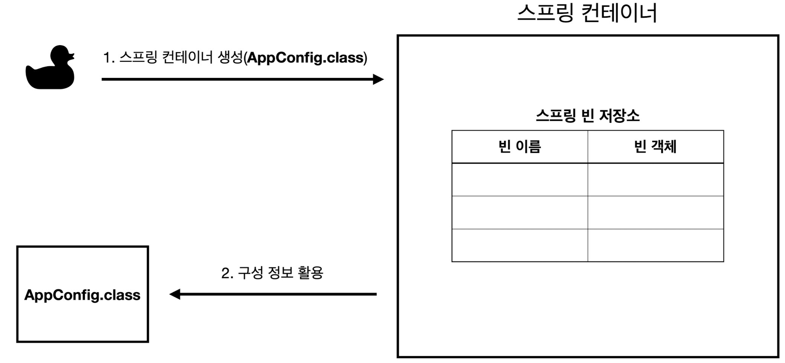
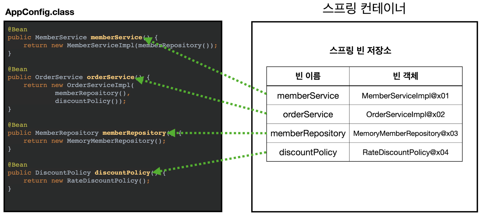
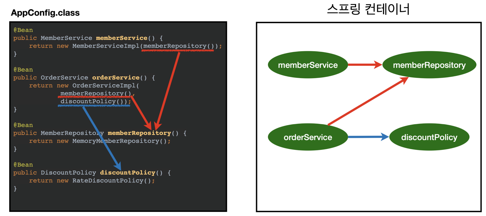
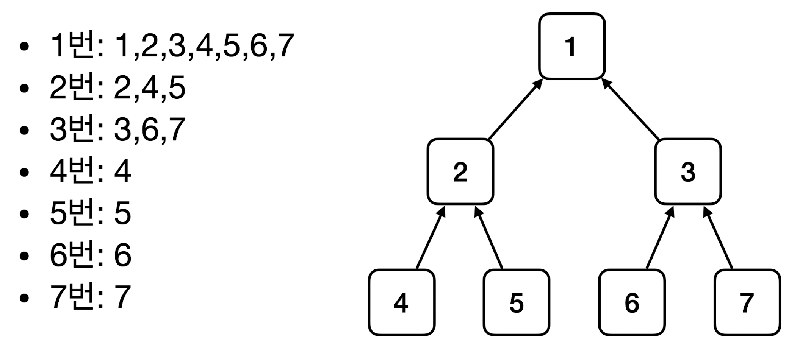
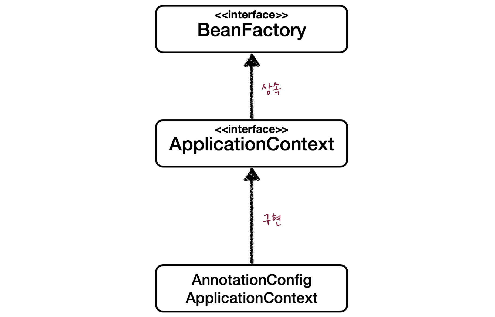
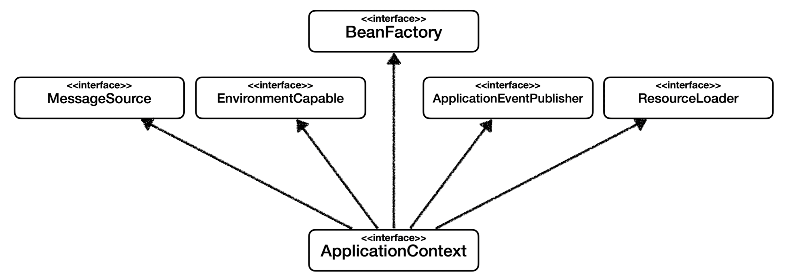
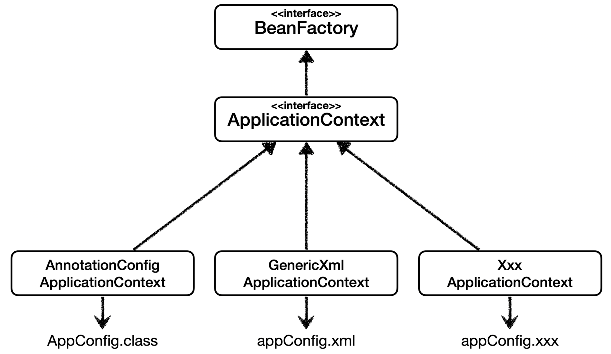
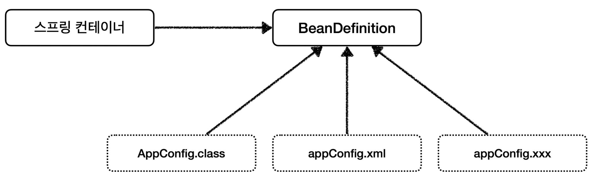
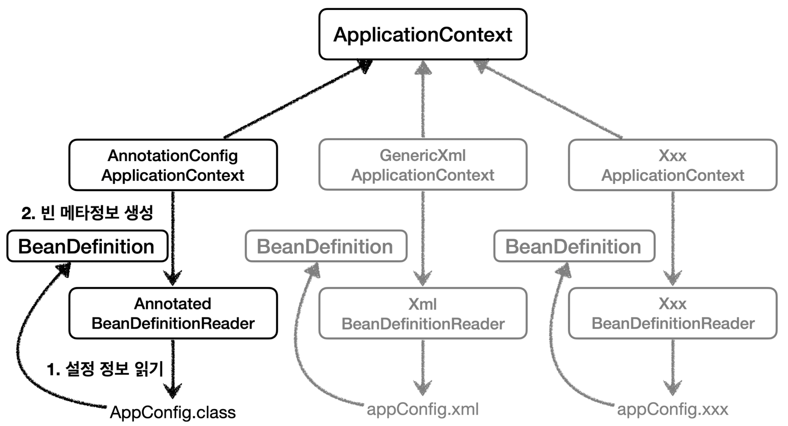
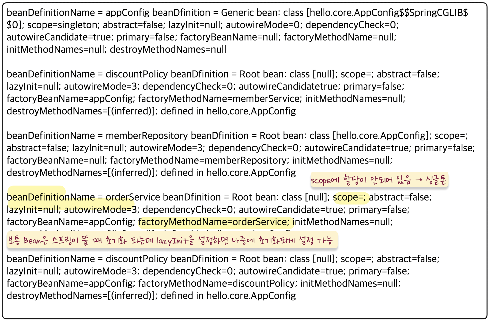

# 스프링으로 전환하기
지금까지 순수한 자바 코드로만 DI를 적용했다. 이제 스프링을 적용한다.

## 스프링 전환 코드 변경
### AppConfig 스프링 기반으로 변경
```java
package hello.core;  
  
import hello.core.discount.DiscountPolicy;  
import hello.core.discount.FixDiscountPolicy;  
import hello.core.discount.RateDiscountPolicy;  
import hello.core.member.MemberRepository;  
import hello.core.member.MemberService;  
import hello.core.member.MemberServiceImpl;  
import hello.core.member.MemoryMemberRepository;  
import hello.core.order.OrderService;  
import hello.core.order.OrderServiceImpl;  
import org.springframework.context.annotation.Bean;  
import org.springframework.context.annotation.Configuration;  
  
@Configuration  
public class AppConfig {  
    @Bean  
    public MemberService memberService(){  
        return new MemberServiceImpl(memberRepository());  
    }  
  
    @Bean  
    public OrderService orderService(){  
        return new OrderServiceImpl(  
                memberRepository(),  
                discountPolicy());  
    }  
  
    @Bean  
    public MemberRepository memberRepository(){  
        return new MemoryMemberRepository();  
    }  
  
    @Bean  
    public DiscountPolicy discountPolicy(){  
//        return new FixDiscountPolicy();  
        return new RateDiscountPolicy();  
    }  
  
}
```
- AppConfig에 설정을 구성한다는 뜻의 `@Configuration`을 붙여준다.
- 각 메서드에 `@Bean`을 붙여준다. 이 어노테이션을 붙임으로써 스프링 컨테이너에 스프링 빈으로 등록된다.
### MemberApp에 스프링 컨테이너 적용
```java
package hello.core;  
  
import hello.core.member.Grade;  
import hello.core.member.Member;  
import hello.core.member.MemberService;  
import hello.core.member.MemberServiceImpl;  
import org.springframework.context.ApplicationContext;  
import org.springframework.context.annotation.AnnotationConfigApplicationContext;  
  
public class MemberApp {  
    public static void main(String[] args) {  
//        AppConfig appConfig = new AppConfig();  
//        MemberService memberService = appConfig.memberService();  
        ApplicationContext applicationContext = new AnnotationConfigApplicationContext(AppConfig.class);  
        MemberService memberService = applicationContext.getBean("memberService", MemberService.class);  
        Member member = new Member(1L, "memberA", Grade.VIP);  
        memberService.join(member);  
  
        Member findMember = memberService.findMember(1L);  
        System.out.println("new member = " + member.getName());  
        System.out.println("find member = " + findMember.getName());  
    }  
}
```
- 기본적으로 Bean의 이름은 메소드 이름으로 설정됨.

### OrderApp에 스프링 컨테이너 적용
```java
package hello.core;  
  
import hello.core.member.Grade;  
import hello.core.member.Member;  
import hello.core.member.MemberService;  
import hello.core.member.MemberServiceImpl;  
import hello.core.order.Order;  
import hello.core.order.OrderService;  
import hello.core.order.OrderServiceImpl;  
import org.springframework.context.ApplicationContext;  
import org.springframework.context.annotation.AnnotationConfigApplicationContext;  
  
public class OrderApp {  
    public static void main(String[] args) {  
//        AppConfig appConfig = new AppConfig();  
//        MemberService memberService = appConfig.memberService();  
//        OrderService orderService = appConfig.orderService();  
  
        ApplicationContext applicationContext = new AnnotationConfigApplicationContext(AppConfig.class);  
        MemberService memberService = applicationContext.getBean("memberService", MemberService.class);  
        OrderService orderService = applicationContext.getBean("orderService", OrderService.class);  
          
        long memberId = 1L;  
        Member member = new Member(memberId, "memberA", Grade.VIP);  
        memberService.join(member);  
  
        Order order = orderService.createOrder(memberId, "itemA", 10000);  
        System.out.println("order = " + order);  
    }  
}
```

>💡스프링 부트 3.1 이상 버전 로그 출력 안되는 문제
> 스프링 부트 3.1 이상 버전부터 MemberApp과 OrderApp을 실행할 때, 스프링 관련 로그가 출력되지 않는다.
> `logback.xml`파일 필요
> `src/main/resources/logback.xml`
> ```xml
> <configuration>  
>  
>    <appender name="STDOUT" class="ch.qos.logback.core.ConsoleAppender">  
>         <encoder>            
> 	        <pattern>%d{HH:mm:ss.SSS} [%thread] %-5level %logger{36} -%kvp-%msg%n</pattern>  
>         </encoder>   
> 	   </appender>  
>     <root level="DEBUG">  
>         <appender-ref ref="STDOUT"/>  
>     </root>
> </configuration>
> ```
> - 스프링 부트 3.1 부터 기본 로그 레벨을 `INFO`로 빨게 설정하기 때문에 로그를 확인할 수 없는데, 이렇게하면 기본 로그 레벨을 `DEBUG`로 설정해서 로그를 확인할 수 있다.

## 스프링 컨테이너
- `ApplicationContext`를 스프링 컨테이너라고 한다.
- 기존에는 개발자가 AppConfig를 사용해서 직접 객체를 생성하고 DI를 했지만, 이제부터는 스프링 컨테이너를 통해서 사용한다.
- 스프링 컨테이너는 `@Configuration`이 붙은 `AppConfig`를 설정(구성) 정보로 사용한다. 여기서 `@Bean`이라 적힌 메서드를 모두 호출해서 반환된 객체를 스프링 컨테이너에 등록한다. 이렇게 스프링 컨테이너에 등록된 객체를 스프링 빈이라 한다.
- 스프링 빈은 `@Bean`이 붙은 메서드의 명을 스프링 빈의 이름으로 사용한다. - `@Bean(name = "이름")`으로 수정 가능
- 이전에는 개발자가 필요한 객체를 `AppConfig`를 사용해서 직접 조회했지만, 이제부터는 스프링 컨테이너를 통해서 필요한 스프링 빈(객체)를 찾아야 한다. 스프링 빈은 `applicationContext.getBean()` 메서드를 사용해서 찾을 수 있다.
- 기존에는 개발자가 직접 자바코드로 모든 것을 했다면 이제부터는 스프링 컨테이너에 객체를 스프링 빈으로 등록하고, 스프링 컨테이너에서 스프링 빈을 찾아서 사용하도록 변경되었다.

# 스프링 컨테이너 생성
스프링 컨테이너가 생성되는 과정을 알아보자.
```java
//스프링 컨테이너 생성
ApplicationContext applicationContext = new AnnotationConfigApplicationContext(AppConfig.class);
```
- `ApplicationContext`를 스프링 컨테이너라 한다. 
- `ApplicationContext`는 인터페이스이다.(`AnnotationConfigApplicationContext` 클래스는 `ApplicationContext`의 구현체 중 하나이다.)
- 스프링 컨테이너는 **①XML을 기반**으로 만들 수 있고, **②어노테이션 기반**의 자바 설정 클래스로 만들 수 있다.
- 직전에 AppConfig를 사용했던 방식이 애노테이션 기반의 자바 설정 클래스로 스프링 컨테이너를 만든 것이다.
- 자바 설정 클래스를 기반으로 `스프링 컨테이너(ApplicationContext)`를 만들어보자.
	- `new AnnotationConfigApplicationContext(AppConfig.class);`
	- 이 클래스는 `ApplicationContext`인터페이스의 구현체 이다.

>💡 더 정확히는 스프링 컨테이너를 부를 때 `BeanFactory`, `ApplicationContext`로 구분해서 이야기한다. `BeanFactory`를 직접 사용하는 경우는 거의 없으므로 일반적으로 `ApplciationContext`를 스프링 컨테이너라 한다.


## 스프링 컨테이너의 생성 과정
### 1. 스프링 컨테이너 생성

- `new AnnotationConfigApplicationContext(AppConfig.class)`
- 스프링 컨테이너를 생성할 때는 구성 정보를 지정해줘야 한다.
- 여기서는 `AppConfig.class`를 구성 정보로 지정했다.

### 2. 스프링 빈 등록

- 스프링 컨테이너는 파라미터로 넘어온 설정 클래스 정보를 사용해서 스프링 빈을 등록한다.
**빈 이름**
- 빈 이름은 메서드 이름을 사용한다.
- 빈 이름을 직접 부여할 수도 있다.
	- `@Bean(name = "memberService2")`

>✔︎주의! **빈 이름은 항상 다른 이름을 부여**해야 한다. 같은 이름을 부여하면, 다른 빈이 무시되거나, 기존 빈을 덮어버리거나 설정에 따라 오류가 발생한다.


### 3. 스프링 빈 의존관계 설정 - 준비


### 4. 스프링 빈 의존관계 설정 - 완료

- 스프링 컨테이너는 설정 정보를 참고해서 의존관계를 주입(DI)한다.
- 단순히 자바 코드를 호출하는 것 같지만, 차이가 있다.

>ps. 스프링은 빈을 생성하고, 의존관계를 주입하는 단계가 나누어져 있다. 그런데 이렇게 자바 코드로 스프링 빈을 등록하면 생성자를 호출하면서 의존관계 주입도 한번에 처리된다. 여기서는 이해를 돕기 위해 개념적으로 나누어 설명했다.


# 스프링 빈
## 컨테이너에 등록된 모든 빈 조회
```java
package hello.core.beanfind;  
  
import hello.core.AppConfig;  
import org.junit.jupiter.api.DisplayName;  
import org.junit.jupiter.api.Test;  
import org.springframework.beans.factory.config.BeanDefinition;  
import org.springframework.context.ApplicationContext;  
import org.springframework.context.annotation.AnnotationConfigApplicationContext;  
  
class ApplicationContextInfoTest {  
  
    // ApplicationContext에는 .getBeanDefinition() 메소드가 없어서 AnnotationConfigApplicationContext 사용.   
    AnnotationConfigApplicationContext ac = new AnnotationConfigApplicationContext(AppConfig.class);  
  
    @Test  
    @DisplayName("모든 빈 출력하기")  
    void findAllBean() {  
        String[] beanDefinitionNames = ac.getBeanDefinitionNames();  
        for (String beanDefinitionName : beanDefinitionNames) {  
            Object bean = ac.getBean(beanDefinitionName);  
            System.out.println("name=" + beanDefinitionName + " object=" + bean);  
        }  
    }  
  
    @Test  
    @DisplayName("애플리케이션 빈 출력하기")  
    void findApplicationBean(){  
        String[] beanDefinitionNames = ac.getBeanDefinitionNames();  
        for (String beanDefinitionName : beanDefinitionNames) {  
            BeanDefinition beanDefinition = ac.getBeanDefinition(beanDefinitionName);  
              
            //Role ROLE_APPLICATION : 직접 등록한 애플리케이션 빈  
            //Role ROLE_INFRASTRUCTURE : 스프링이 내부에서 사용하는 빈  
            if (beanDefinition.getRole() == BeanDefinition.ROLE_APPLICATION) {  
                Object bean = ac.getBean(beanDefinitionName);  
                System.out.println("name=" + beanDefinitionName + " object=" + bean);  
            }  
        }  
    }  
}
```
`[실행결과]`
```
// 모든 빈 출력하기 
name=org.springframework.context.annotation.internalConfigurationAnnotationProcessor object=org.springframework.context.annotation.ConfigurationClassPostProcessor@341a8659
name=org.springframework.context.annotation.internalAutowiredAnnotationProcessor object=org.springframework.beans.factory.annotation.AutowiredAnnotationBeanPostProcessor@4943defe
name=org.springframework.context.annotation.internalCommonAnnotationProcessor object=org.springframework.context.annotation.CommonAnnotationBeanPostProcessor@5eefa415
name=org.springframework.context.event.internalEventListenerProcessor object=org.springframework.context.event.EventListenerMethodProcessor@181d7f28
name=org.springframework.context.event.internalEventListenerFactory object=org.springframework.context.event.DefaultEventListenerFactory@78d50a3c
name=appConfig object=hello.core.AppConfig$$SpringCGLIB$$0@2fb69ff6
name=memberService object=hello.core.member.MemberServiceImpl@cda4919
name=orderService object=hello.core.order.OrderServiceImpl@7f4d9395
name=memberRepository object=hello.core.member.MemoryMemberRepository@2f19f2aa
name=discountPolicy object=hello.core.discount.RateDiscountPolicy@344b8190

// 애플리케이션 빈 출력하기
name=appConfig object=hello.core.AppConfig$$SpringCGLIB$$0@2b50150
name=memberService object=hello.core.member.MemberServiceImpl@15b986cd
name=orderService object=hello.core.order.OrderServiceImpl@6bb7cce7
name=memberRepository object=hello.core.member.MemoryMemberRepository@41c62850
name=discountPolicy object=hello.core.discount.RateDiscountPolicy@6b530eb9
```
- 모든 빈 출력하기
	- 실행하면 스프링에 등록된 모든 빈 정보를 출력할 수 있다.
	- `ac.getBeanDefinitionNames()` : 스프링에 등록된 모든 빈 이름을 조회한다.
	- `ac.getBean()` : 빈 이름으로 빈 객체(인스턴스)를 조회한다.
- 애플리케이션 빈 출력하기
	- 스프링이 내부에서 사용하는 빈은 제외하고, 내가 등록한 빈만 출력해보자.
	- 스프링이 내부에서 사용하는 빈은 `getRole()`로 구분할 수 있다.
		- `ROLE_APPLICATION` : 일반적으로 사용자가 정의한 빈
		- `ROLE_INFRASTRUCTURE` : 스프링이 내부에서 사용하는 빈


## 스프링 빈 조회 - 기본
스프링 컨테이너에서 스프링 빈을 찾는 가장 기본적인 조회 방법
- `ac.getBean(빈이름, 타입)`
- `ac.getBean(타입)`
- 조회 대상 스프링 빈이 없으면 예외 발생
	- `NoSuchBeanDefinitionException: No bean named 'xxxx' available`

### 예제 코드
```java
package hello.core.beanfind;  
  
import hello.core.AppConfig;  
import hello.core.member.MemberService;  
import hello.core.member.MemberServiceImpl;  
import org.junit.jupiter.api.DisplayName;  
import org.junit.jupiter.api.Test;  
import org.springframework.beans.factory.NoSuchBeanDefinitionException;  
import org.springframework.context.ApplicationContext;  
import org.springframework.context.annotation.AnnotationConfigApplicationContext;  
  
import static org.assertj.core.api.Assertions.assertThat;  
import static org.junit.jupiter.api.Assertions.assertThrows;  
  
class ApplicationContextBasicFindTest {  
  
    AnnotationConfigApplicationContext ac = new AnnotationConfigApplicationContext(AppConfig.class);  
  
    @Test  
    @DisplayName("빈 이름으로 조회")  
    void findBeanByName() {  
        MemberService memberService = ac.getBean("memberService", MemberService.class);  
        assertThat(memberService).isInstanceOf(MemberServiceImpl.class);  
    }  
  
    @Test  
    @DisplayName("이름 없이 타입만으로 조회")  
    void findBeanByType() {  
        MemberService memberService = ac.getBean(MemberService.class);  
        // 인터페이스(MemberService)로 조회하면 인터페이스 구현체(MemberServiceImpl)가 대상이 됨  
        assertThat(memberService).isInstanceOf(MemberServiceImpl.class);  
    }  
  
    @Test  
    @DisplayName("구체 타입으로 조회")  
    void findBeanByName2(){  
        MemberServiceImpl memberService = ac.getBean("memberService", MemberServiceImpl.class);  
        assertThat(memberService).isInstanceOf(MemberServiceImpl.class);  
    }  
  
    @Test  
    @DisplayName("빈 이릉으로 조회X")  
    void findBeanByNameX(){  
        //ac.getBean("xxxxx", MemberService.class);  
        assertThrows(NoSuchBeanDefinitionException.class, () -> ac.getBean("xxxxx", MemberService.class));  
    }  
}
```

> 구체 타입으로 조회하면 변경시 유연성이 떨어진다.


## 스프링 빈 조회 - 동일한 타입이 둘 이상
- 타입으로 조회시 같은 타입의 스프링 빈이 둘 이상이면 오류가 발생한다. 이 때는 빈 이름을 지정하자.
- `ac.getBeansOfType()`을 사용하면 해당 타입의 모든 빈을 조회할 수 있다.

### 예제 코드
```java
package hello.core.beanfind;  
  
import hello.core.member.MemberRepository;  
import hello.core.member.MemoryMemberRepository;  
import org.junit.jupiter.api.DisplayName;  
import org.junit.jupiter.api.Test;  
import org.springframework.beans.factory.NoUniqueBeanDefinitionException;  
import org.springframework.context.annotation.AnnotationConfigApplicationContext;  
import org.springframework.context.annotation.Bean;  
import org.springframework.context.annotation.Configuration;  
  
import java.util.Map;  
  
import static org.assertj.core.api.Assertions.assertThat;  
import static org.junit.jupiter.api.Assertions.assertThrows;  
  
class ApplicationContextSameBeanFindTest {  
  
    AnnotationConfigApplicationContext ac = new AnnotationConfigApplicationContext(SameBeanConfig.class);  
  
    @Test  
    @DisplayName("타입으로 조회시 같은 타입이 둘 이상 있으면, 중복 오류가 발생한다.")  
    void findBeanByTypeDuplication(){  
        //MemberRepository bean = ac.getBean(MemberRepository.class);  
        assertThrows(NoUniqueBeanDefinitionException.class, () -> ac.getBean(MemberRepository.class));  
    }  
  
    @Test  
    @DisplayName("타입으로 조회시 같은 타입이 둘 이상 있으면, 빈 이름을 지정하면 된다.")  
    void findBeanByName(){  
        MemberRepository memberRepository = ac.getBean("memberRepository1", MemberRepository.class);  
        assertThat(memberRepository).isInstanceOf(MemberRepository.class);  
    }  
  
    @Test  
    @DisplayName("특정 타입을 모두 조회하기")  
    void findAllBeanByType(){  
        Map<String, MemberRepository> beansOfType = ac.getBeansOfType(MemberRepository.class);  
        for (String key : beansOfType.keySet()) {  
            System.out.println("key = " + key + " value = " + beansOfType.get(key));  
        }  
        System.out.println("beansOfType = " + beansOfType);  
        assertThat(beansOfType.size()).isEqualTo(2);  
    }  
  
  
    @Configuration  
    static class SameBeanConfig {  
  
        @Bean  
        public MemberRepository memberRepository1() {  
            return new MemoryMemberRepository();  
        }  
  
        @Bean  
        public MemberRepository memberRepository2() {  
            return new MemoryMemberRepository();  
        }  
    }  
}
```
`[실행결과]`
```
key = memberRepository1 value = hello.core.member.MemoryMemberRepository@64a1923a
key = memberRepository2 value = hello.core.member.MemoryMemberRepository@7d2a6eac
beansOfType = {memberRepository1=hello.core.member.MemoryMemberRepository@64a1923a, memberRepository2=hello.core.member.MemoryMemberRepository@7d2a6eac}
```


## 스프링 빈 조회 - 상속 관계
- 부모 타입으로 조회하면, 자식 타입도 함께 조회한다.
- 그래서 모든 자바 객체의 최고 부모인 `Object`타입으로 조회하면, 모든 스프링 빈을 조회한다.


### 예제 코드
```java
package hello.core.beanfind;  
  
import hello.core.discount.DiscountPolicy;  
import hello.core.discount.FixDiscountPolicy;  
import hello.core.discount.RateDiscountPolicy;  
import org.junit.jupiter.api.DisplayName;  
import org.junit.jupiter.api.Test;  
import org.springframework.beans.factory.NoUniqueBeanDefinitionException;  
import org.springframework.context.annotation.AnnotationConfigApplicationContext;  
import org.springframework.context.annotation.Bean;  
import org.springframework.context.annotation.Configuration;  
  
import java.util.Map;  
  
import static org.assertj.core.api.Assertions.assertThat;  
import static org.junit.jupiter.api.Assertions.assertThrows;  
  
class ApplicationContextExtendsFindTest {  
  
    AnnotationConfigApplicationContext ac = new AnnotationConfigApplicationContext(TestConfig.class);  
  
    @Test  
    @DisplayName("부모 타입으로 조회시, 자식이 둘 이상 있으면, 중복 오류가 발생한다.")  
    void findBeanByParentTypeDuplicate(){  
        //DiscountPolicy bean = ac.getBean(DiscountPolicy.class);  
        assertThrows(NoUniqueBeanDefinitionException.class, () -> ac.getBean(DiscountPolicy.class));  
    }  
  
    @Test  
    @DisplayName("부모 타입으로 조회시, 자식이 둘 이상 있으면, 빈 이름을 지정하면 된다.")  
    void findBeanByParentTypeBeanName(){  
        DiscountPolicy rateDiscountPolicy = ac.getBean("rateDiscountPolicy", DiscountPolicy.class);  
        assertThat(rateDiscountPolicy).isInstanceOf(RateDiscountPolicy.class);  
    }  
  
    @Test  
    @DisplayName("특정 하위 타입으로 조회")  
    void findBeanBySubType(){  
        RateDiscountPolicy bean = ac.getBean(RateDiscountPolicy.class);  
        assertThat(bean).isInstanceOf(RateDiscountPolicy.class);  
    }  
  
    @Test  
    @DisplayName("부모 타입으로 모두 조회하기")  
    void findAllBeanByParentType(){  
        Map<String, DiscountPolicy> beansOfType = ac.getBeansOfType(DiscountPolicy.class);  
        assertThat(beansOfType.size()).isEqualTo(2);  
        for (String key : beansOfType.keySet()) {  
            System.out.println("key = " + key + " value = " + beansOfType.values());  
        }  
    }  
  
    @Test  
    @DisplayName("부모 타입으로 모두 조회하기 - Object")  
    void findAllBeanByObjectType(){  
        Map<String, Object> beansOfType = ac.getBeansOfType(Object.class);  
        for (String key : beansOfType.keySet()) {  
            System.out.println("key = " + key + " value = " + beansOfType.values());  
        }  
    }  
  
  
    @Configuration  
    static class TestConfig {  
        // 리턴 타입을 더 구체적으로 RateDiscountPolicy로 설정해도 되지만, 역할을 보여주는 부모인 DiscountPolicy로 설정하는게 더 좋다.  
        @Bean  
        public DiscountPolicy rateDiscountPolicy() {  
            return new RateDiscountPolicy();  
        }  
  
        @Bean  
        public DiscountPolicy fixDiscountPolicy() {  
            return new FixDiscountPolicy();  
        }  
    }  
}
```
`[실행결과]`
```
key = rateDiscountPolicy value = [hello.core.discount.RateDiscountPolicy@28c88600, hello.core.discount.FixDiscountPolicy@5f8890c2]
key = fixDiscountPolicy value = [hello.core.discount.RateDiscountPolicy@28c88600, hello.core.discount.FixDiscountPolicy@5f8890c2]
```

# BeanFactory와 ApplicationContext


## BeanFactory
- 스프링 컨테이너의 최상위 인터페이스이다.
- 스프링 빈을 관리하고 조회하는 역할을 담당한다.
- `getBean()`을 제공한다.
- 지금까지 우리가 사용했던 대부분의 기능을 `BeanFactory`가 제공하는 기능이다.

## ApplicationContext
- `BeanFactory`의 기능을 모두 상속받아서 제공한다.
- 빈을 관리하고 검색하는 기능을 `BeanFactory`가 제공해주지만, 애플리케이션을 개발할 때는 빈을 관리하고 조회하는 기능은 물론이고, 수 많은 부가기능이 필요하다.

### ApplicationContext가 제공하는 부가기능

- 메시지소스를 활용한 국제화 기능
	- 예를 들어 한국에서 들어오면 한국어로, 영어권에서 들어오면 영어로 출력
- 환경변수
	- 로컬, 개발, 운영 등을 구분해서 처리
- 애플리케이션 이벤트
	- 이벤트를 발행하고 구독하는 모델을 편리하게 지원
- 편리한 리소스 조회
	- 파일, 클래스패스, 외부 등에서 리소스를 편리하게 조회

## 정리
- `ApplicationContext`는 `BeanFactory`의 기능을 상속받는다.
- `ApplicationContext`는 빈 관리기능 + 편리한 부가 기능을 제공한다.
- `BeanFactory`를 직접 사용할 일은 거의 없다. 부가기능이 포함된 `ApplicationContext`를 사용한다.
- `BeanFactory`나 `ApplicatonContext`를 스프링 컨테이너라 한다.


# 다양한 설정 형식 지원 - 자바 코드, XML
- 스프링 컨테이너는 다양한 형식의 설정 정보를 받아들일 수 있게 유연하게 설계되어 있다.
	- 자바 코드, XML, Groovy 등등


## 애노테이션 기반 자바 코드 설정 사용
- 지금까지 적용했던 방식이다.
- `new AnnotationConfigApplicationContext(AppConfig.class)`
- `AnnotationConfigApplicationContext`클래스를 사용하면서 자바 코드로된 설정 정보를 넘기면 된다.

## XML 설정 사용
- 최근에는 스프링 부트를 많이 사용하면서 XML기반의 설정은 잘 사용하지 않는다. 아직 많은 레거시 프로젝트들이 XML로 되어 있고, 또 XML을 사용하면 컴파일 없이 빈 설정 정보를 변경할 수 있는 장접도 있다.
- `GenericXmlApplicationContext`를 사용하면서 `.xml`설정 파일을 넘기면 된다.

### XmlAppConfig 사용 자바 코드
```java
package hello.core.xml;  
  
import hello.core.member.MemberService;  
import org.junit.jupiter.api.Test;  
import org.springframework.context.ApplicationContext;  
import org.springframework.context.support.GenericXmlApplicationContext;  
  
import static org.assertj.core.api.Assertions.assertThat;  
  
public class XmlAppContext {  
  
    @Test  
    void xmlAppContext(){  
        ApplicationContext ac = new GenericXmlApplicationContext("appConfig.xml");  
  
        MemberService memberService = ac.getBean("memberService", MemberService.class);  
        assertThat(memberService).isInstanceOf(MemberService.class);  
    }  
}
```

### xml 기반의 스프링 빈 설정 정보
`src/main/resource/appConfig.xml` - java코드가 아닌건 다 resource 패키지에 만들면 됨.
```xml
<?xml version="1.0" encoding="UTF-8"?>  
<beans xmlns="http://www.springframework.org/schema/beans"  
       xmlns:xsi="http://www.w3.org/2001/XMLSchema-instance"  
       xsi:schemaLocation="http://www.springframework.org/schema/beans http://www.springframework.org/schema/beans/spring-beans.xsd">  
    <bean id="memberService" class="hello.core.member.MemberServiceImpl">  
        <constructor-arg name="memberRepository" ref="memberRepository" />  
    </bean>    <bean id="memberRepository"  
          class="hello.core.member.MemoryMemberRepository" />  
    <bean id="orderService" class="hello.core.order.OrderServiceImpl">  
        <constructor-arg name="memberRepository" ref="memberRepository" />  
        <constructor-arg name="discountPolicy" ref="discountPolicy" />  
    </bean>    <bean id="discountPolicy" class="hello.core.discount.RateDiscountPolicy" />  
</beans>
```

- xml 기반의 `appConfig.xml` 스프링 설정 정보와 자바 코드로 된 `AppConfig.java`설정 정보를 비교해보면 거의 비슷하다.
- 추가적인 정보는 스프링 공식 레퍼런스 문서를 참고하자([https://spring.io/projects/spring-framework](https://spring.io/projects/spring-framework))


# 스프링 빈 설정 메타 정보 - BeanDefinition
- 스프링은 어떻게 이런 다양한 설정 형식을 지원하는 걸까?그 중심에는 `BeanDefinition`이라는 추상화가 있다.
- **역할과 구현을 개념적으로 나눔**
	- XML을 읽어서 BeanDefinition을 만든다.
	- 자바 코드를 읽어서 BeanDefinition을 만든다.
	- 스프링 컨테이너는 자바 코드인지, XML인지 몰라도 된다. 오직 BeanDefinition만 알면 된다.
- `BeanDefinition`을 빈 설정 메타정보라 한다.
	- `@Bean`, `<bean>`당 각각 하나씩 메타 정보가 생성된다.
- 스프링 컨테이너는 이 메타정보를 기반으로 스프링 빈을 생성한다.


- `AnnotationConfigApplicationConext`는 `AnnotatedBeanDefinitionReader`를 사용해서 `AppConfig.class`를 읽고 `BeandDefinition`을 생성한다.
- `GenericXmlApplicationContext`는 `XmlBeanDefinitionReader`를 사용해서 `appConfig.xml` 설정 정보를 읽고 `BeanDefinition`을 생성한다.
- 새로운 형색의 설정 정보가 추가되면, XxxBeanDefinitionReader를 만들어서 `BeanDefinition`을 생성하면 된다.


## BeanDefinition 살펴보기

**BeanDefinition 정보**
- BeanClassName : 생성할 빈의 클래스 명(자바 설정처럼 팩토리 역할의 빈을 사용하면 없음)
- factoryBeanName : 팩토리 역할의 빈을 사용할 경우 이름. (예 : appConfig)
- factoryMethodName : 빈을 생성할 팩토리 메서드 지정. (예 : memberService)
- Scope : 싱글톤(default)
- lazyInit : 스프링 컨테이너를 생성할 때 빈을 생성하는 것이 아니라, 실제 빈을 사용할 때까지 최대한 생성을 지연처리 하는지 여부
- InitMethodName : 빈을 생성하고, 의존관계를 적용한 뒤에 호출되는 초기화 메서드 명
- DestroyMethodName : 빈의 생명주기가 끝나서 제거하기 직전에 호출되는 메서드 명
- Constructor arguments, Properties : 의존관계 주입에서 사용한다.(자바 설정 처럼 팩토리 역할의 빈을 사용하면 없음)

### 테스트 코드
```java
package hello.core.beandefinition;  
  
import hello.core.AppConfig;  
import org.junit.jupiter.api.DisplayName;  
import org.junit.jupiter.api.Test;  
import org.springframework.beans.factory.config.BeanDefinition;  
import org.springframework.context.annotation.AnnotationConfigApplicationContext;  
import org.springframework.context.support.GenericXmlApplicationContext;  
  
class BeanDefinitionTest {  
  
    AnnotationConfigApplicationContext ac = new AnnotationConfigApplicationContext(AppConfig.class);  
//    GenericXmlApplicationContext ac = new GenericXmlApplicationContext("appConfig.xml");  
  
    @Test  
    @DisplayName("빈 설정 메타정보 확인")  
    void findApplicationBean(){  
        String[] beanDefinitionNames = ac.getBeanDefinitionNames();  
        for (String beanDefinitionName : beanDefinitionNames) {  
            BeanDefinition beanDefinition = ac.getBeanDefinition(beanDefinitionName);  
            if (beanDefinition.getRole() == BeanDefinition.ROLE_APPLICATION) {  
                System.out.println("beanDefinitionName" + beanDefinitionName + " beanDefinition = " + beanDefinition);  
            }  
        }  
    }  
}
```
`[실행결과]`
```
beanDefinitionNameappConfig beanDefinition = Generic bean: class [hello.core.AppConfig$$SpringCGLIB$$0]; scope=singleton; abstract=false; lazyInit=null; autowireMode=0; dependencyCheck=0; autowireCandidate=true; primary=false; factoryBeanName=null; factoryMethodName=null; initMethodNames=null; destroyMethodNames=null
beanDefinitionNamememberService beanDefinition = Root bean: class [null]; scope=; abstract=false; lazyInit=null; autowireMode=3; dependencyCheck=0; autowireCandidate=true; primary=false; factoryBeanName=appConfig; factoryMethodName=memberService; initMethodNames=null; destroyMethodNames=[(inferred)]; defined in hello.core.AppConfig
beanDefinitionNameorderService beanDefinition = Root bean: class [null]; scope=; abstract=false; lazyInit=null; autowireMode=3; dependencyCheck=0; autowireCandidate=true; primary=false; factoryBeanName=appConfig; factoryMethodName=orderService; initMethodNames=null; destroyMethodNames=[(inferred)]; defined in hello.core.AppConfig
beanDefinitionNamememberRepository beanDefinition = Root bean: class [null]; scope=; abstract=false; lazyInit=null; autowireMode=3; dependencyCheck=0; autowireCandidate=true; primary=false; factoryBeanName=appConfig; factoryMethodName=memberRepository; initMethodNames=null; destroyMethodNames=[(inferred)]; defined in hello.core.AppConfig
beanDefinitionNamediscountPolicy beanDefinition = Root bean: class [null]; scope=; abstract=false; lazyInit=null; autowireMode=3; dependencyCheck=0; autowireCandidate=true; primary=false; factoryBeanName=appConfig; factoryMethodName=discountPolicy; initMethodNames=null; destroyMethodNames=[(inferred)]; defined in hello.core.AppConfig
```

## 정리
- BeanDefinition을 직접 생성해서 스프링 컨테이너에 등록할 수도 있다. 하지만 실무에서 BeanDefinition을 직접 정의하거나 사용할 일은 거의 없다.
- BeanDefinition에 대해서는 너무 깊이있게 이해하기 보다는, 스프링이 다양한 형태의 설정 정보를 BeanDefinition으로 추상화해서 사용한다 정도만 이해하면된다.
- 가끔 스프링 코드나 스프링 관련 오픈 소스의 코드를 볼 때, BeanDefinition이라는 것이 보일 때 이러한 매커니즘을 떠올리면 된다.



