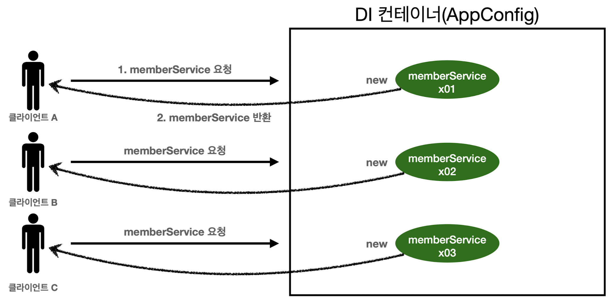
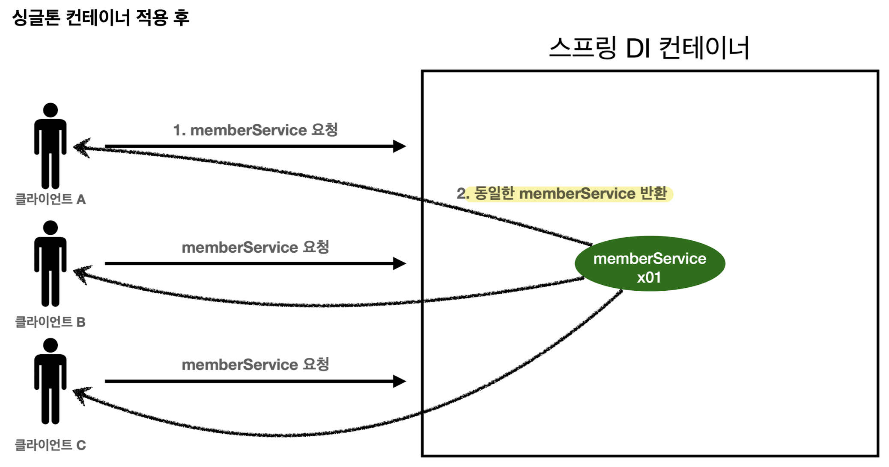
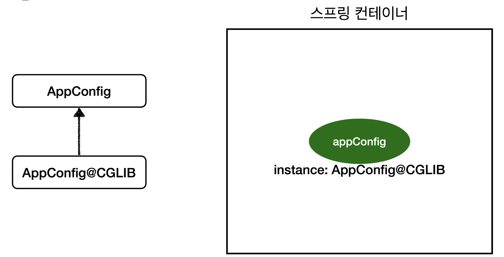

# 웹 어플리케이션과 싱글톤
- 스프링은 태생이 기업용 온라인 서비스 기술을 지원하기 위해 탄생했다.
- 대부분의 스프링 애플리케이션은 웹 애플리케이션이다. 
- 웹 애플리케이션은 보통 여러 고객이 동시에 요청을 한다.


### 스프링 없는 순수한 DI 컨테이너 테스트
```java
package hello.core.singleton;  
  
import hello.core.AppConfig;  
import hello.core.member.MemberService;  
import org.junit.jupiter.api.DisplayName;  
import org.junit.jupiter.api.Test;  
  
import static org.assertj.core.api.Assertions.assertThat;  
  
public class SingletonTest {  
  
    @Test  
    @DisplayName("스프링 없는 순수한 DI 컨테이너")  
    void pureContainer(){  
  
        AppConfig appConfig = new AppConfig();  
        //1. 조회 : 호출할 때 마다 객체를 생성  
        MemberService memberService1 = appConfig.memberService();  
  
        //2. 조회 : 호출할 때 마다 객체를 생성  
        MemberService memberService2 = appConfig.memberService();  
  
        //참조값이 다른 것을 확인  
        System.out.println("memberService1 = " + memberService1);  
        System.out.println("memberService2 = " + memberService2);  
  
        //memberService1 != memberService2  
        assertThat(memberService1).isNotSameAs(memberService2);  
    }  
}
```
`[실행결과]`
```
memberService1 = hello.core.member.MemberServiceImpl@1c742ed4
memberService2 = hello.core.member.MemberServiceImpl@79207381
```
- 스프링 없는 순수한 DI 컨테이너인 AppConfig는 요청을 할 때 마다 객체를 새로 생성한다.
- 고객 트래픽이 초당 100이 나오면 초당 100개 객체가 생서되고 소멸된다! → 메모리 낭비가 심하다
- 이를 해결하기 위해 싱글톤 패턴 사용 - 해당 객체가 1개만 생성되고 공유하도록 설계


## 싱클톤 패턴
- 클래스의 인스턴스가 딱 1개만 생성되는 것을 보장하는 디자인 패턴
- 객체 인스턴스를 2개 이상 생성하지 못하도록 막아야한다.
	- private 생성자를 사용해서 외부에서 임의로 new 키워드를 사용하지 못하도록 막음.

### 예제 코드 - 테스트 코드에 작성
```java
package hello.core.singleton;  
  
public class SingletonService {  
  
    //1. static 영역에 객체를 딱 1개만 생성해둔다.  
    private static final SingletonService instance = new SingletonService();  
  
    //2. public으로 열어서 객체 인스턴스가 필요하면 이 static 메서드를 통해서만 조회하도록 허용한다.  
    public static SingletonService getInstance() {  
        return instance;  
    }  
      
    //3. 생성자를 private으로 선언해서 외부에서 new 키워드를 사용한 객체 생성을 못하게 막는다.  
    private SingletonService(){  
          
    }  
      
    public void logic(){  
        System.out.println("싱글톤 객체 로직 호출");  
    }  
}
```
1. static 영역에 객체 instance를 미리 하나 생성해서 올려둔다ㅏ.
2. 이 객체 인스턴스가 필요하면 오직 `getInstance()`메서드를 통해서만 조회할 수 있다. 이메서드를 호출하면 항상 같은 인스턴스를 반환한다.
3. 딱 1개의 객체 인스턴스만 존재해야 하므로, 생성자를 private으로 막아서 혹시라도 외부에서 new 키워드로 객체 인스턴스가 생성되는 것을 막는다.


### 싱글톤 패턴 테스트 코드 작성
```java
@Test  
@DisplayName("싱글톤 패턴을 적용한 객체 사용")  
void singletonServiceTest(){  
    //private으로 생성자를 막아두었다. 컴파일 오류 발생  
    // new SingletonService();  
  
    //1. 조회: 호출할 때 마다 같은 객체를 반환  
    SingletonService singletonService1 = SingletonService.getInstance();  
    //2. 조회: 호출할 때 마다 같은 객체를 반환  
    SingletonService singletonService2 = SingletonService.getInstance();  
  
    //참조값이 같은 것을 확인  
    System.out.println("singletonService1 = " + singletonService1);  
    System.out.println("singletonService2 = " + singletonService2);  
  
    //singletonService1 == singletonService2  
    assertThat(singletonService1).isSameAs(singletonService2);
    
    singletonService1.logic();  
}
```
`[실행결과]`
```
singletonService1 = hello.core.singleton.SingletonService@3feb2dda
singletonService2 = hello.core.singleton.SingletonService@3feb2dda
싱글톤 객체 로직 호출
```
- private을 new 키워드 막음.
- 호출할  때 마다 같은 객체 인스턴스를 반환하는 것을 확인할 수 있다.

>- `.isSameAs()` : ==
>- `.isEqualTo()` : equal()

## 싱글톤 패턴 문제점
- 싱글톤 패턴을 구현하는 코드 자체가 많이 들어간다.
- 의존관계상 클라이언트가 구체 클래스에 의존한다. 구체 클래스 `.getInstance()`를 사용해서 DI 적용이 힘듦. → DIP를 위반한다.
- 클라이언트가 구체 클래스에 의존해서 OCP 원책을 위반할 가능성이 높다.
- 테스트하기 어렵다.
- 내부 속성을 변경하거나 초기화하기 어렵다.
- private 생성자로 자식 클래스를 만들기 어렵다.
- 결론적으로 유연성이 떨어진다.
- 안티패턴으로 불리기도 한다.


# 싱글톤 컨테이너
스프링 컨테이너는 싱글톤 패턴의 문제점을 해결하면서, 객체 인스턴스를 싱글톤(1개만 생성)으로 관리한다. 지금까지 우리가 학습한 스프링 빈이 바로 싱글톤으로 관리되는 빈이다.

**싱글톤 컨테이너**
- 스프링 컨테이너는 싱글톤 패턴을 적용하지 않아도 객체 인스턴스를 싱글톤으로 관리한다.
	- 이전에 설명한 컨테이너 생성 과정을 자세히 보자. 컨테이너는 객체를 하나만 생성해서 관리한다.
- 스프링 컨테이너는 싱글톤 컨테이너 역할을 한다. 이렇게 싱글톤 객체를 생성하고 관리하는 기능을 **싱글톤 레지스트리**라고 한다.
- 스프링 컨테이너의 이런 기능 덕분에 싱글톤 패턴의 모든 단접을 해결하면서 객체를 싱글톤으로 유지할 수 있다.
	- 싱글톤 패턴을 위한 지저분한 코드가 들어가지 않아도 된다.
	- DIP, OCP, 테스트, private 생성자로부터 자유롭게 싱글톤을 사용할 수 있다.

### 스프링 컨테이너를 사용하는 테스트 코드
```java
@Test  
@DisplayName("스프링 컨테이너와 싱글톤")  
void springContainer(){  
  
    ApplicationContext ac = new AnnotationConfigApplicationContext(AppConfig.class);  
  
    //1. 조회 : 호출할 때 마다 같은 객체를 반환  
    MemberService memberService1 = ac.getBean("memberService", MemberService.class);  
  
    //2. 조회 : 호출할 때 마다 같은 객체를 반환  
    MemberService memberService2 = ac.getBean("memberService", MemberService.class);  
  
    //참조값이 같은 것을 확인  
    System.out.println("memberService1 = " + memberService1);  
    System.out.println("memberService2 = " + memberService2);  
  
    //memberService1 == memberService2  
    assertThat(memberService1).isSameAs(memberService2);  
}
```
`[실행결과]`
```
memberService1 = hello.core.member.MemberServiceImpl@5fa05212
memberService2 = hello.core.member.MemberServiceImpl@5fa05212
```

- 스프링 컨테이너 덕분에 고객의 요청이 올 때마다 객체를 생성하는 것이 아니라, 이미 만들어진 객체를 공유해서 효율적으로 재사용할 수 있다.


## 싱글톤 방식의 주의점
- 싱글톤 패턴이든, 스프링 같은 싱글톤 컨테이너를 사용하든, 객체 인스턴스를 하나만 생성해서 공유하는 싱글톤 방식은 여러 클라이언트가 하나의 같은 객체 인스턴스를 공유하기 때문에 싱글톤 객체는 상태를 유지(stateful)하게 설계하면 안된다.
- 무상태(stateless)로 설계해야 한다.
	- 특정 클라이언트가 의존적인 필드가 있으면 안된다.
	- 특정 클라이언트가 값을 변경할 수 있는 필드가 있으면 안된다.
	- 가급적 읽기만 가능해야 한다.(가급적 수정X)
	- 필드 대신에 자바에서 공유되지 않는 지역변수, 파라미터, ThreadLocal등을 사용해야 한다.
- 스프링 빈의 필드에 공유 값을 설정하면 정말 큰 장애가 발생할 수 있다!!

### 상태를 유지할 경우 발생하는 문제점 예시
```java
package hello.core.singleton;  
  
public class StatefulService {  
    private int price;   // 상태를 유지하는 필드  
  
    public int order(String name, int price) {  
        System.out.println("name + \", price = \" + price = " + name + ", price = " + price);  
        this.price = price;  // 여기가 문제!  
        //return price;   - 문제 해결시
    }  
  
    public int getPrice() {  
        return price;  
    }  
}
```

```java
package hello.core.singleton;  
  
import org.assertj.core.api.Assertions;  
import org.junit.jupiter.api.Test;  
import org.springframework.context.ApplicationContext;  
import org.springframework.context.annotation.AnnotationConfigApplicationContext;  
import org.springframework.context.annotation.Bean;  
  
public class StatefulServiceTest {  
  
    @Test  
    void statefulServiceSingleton(){  
        ApplicationContext ac = new AnnotationConfigApplicationContext(TestConfig.class);  
        StatefulService statefulService1 = ac.getBean("statefulService", StatefulService.class);  
        StatefulService statefulService2 = ac.getBean("statefulService", StatefulService.class);  
  
        //ThreadA: A사용자 10000원 주문  
        statefulService1.order("userA", 10000);
//        int userAPrice = statefulService1.order("userA", 10000);  
        //TreadB: B사용자 20000원 주문  
        statefulService2.order("userB", 20000);
//        int userBPrice = statefulService2.order("userB", 20000);  
  
        //ThreadA: 사용자A 주문 금액 조회  
        int price = statefulService1.getPrice();  
        //ThreadA: 사용자A는 10000원을 기대했지만, 기대와 다르게 20000원이 출력  
        System.out.println("price = " + price);  
//        System.out.println("price = " + userAPrice);  

		Assertions.assertThat(statefulService1.getPrice()).isEqualTo(20000);  
//        Assertions.assertThat(userBPrice).isEqualTo(20000);  
    }  
  
    static class TestConfig {  
  
        @Bean  
        public StatefulService statefulService() {  
            return new StatefulService();  
        }  
    }  
  
}
```

- `StatefulService`의 `price` 필드는 공유되는 필드인데, 특정 클라이언트가 값을 변경한다.
- 사용자A의 주문금액은 10000원이 되어야 하는데, 20000원이라는 결과가 나옴.
- 진짜 공유필드는 조심해야 한다! 스프링 빈은 항상 무상태(stateless)로 설계하자. ⇒ **지역 변수를 사용해서 해결가능**


## `@Configuration`과 싱글톤

```java
package hello.core;  
  
import hello.core.discount.DiscountPolicy;  
import hello.core.discount.FixDiscountPolicy;  
import hello.core.discount.RateDiscountPolicy;  
import hello.core.member.MemberRepository;  
import hello.core.member.MemberService;  
import hello.core.member.MemberServiceImpl;  
import hello.core.member.MemoryMemberRepository;  
import hello.core.order.OrderService;  
import hello.core.order.OrderServiceImpl;  
import org.springframework.context.annotation.Bean;  
import org.springframework.context.annotation.Configuration;  
  
@Configuration  
public class AppConfig {  
    @Bean  
    public MemberService memberService(){  
        return new MemberServiceImpl(memberRepository());  
    }  
  
    @Bean  
    public OrderService orderService(){  
        return new OrderServiceImpl(  
                memberRepository(),  
                discountPolicy());  
    }  
  
    @Bean  
    public MemberRepository memberRepository(){  
        return new MemoryMemberRepository();  
    }  
  
    @Bean  
    public DiscountPolicy discountPolicy(){  
//        return new FixDiscountPolicy();  
        return new RateDiscountPolicy();  
    }  
  
}
```

- `AppConfig()`를 살펴보면
	- `memberService`빈을 만드는 코드를 보면 `memberRepository()`를 호출한다.
	- `orderService`빈을 만든는 코드도 동일하게 `memberRepository()`를 호출한다.

결과적으로 각각 다른 2개의 `MemoryMemberRepository`가 생성되면서 싱글톤이 깨지는 것 처럼 보인다. 스프링 컨테이너는 이 문제를 어떻게 해결하는가?

- 테스트를 위해 `MemberRepository`를 조회할 수 있는 기능을 추가한다. 
```java
package hello.core.member;  
  
public class MemberServiceImpl implements MemberService {  
  
    private final MemberRepository memberRepository;  
  
    //테스트 용도  
    public MemberRepository getMemberRepository() {  
        return memberRepository;  
    }
}

package hello.core.order;  
  
import hello.core.discount.DiscountPolicy;  
import hello.core.discount.FixDiscountPolicy;  
import hello.core.discount.RateDiscountPolicy;  
import hello.core.member.Member;  
import hello.core.member.MemberRepository;  
import hello.core.member.MemoryMemberRepository;  
  
public class OrderServiceImpl implements OrderService {  
  
//    private final DiscountPolicy discountPolicy = new FixDiscountPolicy();  
    private final MemberRepository memberRepository;  
      
    //테스트 용도  
    public MemberRepository getMemberRepository() {  
        return memberRepository;  
    }
```

테스트 코드
```java
package hello.core.singleton;  
  
import hello.core.AppConfig;  
import hello.core.member.MemberRepository;  
import hello.core.member.MemberServiceImpl;  
import hello.core.order.OrderServiceImpl;  
import org.junit.jupiter.api.Test;  
import org.springframework.context.ApplicationContext;  
import org.springframework.context.annotation.AnnotationConfigApplicationContext;  
  
import static org.assertj.core.api.Assertions.assertThat;  
  
public class ConfigurationSingletoneTest {  
  
    @Test  
    void configurationTest(){  
        ApplicationContext ac = new AnnotationConfigApplicationContext(AppConfig.class);  
        MemberServiceImpl memberService = ac.getBean("memberService", MemberServiceImpl.class);  
        OrderServiceImpl orderService = ac.getBean("orderService", OrderServiceImpl.class);  
        MemberRepository memberRepository = ac.getBean("memberRepository", MemberRepository.class);  
  
        //모두 같은 인스턴스를 참고하고 있다.  
        System.out.println("memberService -> memberRepository = " + memberService.getMemberRepository());  
        System.out.println("orderService -> memberRepository = " + orderService.getMemberRepository());  
        System.out.println("memberRepository = " + memberRepository);  
  
        //모두 같은 인스턴스를 참고하고 있다.  
        assertThat(memberService.getMemberRepository()).isSameAs(memberRepository);  
        assertThat(orderService.getMemberRepository()).isSameAs(memberRepository);  
  
    }  
}
```
`[실행결과]`
```
memberService -> memberRepository = hello.core.member.MemoryMemberRepository@7a791b66
orderService -> memberRepository = hello.core.member.MemoryMemberRepository@7a791b66
memberRepository = hello.core.member.MemoryMemberRepository@7a791b66
```

- `[실행결과]`를 보면 `memberRepository` 인스턴스는 모두 같은 인스턴스가 공유되어 사용된다.
- `AppConfig`에 로그를 남겨 다른 인스턴스가 생기지 않고 같은 인스턴스가 생기는 과정을 확인해보자

**AppConfig에 호출 로그 남김**
```java
package hello.core;  
  
import hello.core.discount.DiscountPolicy;  
import hello.core.discount.FixDiscountPolicy;  
import hello.core.discount.RateDiscountPolicy;  
import hello.core.member.MemberRepository;  
import hello.core.member.MemberService;  
import hello.core.member.MemberServiceImpl;  
import hello.core.member.MemoryMemberRepository;  
import hello.core.order.OrderService;  
import hello.core.order.OrderServiceImpl;  
import org.springframework.context.annotation.Bean;  
import org.springframework.context.annotation.Configuration;  
  
@Configuration  
public class AppConfig {  
    @Bean  
    public MemberService memberService(){  
        //1번  
        System.out.println("call AppConfig.memberService");  
        return new MemberServiceImpl(memberRepository());  
    }  
  
    @Bean  
    public OrderService orderService(){  
        //1번  
        System.out.println("call AppConfig.orderService");  
        return new OrderServiceImpl(  
                memberRepository(),  
                discountPolicy());  
    }  
  
    @Bean  
    public MemberRepository memberRepository(){  
        //2번? 3번?  
        System.out.println("call AppConfig.memberRepository");  
        return new MemoryMemberRepository();  
    }  
  
    @Bean  
    public DiscountPolicy discountPolicy(){  
//        return new FixDiscountPolicy();  
        return new RateDiscountPolicy();  
    }  
  
}
```
`[실행결과]`
```
08:24:32.837 [main] DEBUG o.s.b.f.s.DefaultListableBeanFactory --Creating shared instance of singleton bean 'appConfig'
08:24:32.842 [main] DEBUG o.s.b.f.s.DefaultListableBeanFactory --Creating shared instance of singleton bean 'memberService'
call AppConfig.memberService
08:24:32.846 [main] DEBUG o.s.b.f.s.DefaultListableBeanFactory --Creating shared instance of singleton bean 'memberRepository'
call AppConfig.memberRepository
08:24:32.848 [main] DEBUG o.s.b.f.s.DefaultListableBeanFactory --Creating shared instance of singleton bean 'orderService'
call AppConfig.orderService
08:24:32.849 [main] DEBUG o.s.b.f.s.DefaultListableBeanFactory --Creating shared instance of singleton bean 'discountPolicy'
memberService -> memberRepository = hello.core.member.MemoryMemberRepository@6b9ce1bf
orderService -> memberRepository = hello.core.member.MemoryMemberRepository@6b9ce1bf
memberRepository = hello.core.member.MemoryMemberRepository@6b9ce1bf
```


## @Configuration과 바이트코드 조작의 마법
스프링 컨테이너는 싱글톤 레지스트리다. 따라서 스프링 빈이 싱글통이 되도록 보장해주어야 한다. 하지만 스프링이 자바 코드까지 변경하는건 어렵다. 저 자바 코드를 보면 분명 3번 호출되어야 하는 것이 맞다. 그렇게 되지 않는 이유는 스프링이 클래스의 바이트코드를 조작하는 라이브러리를 사용하기 때문이다.
`@Configuration`을 적용한 `AppConfig`에서 비밀을 찾을 수 있다.

```java
@Test  
void configurationDeep(){  
    ApplicationContext ac = new AnnotationConfigApplicationContext(AppConfig.class);  
  
    //AppConfig도 스프링 빈으로 등록된다.  
    AppConfig been = ac.getBean(AppConfig.class);  
  
    System.out.println("been = " + been.getClass());  
    //출력 : been = class hello.core.AppConfig$$SpringCGLIB$$0
}
```
- `AnnotationConfigApplicationContext`에 파라미터로 넘긴 값은 스프링 빈으로 등록된다. 그래서 `AppConfig`도 스프링 빈이 된다.
- `AppConfig` 스프링 빈을 조회해서 클래스 정보를 출력해보자.
```java
been = class hello.core.AppConfig$$SpringCGLIB$$0
// AppConfig가 순수 클래스였다면 다음과 같이 출력되어야 한다.
class hello.core.AppConfig
```

- 예상과 달리 클래스 명에 `xxxCGLIB`가 붙으면서 상당히 복잡해져 있다. 이것은 내가 만든 클래스가 아니라 스프링이 `CGLIB`라는 바이트코드 조작 라이브러리를 사용해서 `AppConfig`클래스를 상속받은 임의의 다른 클래스를 만들고 그 다른 클래스를 스프링 빈으로 등록한 것이다.

그 임의의 다른 클래스가 바로 싱글톤이 보장되도록 해준다. 아마도 다음과 같이 바이트 코드르 조작해서 작성되어 있을 것이다.(실제로는 CGLIB의 내부 기술을 사용하는데 매우 복잡하다.)

**AppConfig@CGLIB 예상 코드**
```java
@Bean
public MemberRepository memberRepository() {

	if (memberMemberRepository가 이미 스프링 컨테이너에 등록되어 있으면?) {
		return 스프링 컨테이너에서 찾아서 반환; //그래서 한번만 생성됨
	} else { // 스프링 컨테이너에 없으면
		기존 로직을 호출해서 MemoryMemberRepository를 생성하고 스프링 컨테이너에 등록
		return 반환
	}

}
```
- `@Bean`이 붙은 메서드마다 이미 스프링 빈이 존재하면 존재하는 빈을 반환하고, 스프링 빈이 없으면 생성해서 스프링 빈으로 등록하고 반환하는 코드가 동적으로 만들어진다.
- 덕분에 싱글톤이 보장된다.

>참고 
>`AppConfig@CGLIB`은 `AppConfig`의 자식 타입이므로, `AppConfig`타입으로 조회할 수 있다.


## @Configuration을 적용하지 않고, @Bean만 적용하면 어떻게 될까?
`@Configuration`을 붙이면 바이트코드를 조작하는 CGLIB 기술을 사용해서 싱글톤을 보장하지만, 만약 `@Bean`만 적용하면 어떻게 될까?

```java
//@Configuration 삭제
public class AppConfig{

}
```
`[configurationDeep() 실행결과]`
```
been = class hello.core.AppConfig
```
실행결과를 통해 `AppConfig`가 CGLIB 기술 없이 순수한 `AppConfig`로 스프링 빈에 등록된 것을 확일할 수 있다.

```
call AppConfig.memberService
call AppConfig.memberRepository
call AppConfig.orderService
call AppConfig.memberRepository
call AppConfig.memberRepository
```
이 출력 결과를 통해 `MemberRepository`가 총 3번 호출된 것을 알 수 있다. 1번은 `@Bean`에 의해 스프링 컨테이너에 등록하기 위해서이고, 2번은 각각 `memberRepository()`를 호출하면서 발생한 코드다.

**인스턴스가 같은지 테스트 결과**
```
memberService -> memberRepository = hello.core.member.MemoryMemberRepository@613a8ee1
orderService -> memberRepository = hello.core.member.MemoryMemberRepository@178213b
memberRepository = hello.core.member.MemoryMemberRepository@7103cb56
```
당연히 인스턴스가 같은지 테스트하는 코드도 실패하고, 각각 다른 `MemoryMemberRepository`인스턴스를 가지고 있다.

-- 확인 끝났으면 `@Configuration`원복


## 정리
- `@Bean`만 사용해도 스프링 빈으로 등록되지만, 싱글톤을 보장하지는 않는다.
	- `memberRepository()`처럼 의존관계 주입이 필요해서 메서드를 직접 호출할 때 싱글톤을 보장하지 않는다.
- 스프링 설정 정보는 항상 `@Configuration`을 사용하자.(그래서 싱글톤 보장이 된다!)


