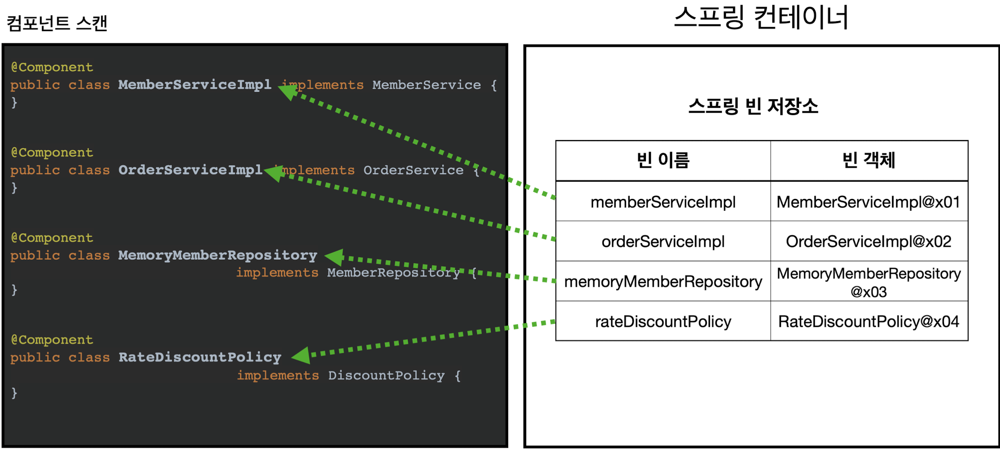
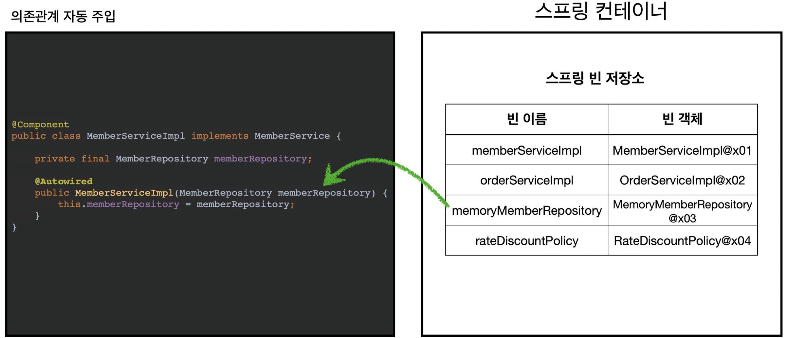
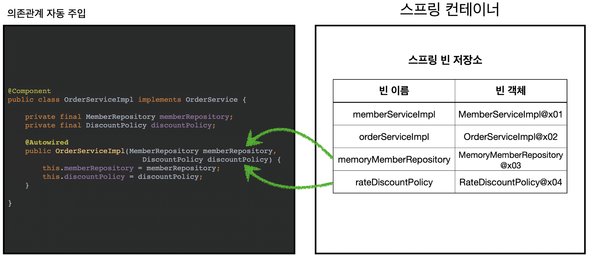

# 컴포넌트 스캔과 의존관계 자동 주입 시작하기
- 지금까지 스프링 빈을 등록할 때는 자바 코드의 `@Bean`이나 XML의 \<bean>등을 통해서 설정 정보에 직접 등록할 스프링 빈을 나열했다.
- 예제에서는 몇개가 안되었지만, 이렇게 등록해야 할 스프링 빈이 수십, 수백개가 되면 일일이 등록하기도 힘들고, 설정 정보도 커지고, 누락하는 문제도 발생한다. 
- 그래서 스프링은 설정 정보가 없어도 자동으로 스프링 빈을 등록하는 컴포넌트 스캔이라는 기능을 제공한다.
- 의존 관계를 자동으로 주입하는 `@Autowired`라는 기능도 제공한다.

## 코드로 컴포넌트 스캔과 의존관계 자동 주입 알아보기
코드로 컴포넌트 스캔과 의존관계 자동 주입을 알아보자.


`AutoAppConfig.java`
```java
package hello.core;  
  
import org.springframework.context.annotation.ComponentScan;  
import org.springframework.context.annotation.Configuration;  
import org.springframework.context.annotation.FilterType;  
  
@Configuration  
@ComponentScan(excludeFilters = @ComponentScan.Filter(type = FilterType.ANNOTATION, classes = {Configuration.class}))  
public class AutoAppConfig {  
}
```
- 컴포넌트 스캔을 사용하려면 먼저 `@ComponentScan`을 설정 정보에 붙여주면 된다.
- 기존 `AppConfig`와는 다르게 `@Bean`으로 등록한 클래스가 하나도 없다.

>`@ComponentScan`
>- `@Component` 애노테이션이 붙은 스프링 빈을 자동으로 스캔해서 다 빈으로 등록해줌
>		- 따라서, `AppConfig`, `TestConfig`등 앞서 만들어두었던 설정 정보도 함께 등록되고 실행되어 버린다.
>- `excludeFilters`는 자동등록되는 대상에서 제외할 항목설정.
>- 보통 설정 정보를 컴포넌트 스캔 대상에서 제외하지는 않지만, 기존 예제 코드를 최대한 남기고 유지하기 위해서 이 방법 적용.

>참고 : `@Configuration`이 컴포너늩 스캔의 대상이 된 이유도 `@Configuration` 소스코드를 열어보면 `@Component` 애노테이션이 붙어 있기 때문이다.

이제 각 클래스가 컴포넌트 스캔의 대상이 되도록 `@Component`애노테이션을 붙여주자.

**MemoryMemberRepository @Component 추가**
```java
@Component
public class MemoryMemberRepository implements MemberRepository{}
```

**RateDiscountPolicy @Component 추가**
```java
@Component
public Class RateDiscountPolicy implements DiscountPolicy{}
```

**MemberServiceImpl @Component, @Autowired 추가**
```java
@Component  
public class MemberServiceImpl implements MemberService {  
  
    private final MemberRepository memberRepository;  
  
    @Autowired  
    public MemberServiceImpl(MemberRepository memberRepository) {  
        this.memberRepository = memberRepository;  
    }
```
- 이전에 `AppConfig`에서는 `@Bean`으로 직접 설정 정보를 작성했고, 의존관계도 직접 명시했다. 이제는 이런 설정 정보 자체게 없기 때문에, 의존관계 주입도 이 클래스 안에서 해결해야 한다.
- `@Autowired`는 의존관계를 자동으로 주입해준다.

**OrderServiceimpl @Component, @Autowired 추가**
```java
@Component  
public class OrderServiceImpl implements OrderService {  

    private final MemberRepository memberRepository;  
    private final DiscountPolicy discountPolicy;  
  
    @Autowired  
    public OrderServiceImpl(MemberRepository memberRepository, DiscountPolicy discountPolicy) {  
        this.memberRepository = memberRepository;  
        this.discountPolicy = discountPolicy;  
    }
```
- `@Autowired`를 사용하면 생성자에서 여러 의존관계도 한번에 주입받을 수 있다.

`AutoAppConfigTest.java`
```java
package hello.core;  
  
import hello.core.member.MemberService;  
import org.junit.jupiter.api.Test;  
import org.springframework.context.ApplicationContext;  
import org.springframework.context.annotation.AnnotationConfigApplicationContext;  
  
import static org.assertj.core.api.Assertions.assertThat;  
import static org.junit.jupiter.api.Assertions.*;  
  
class AutoAppConfigTest {  
  
    @Test  
    void basicScan(){  
        ApplicationContext ac = new AnnotationConfigApplicationContext(AutoAppConfig.class);  
        MemberService memberService = ac.getBean(MemberService.class);  
        assertThat(memberService).isInstanceOf(MemberService.class);  
    }  
}
```
- `AnnotationConfigApplicationContext`를 사용하는 것은 기존과 동일하다.
- 설정 정보로 `AutoAppConfig`클래스를 넘겨준다.
- 실행해보면 기존과 같이 잘 동작하는 걸 확인할 수 있다.

로그를 보면 컴포넌트 스캔이 잘 동작하는 걸 확인할 수 있다.
```
ClassPathBeanDefinitionScanner --Identified candidate component class: ...RateDiscountPolicy.class]
...MemberServiceImpl.class]
...MemoryMemberRepository.class]
...OrderServiceImpl.class]
```


## 컴포넌트 스캔과 자동 의존관계 주입이 어떻게 동작하는지 그림으로 알아보기
컴포넌트 스캔과 자동 의존관계 주입이 어떻게 동작하는지 그림으로 알아보자.

**1. @ComponentScan**

- `@ComponentScan`은 `@Component`가 붙은 모든 클래스를 스프링 빈으로 등록한다. ⇢ 당연히 싱글톤으로 등록됨
- 이때 스프링 빈의 기본 이름은 클래스명을 사용하되 맨 앞글자만 소문자를 사용한다.
	- 빈 이름 기본 전략 : MemberServiceImpl 클래스 → memberServiceImpl
	- 빈 이름 직접 지정 : 만약 스프링 빈의 이름을 직접 지정하고 싶으면 `@Component("memberService2")` 이런식으로 이름을 부여하면 된다.

**2. @Autowired 의존관계 자동 주입**

- 생성자에 `@Autowired`를 지정하면, 스프링 컨테이너가 자동으로 해당 스프링 빈을 찾아서 주입한다.
- 이때 기본 조회 전략은 타입이 같은 빈을 찾아서 주입니다.
	- `getBean(MemberRepository.class)`와 동일하다고 이해하면 된다.


- 생성자에 파라미터가 많아도 다 찾아서 자동으로 주입한다.


# 탐색 위치와 기본 스캔 대상
## 탐색할 패키지의 시작 위치 지정
모든 자바 클래스를 다 컴포넌트 스캔하면 시간이 오래 걸린다. 그래서 꼭 필요한 위치부터 탐색하도록 시작 위치를 지정할 수 있다.
```java
@ComponentScan(basePackages ="hello.core",)
```
- `basePackages` : 탐색할 패키지의 시작 위치를 지정한다. 이 패키지를 포함해서 하위 패키지를 모두 탐색한다. 
	- `basePackages = {"hello.core", "hello.service"}` 이렇게 여러 시작 위치를 지정할 수도 있다.
- `basePackageClasses` : 지정한 클래스의 패키지를 탐색 시작 위치로 지정한다.
- 만약 지정하지 않으면 `@ComponentScan`이 붙은 설정 정보 클래스의 패키지가 시작 위치가 된다. (ex : `hello.core` 패키지와 하위 패키지 전부 스캔)

### 권장하는 방법
개인적으로 즐겨 사용하는 방법은 패키지 위치를 지정하지 않고, 설정 정보 클래스의 위치를 프로젝트 최상단에 두는 것이다. 최근 스프링 부트도 이 방법을 기본으로 제공한다.

예를 들어 프로젝트가 다음과 같은 구조가 되어 있으면
- `com.hello`
- `com.hello.service`
- `com.hello.repository`

`com.hello` → 프로젝트 시작 루트, 여기에 `AppConfig`같은 메인 설정 정보를 두고, `@ComponentScan` 애노테이션을 붙이고, `basePackages` 지정은 생략한다.

이렇게 하면 `com.hello`를 포함한 하위는 모두 자동으로 컴포넌트 스캔의 대상이 된다. 그리고 프로젝트 메인 설정 정보는 프로젝트를 대표하는 정보이기 때문에 프로젝트 시작 루트 위치에 두는 것이 좋다.
참고로 스프링 부트를 사용하면 스프링 부트의 대표 시작 정보인 `@SpringBootApplication`를 이 프로젝트 시작 루트 위치에 두는 것이 관례이다. (그리고 이 설정안에 `@ComponentScan`이 들어있다.)

## 컴포넌트 스캔 기본 대상
컴포넌트 스캔은 `@Component` 뿐만 아니라 다음 내용도 추가로 스캔 대상에 포함된다.
- `@Component` : 컴포넌트 스캔에서 사용
- `@Controller` : 스프링 MVC 컨트롤러에서 사용
- `@Service` : 스프링 비즈니스 로직에서 사용
- `@Repository` : 스프링 데이터 접근 계층에서 사용
- `@Configuration` : 스프링 설정 정보에서 사용

해당 클래스의 소스 코드를 보면 `@Component`를 포함하고 있는 것을 알 수 있다.
```java
@Component
public @interface Controller{}

@Component
public @interface Service{}

@Component
public @interface Configuration{}
```
>🫥참고 : 사실 애노테이션(메타 정보)에는 상속관계라는 것이 없다. 그래서 이렇게 애노테이션이 특정 애노테이션을 들고 있는 것을 인식할 수 있는 것은 자바 언어가 지원하는 기능은 아니고, 스프링이 지원하는 기능이다.

컴포넌트 스캔의 용도 뿐만 아니라 다음 애노테이션이 있으면 스프링은 부가 기능을 수행한다.
- `@Controller` : 스프링 MVC 컨트롤러로 인식
- `@Repository` : 스프링 데이터 접근 계층으로 인식하고, 데이터 계층의 예외를 스프링 예외로 변환해준다.
- `@Configuration` : 앞서 보았듯이 스프링 설정 정보로 인식하고, 스프링 빈이 싱글톤을 유지하도록 추가 처리를 한다.
- `@Service` : 사실 `@Service`는 특별한 처리를 하지 않는다. 대신 개발자들이 핵심 비즈니스 로직이 여기에 있겠구나 라고 비즈니스 계층을 인식하는데 도움이 된다. (트랜잭션등이 있는 것을 알려줌.)

>🫥참고 : `useDefaultFilters` 옵션은 기본으로 켜져있는데, 이 옵션을 끄면 기본 스캔 대상들이 제외된다. 그냥 이런 옵션이 있구나 정도 알고 넘어가자.


# 필터
- `includeFilters` : 컴포넌트 스캔 대상을 추가로 지정한다.
- `excludFilters` : 컴포넌트 스캔에서 제외할 대상을 지정한다.

## 코드로 확인해 보기
빠르게 예제로 확인해보자. (모든 코드는 테스트 코드에 추가)

**컴포넌트 스캔 대상에 추가할 애노테이션**
```java
package hello.core.scan.filter;  
  
import java.lang.annotation.*;  
  
@Target(ElementType.TYPE)  
@Retention(RetentionPolicy.RUNTIME)  
@Documented  
public @interface MyIncludeComponent {  
  
}
```

**컴포넌트 스캔 대상에서 제외할 애노테이션**
```java
package hello.core.scan.filter;  
  
import java.lang.annotation.*;  
  
@Target(ElementType.TYPE)  
@Retention(RetentionPolicy.RUNTIME)  
@Documented  
public @interface MyExcludeComponent {  
  
}
```

**컴포넌트 스캔 대상에 추가할 클래스**
```java
package hello.core.scan.filter;  
  
@MyIncludeComponent  
public class BeanA {  
}
```
- `@MyIncludeComponent` 적용

**컴포넌트 스캔 대상에서 제외할 클래스**
```java
package hello.core.scan.filter;  
  
@MyExcludeComponent  
public class BeanB {  
}
```
- `@MyExcludComponent` 적용

**설정 정보와 전체 테스트 코드**
```java
package hello.core.scan.filter;  
  
import hello.core.AppConfig;  
import org.junit.jupiter.api.Assertions;  
import org.junit.jupiter.api.Test;  
import org.springframework.beans.factory.NoSuchBeanDefinitionException;  
import org.springframework.context.ApplicationContext;  
import org.springframework.context.annotation.*;  
import org.springframework.context.annotation.ComponentScan.Filter;  
import org.springframework.context.support.ClassPathXmlApplicationContext;  
  
import static org.assertj.core.api.Assertions.assertThat;  
  
public class ComponentFilterAppConfigTest {  
  
    @Test  
    void filterScan(){  
        ApplicationContext ac = new AnnotationConfigApplicationContext(ComponentFilterAppConfig.class);  
  
        BeanA beanA = ac.getBean("beanA", BeanA.class);  
        assertThat(beanA).isNotNull();  
  
        Assertions.assertThrows(  
                NoSuchBeanDefinitionException.class, () -> ac.getBean("beanB", BeanB.class)  
        );  
    }  
  
    @Configuration  
    @ComponentScan(  
            includeFilters = @Filter(type = FilterType.ANNOTATION, classes = MyIncludeComponent.class),  
            excludeFilters = @Filter(type = FilterType.ANNOTATION, classes = MyExcludeComponent.class)  
    )  
    static class ComponentFilterAppConfig {  
    }  
}
```
- `includeFilters`에 `MyIncludeComponent` 애노테이션을 추가해서 BeanA가 스프링 빈에 등록된다.
- `excludeFilters`에 `MyExcludeComponent` 애노테이션을 추가해서 BeanB는 스프링 빈에 등록되지 않는다.
>🫥참고 : `@Filter` 중 `type`의 default 값은 `FilterType.ANNOTATION`여서 생략 가능하다.


## FilterType 옵션
FilterType은 5가지 옵션이 있다.

- `ANNOTATION` : 기본값(default). 애노테이션을 인식해서 동작한다.
	- ex) `org.example.SomeAnnotation`
- `ASSIGNABLE_TYPE` : 지정한 타입과 자식 타입을 인식해서 동작한다.
	- ex) `org.example.SomeClass`
- `ASPECTJ` : AspectJ패턴 사용
	- ex) `org.example..*Service+`
- `REGEX` : 정규 표현식
	- ex) `org\.example\.Default.*`
- `CUSTOM` : `TypeFilter`라는 인터페이스를 구현해서 처리
	- ex) `org.example.MyTypeFilter`

예를 들어서 BeanA도 빼고 싶으면 다음과 같이 추가하면 된다.
```java
    @ComponentScan(  
            includeFilters = @Filter(type = FilterType.ANNOTATION, classes = MyIncludeComponent.class),  
            excludeFilters = {@Filter(type = FilterType.ANNOTATION, classes = MyExcludeComponent.class)
            , @Filter(type = FilterType.ASSIGNABLE_TYPE, classes = BeanA.class)}
    )  
```

>🫥참고 : `@Component`면 충분하기 때문에, `includeFilters`를 사용할 일은 거의 없다. `excludeFilters`는 여러가지 이유로 간혹 사용할 때가 있지만 많지는 않다.
>특히 최근 스프링 부트는 컴포넌트 스캔을 기본으로 제공하는데, 개인적으로는 옵션을 변경하면서 사용하기 보다는 스프링의 기본 설정에 최대한 맞추어 사용하는 것을 권장하고, 선호하는 편이다.


# 중복 등록과 충돌
컴포넌트 스캔에서 같은 빈 이름을 등록하면 어떻게 될까?
다음 두가지 상황이 있다.
1. 자동 빈 등록 vs 자동 빈 등록
2. 수동 빈 등록 vs 자동 빈 등록

## 1. 자동 빈 등록 vs 자동 빈 등록
- 컴포넌트 스캔에 의해 자동으로 스프링 빈이 등록되는데, 그 이름이 같은 경우 스프링은 오류를 발생시킨다.
	- `ConflictingBeanDefinitionException`예외 발생

## 2. 수동 빈 등록 vs 자동 빈 등록
만약 수동 빈 등록과 자동 빈 등록에서 빈 이름이 충돌 된다면

```java
@Component
pulbic class MemoryMemberRepository implements MemberRepository{}
```

```java
@Configuration
@ComponentScan(
	excludeFilters = @Filter(type = FilterType.ANNOTATION, classes = Configuration.class)
)
public class AutoAppConfig {
	@Bean(name = "memoryMemberRepository")
	public MemberRepository memberRepository(){
		return new MemoryMemberRepository();
	}
}
```

이 경우 수동 빈 등록이 우선권을 가진다. (수동 빈이 자동 빈을 오버라이딩 해버린다.)

# ⁉️ 확인 필요
**수동 빈 등록시 남는 로그**
자료와 다르게 overriding을 옵션을 줘야 오버라이딩되다는 로그가 남으면서 스프링이 중단됨.
스프링 버전이 달라서 그런건 지 강의에서는 추가 옵션을 세팅한건 지 코드를 잘못 작성한건 지 확인 필요.
**내 코드에 남은 로그**
```
09:37:26.010 [main] WARN  o.s.c.a.AnnotationConfigApplicationContext --Exception encountered during context initialization - cancelling refresh attempt: org.springframework.beans.factory.support.BeanDefinitionOverrideException: Invalid bean definition with name 'memoryMemberRepository' defined in class path resource [hello/core/AutoAppConfig.class]: Cannot register bean definition [Root bean: class [null]; scope=; abstract=false; lazyInit=null; autowireMode=3; dependencyCheck=0; autowireCandidate=true; primary=false; factoryBeanName=autoAppConfig; factoryMethodName=memberRepository; initMethodNames=null; destroyMethodNames=[(inferred)]; defined in class path resource [hello/core/AutoAppConfig.class]] for bean 'memoryMemberRepository' since there is already [Generic bean: class [hello.core.member.MemoryMemberRepository]; scope=singleton; abstract=false; lazyInit=null; autowireMode=0; dependencyCheck=0; autowireCandidate=true; primary=false; factoryBeanName=null; factoryMethodName=null; initMethodNames=null; destroyMethodNames=null; defined in file [/Users/g.u/logInDev/T.I.L/spring/basic/codebase/core/build/classes/java/main/hello/core/member/MemoryMemberRepository.class]] bound.

(...생략...)

Description:

The bean 'memoryMemberRepository', defined in class path resource [hello/core/AutoAppConfig.class], could not be registered. A bean with that name has already been defined in file [/Users/g.u/logInDev/T.I.L/spring/basic/codebase/core/build/classes/java/main/hello/core/member/MemoryMemberRepository.class] and overriding is disabled.

Action:

Consider renaming one of the beans or enabling overriding by setting spring.main.allow-bean-definition-overriding=true
```

===============================================================
물론 개발자가 의도적으로 이런 결과를 기대했다면, 자동 보다는 수동이 우선권을 가지는 것이 좋다. 하지만 현실은 개발자가 의도적으로 설정해서 이런 겨로가가 만들어지기 보다는 여러 설정들이 꼬여서 이런 겨로가가 만들어지는 경우가 대부분이다. - 그러면 정말 잡기 어려운 버그가 만들어진다. 항상 잡기 어려운 버그는 애매한 버그이다.

그래서 최근 스프링 부트에서는 수동 빈 등록과 자동 빈 등록이 충돌나면 오류가 발생하도록 기본 값을 바꾸었다. 

