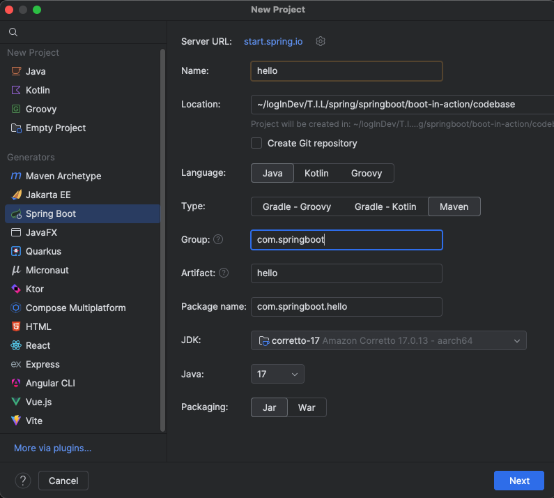

# 프로젝트 생성
스프링 부트 프로젝트를 쉽게 만드는 방법으로는 두가지가 있다.
1) IntelliJ IDEA에서 프로젝트를 생성
2) [start.spring.io](start.spring.io) 사이트에서 'Spring Initializr'를 이용해 생성

## IntelliJ IDEA에서 프로젝트를 생성

- Name : 프로젝트의 이름을 설정한다.
- Location : 프로젝트를 생성할 위치를 설정한다.
- Language : JVM 상에서 동작하는 언어를 선택한다.
- Type : 빌드 툴을 선택한다.
- Group : 이 프로젝트를 정의하는 고유한 식별자 정보인 그룹을 설정한다. 이 프로젝트를 진행하는 데 영향을 주지는 않는다. 
- Artifact : 세부 프로젝트를 식별하는 정보를 기입한다. 추후 빌드명이 된다.
- Package name : Group과 Artifact를 설정하면 자동으로 입력된다.
- JDK : JDK 버전을 설정한다.
- Java : Java 버전 설정
- Packaging : 애플리케이션을 쉽게 배포하고 동작하게 할 파일들의 패키징 옵션
>🫥참고 : JAR(Java Archive) vs WAR(Web Application Archive)
>모두 Java 애플리케이션을 패키징하는 데 사용되는 파일 형식
>**JAR(Java Archive)**
>- 용도 : JAR 파일은 Java 클래스 파일, 메타데이터, 리소스 파일(예: 이미지, 텍스트 파일 등)을 하나의 압축된 파일로 묶는 데 사용된다. 주로 Java 라이브러리나 애플리케이션을 배포하는데 사용된다.
>- 구조 : JAR 파일은 ZIP 형식으로 압축되어 있으며, META-INF 디렉토리와 클래스 파일이 포함된다. MANIFEST.MF 파일을 통해 JAR의 메타데이터를 정의할 수 있다.
>- 실행 : JAR 파일은 Java Runtime Environment(JRE)에서 실행할 수 있으며, `java -jar yourfile.jar`명령어로 실행할 수 있다.
>**WAR(Web Application Archive)**
>- 용도 : WAR 파일은 웹 애플리케이션을 배포하는 데 사용된다. JAR 파일과 유사하지만, 웹 애플리 케이션에 필요한 추가 파일과 구조를 포함한다.
>- 구조 : WAR 파일은 JAR 파일과 유사하게 ZIP 형식으로 압축되지만, WEB-INF 디렉토리와 web.xml 파일이 포함되어 있다. WEB-INF 디렉토리에는 서블릿, JSP 파일, 라이브러리(JAR 파일) 등이 포함된다.
>- 실행 : WAR 파일은 웹 서버(예: Apache Tomcat)에서 배포되어 실행된다. 웹 서버는 WAR 파일을 자동으로 추출하고, 웹 애플리케이션을 실행할 수 있도록 설정한다.
>**최근 Java 프로젝트 패키징 트랜드**
>최근에는 SpringBoot를 많이 사용한다. SpringBoot는 내장 Tomcat, Jetty등을 지원하여, 별도의 웹 서버 없이도 실행할 수 있으므로 JAR 파일 형식으로 애플리케이션을 패키징하는 것을 권장한다. 

**의존성 선택**

# pom.xml(Project Object Model) 살펴보기
`pom.xml` 파일은 메이븐의 기능을 사용하기 위해 작성하는 파일이다. 이 파일에는 프로젝트, 의존성 라이브러리, 빌드 등의 정보 및 해당 프로젝트를 관리하는 데 필요한 내용이 기술되어있다.

## 빌드 관리 도구
빌드 관리 도구는 JVM이나 WAS가 프로젝트를 인식하고 실행할 수 있게 우리가 작성한 소스코드와 프로젝트에 사용된 파일(.xml, .jar, .properties)을 빌드하는 도구이다. 개발 규모가 커질수록 관리할 라이브러리가 많아지고 라이브러리 간 버전 호환성을 체크해야 하는 어려움이 발생하는데, 빌드 관리 도구를 이용하면 이 같은 문제를 해결할 수 있다.

## 메이븐
아파치 메이븐은 자바 기반의 프로젝트를 빌드하고 관리하는 데 사용하는 도구이다. 초창기 자바 프로젝트의 대표적 관리 도구였던 Ant를 대체하기 위해 개발됐다. 메이븐의 가장 큰 특징은 `pom.xml`파일에 필요한 라이브러리를 추가하면 해당 라이브러리에 필요한 라이브러리까지 함께 내려받아 관리한다는 점이다. 

메이븐의 대표 기능
- 프로젝트 관리 : 프로젝트 버전과 아티팩트를 관리한다.
- 빌드 및 패키징 : 의존성을 관리하고 설정된 패키지 형식으로 빌드를 수행한다.
- 테스트 : 빌드를 수행하기 전에 단위 테스트를 통해 작성된 애플리케이션 코드의 정상 동작 여부를 확인한다.
- 배포 : 빌드가 완료된 패키지를 원격 저장소에 배포한다.

### 메이븐의 생명주기
메이븐의 기능은 생명주기 순서에 따라 관리되고 동작한다. IntelliJ의 오른쪽 maven버튼을 클릭하면 메이븐의 생명주기를 알 수 있다.

메이븐의 생명주기는 크게 `기본 생명주기(Default Lifecycle)`, `클린 생명주기(Clean Lifecycle)`, `사이트 생명주기(Site Lifecycle)`의 3가지로 구분한다. 

각 생명주기에는 단계(phase)가 존재하며, 특정 단계를 수행하기 위해서는 이전 단계를 마쳐야 한다.

