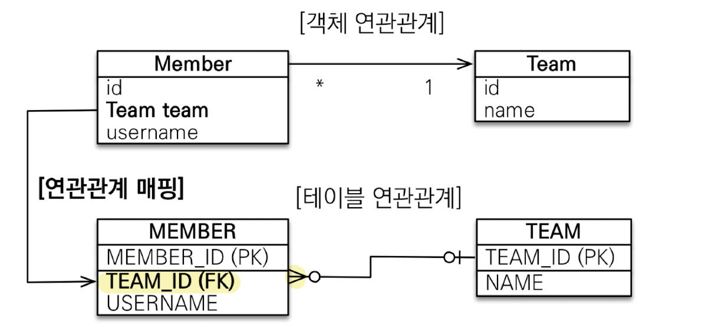
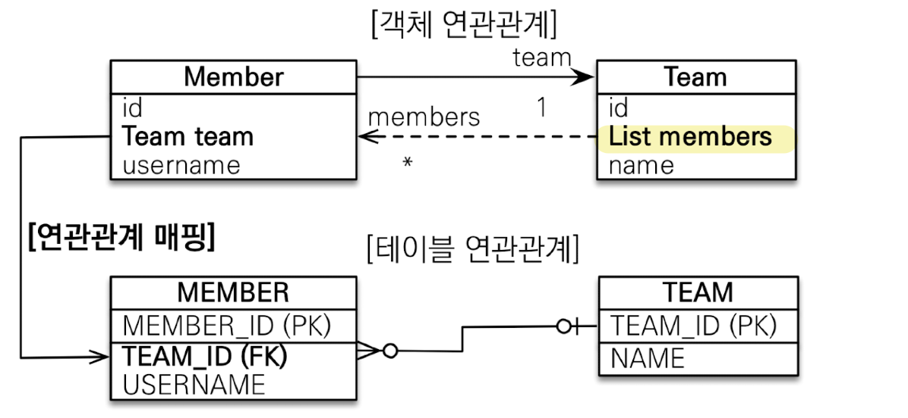
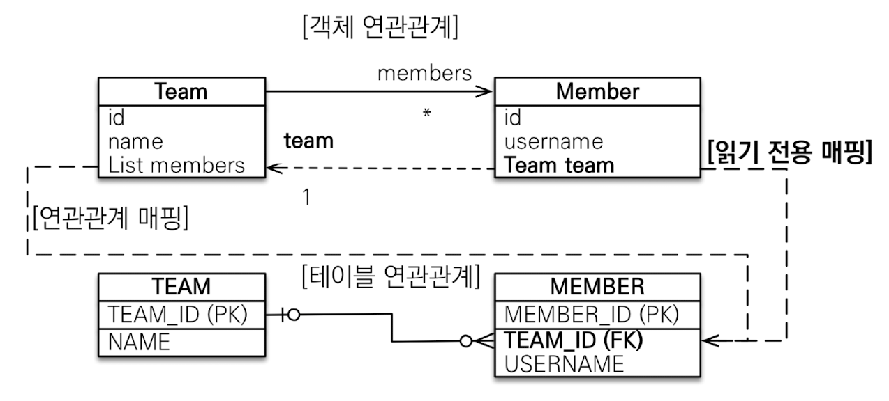
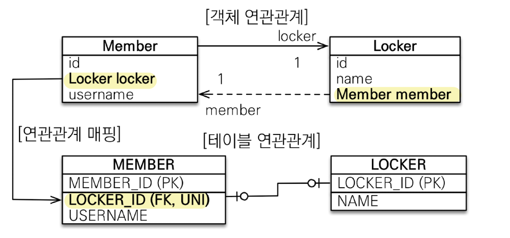
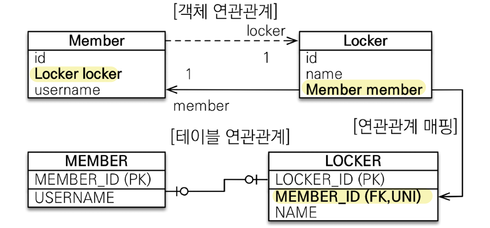
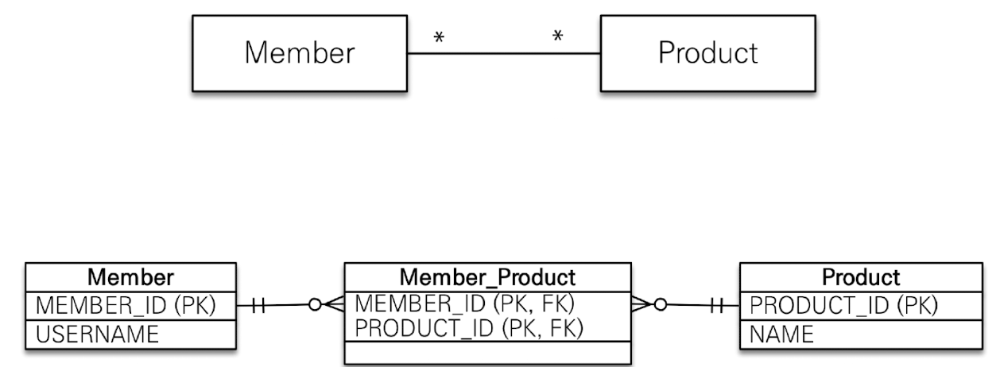
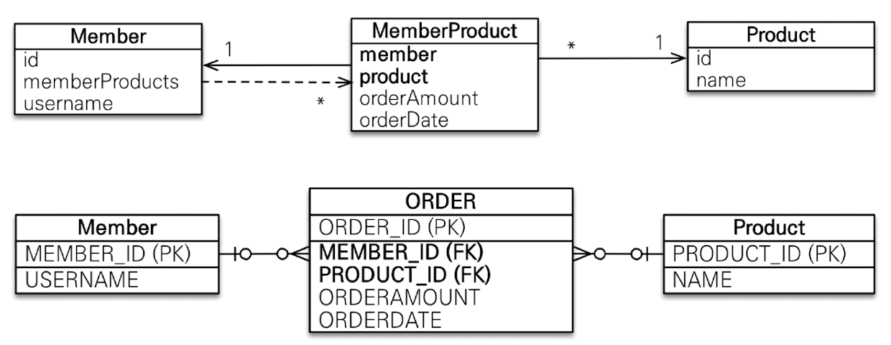
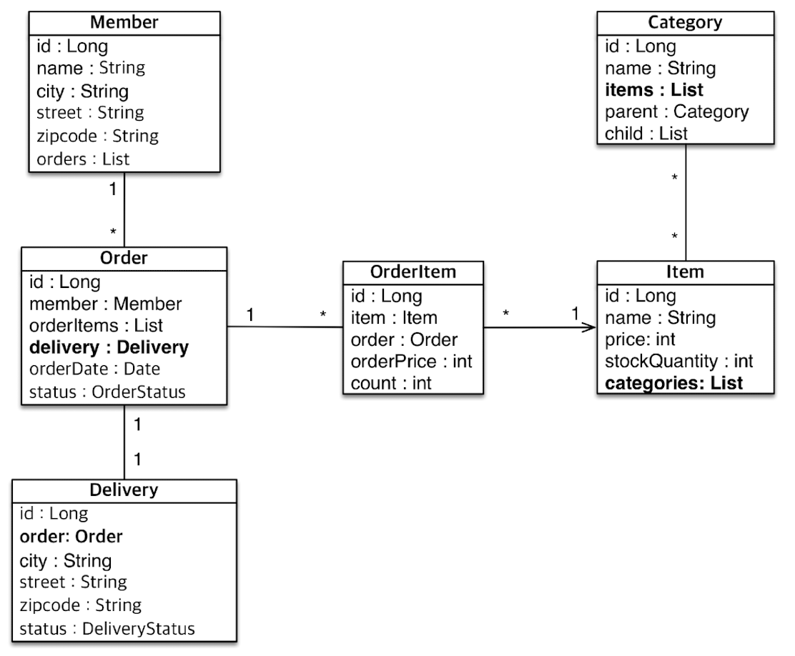
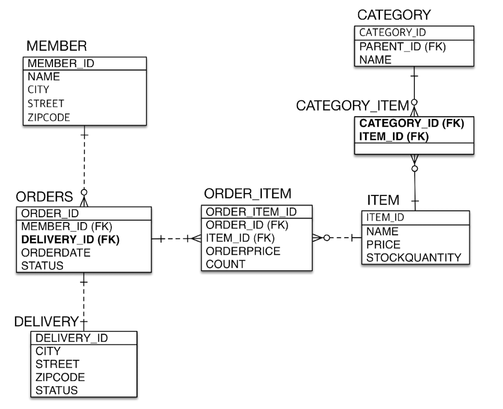

# 연관관계 매핑 시 고려사항 3가지
**1. 다중성**
다중성 관계를 맺을 때 애매한 경우 반대를 생각하면 된다. 일대다의 반대는 다대일이다.
- 다대일 : `@ManyToOne`
- 일대다 : `@OneToMany`
- 일대일 : `@OneToOne`
- 다대다 : `@ManyToMany` - 실무에서 다대다는 쓰면 안 된다.

**2. 단방향, 양방향**
테이블
- 외래 키 하나로 양쪽 조인 가능
- 사실 방향이라는 개념이 없음

객체
- 참조용 필드가 있는 쪽으로만 참조 가능
- 한쪽만 참조하면 단방향
- 양쪽이 서로 참조하면 양방향

**3. 연관관계의 주인**
- 테이블은 외래 키 하나로 두 테이블이 연관관계를 맺음
- 객체 양방향 관계는 A->B, B->A 처럼 참조가 2군데
- 객체 양방향 관계는 참조가 2군데 있음. 둘 중 테이블의 외래 키를 관리할 곳을 지정해야함
- 연관관계의 주인 : 외래 키를 관리하는 참조
- 주인의 반대편 : 외래 키에 영향을 주지 않음. 단순 조회만 가능

# 다대일 \[N : 1]
## 다대일 단방향

- 일대다 관계에서는 항상 다(N)쪽에 외래키가 있어야 한다.
- 가장 많이 사용하는 연관관계
- 다대일의 반대는 일대다이다.

## 다대일 양방향

- 양뱡항을 위해 객체에 추가해도 테이블은 영향받는게 없음.
- 외래키가 있는 쪽이 연관관계의 주인
- 양쪽을 서로 참조하도록 개발

# 일대다 \[1 : N]
## 일대다 단방향

- 실무에서는 사용안함(비추천)
- 성능상 큰 문제는 없지만 team에 추가를 했는데 member 테이블에 update 쿼리가 나가야하는 현상.
- 일대다 단방향은 일대다(1:N)에서 일(1)이 연관관계의 주인
- 테이블 일대다 관계는 항상 다(N)쪽에 외래키가 있음
- 객체와 테이블의 차이 때문에 반대편 테이블의 외래 키를 관리하는 특이한 구조
- `@JoinColumn`을 꼭 사용해야 함. 그렇지 않으면 조인 테이블 방식을 사용함(중간에 테이블 하나 추가함)
- ⊖엔티티가 관리하는 외래 키가 다른 테이블에 있음
- ⊖연관관계 관리를 위해 추가로 update SQL 실행해야 함.
- 일대다 단방향 매핑보다는 다대일 양방향 매핑을 사용하자.

## 일대다 양방향

- 이런 매핑은 공식적으로 존재 X
- `@JoinColumn(insertable=false, updatable=false)`
- 읽기 전용 필드를 사용해서 양방향처럼 사용하는 방법
- 일대다 단방향 · 양방향 사용하지 말고 **다대일 양방향**을 사용하자

# 일대일 \[1 : 1]
- 일대일 관계는 그 반대도 일대일
- 주 테이블이나 대상 테이블 중에 외래 키 선택 가능
- 외래 키에 데이터 베이스 유니크(UN) 제약조건 추가

## 일대일 - 주 테이블에 외래 키 단방향

- 다대일(`@ManyToOne`) 단방향 매핑과 유사

## 일대일 - 주 테이블에 외래 키 양방향

- 다대일 양방향 매핑처럼 외래키가 있는 곳이 연관관계의 주인
- 반대편은 `mappedBy` 적용

## 일대일 - 대상 테이블에 외래 키 단방향

- 단방향 관계는 JPA 지원 X
- 양방향 관계는 지원 O

## 일대일 - 대상 테이블에 외래 키 양방향

- 일대일 주 테이블에 외래 키 양방향과 매핑 방법은 같음.

## 일대일 정리
### 주 테이블에 외래 키
- 주 객체가 대상 객체의 참조를 가지는 것 처럼 주테이블에 외래 키를 두고 대상 테이블을 찾음
- 객체지향 개발자 선호
- JPA 매핑 편리
- ⊕주 테이블만 조회해도 대상 테이블에 데이터가 있는지 확인 가능 - 개발 입장에서 성능상 조회 시 주 테이블에 외래키가 있는게 좋음
- ⊖값이 없으면 외래 키에 null 허용
- 실무에서는 주 테이블 외래키에 일대일 단방향을 주로 사용함 - 단, 단점 때문에 DBA의 양해가 필요함

### 대상 테이블에 외래 키
- 대상 테이블에 외래 키가 존재
- 전통적인 데이터베이스 개발자 선호
- ⊕주 테이블과 대상 테이블을 일대일에서 일대다 관계로 변경할 때 테이블 구조 유지
- ⊖프록시 기능의 한계로 지연 로딩으로 설정해도 항상 즉시 로딩됨

# 다대다 \[N : M]
- **실무에서 사용되면 안된다 생각되는 방식**
- 관계형 데이터 베이스는 정규화된 테이블 2개로 다대다 관계를 표현할 수 없음
- 연결 테이블을 추가해서 일대다, 다대일 관계로 풀어내야 함.

- **객체는 컬렉션을 사용해서 객체 2개로 다대다 관계 가능**

- `@ManyToMany` 사용
- `@JoinTable` - `mappedBy`로 연결 테이블 지정
- 다대다 매핑 : 단방향, 양방향 가능
- ⊖편리해 보이지만 실무에서 사용 X
- ⊖연결 테이블이 단순히 연결만 하고 끝나지 않음
- ⊖매핑 정보만 들어가고 추가적인 정보가 들어가지 않음
- ⊖쿼리도 내가 생각하지 못한 쿼리가 나감

### 다대다 한계 극복
- 연결 테이블용 엔티티 추가(연결 테이블을 엔티티로 승격)
- `@ManyToMany` -> `@OneToMany`, `@ManyToOne`

# 실전 - 다양한 연관관계 매핑
## 엔티티
- 주문과 배송은 1 : 1(`@OneToOne`)
- 상품과 카테고리는 N : M(`@ManyToMany`)

## ERD

## N:M 관계는 1:N, N:1로
- 테이블의 N:M 관계는 중간 테이블을 이용해서 1:N, N:1
- 실전에서는 중간 테이블이 단순하지 않다.
- `@ManyToMany`는 제약 : 필드 추가 X, 엔티티 테이블 불일치
- 실무에서는 `@ManyToMany` 사용 X

## @JoinColumn
- 외래 키를 매핑할 때 사용

| 속성                                                                        | 설명                                                 | 기본값                              |
| ------------------------------------------------------------------------- | -------------------------------------------------- | -------------------------------- |
| name                                                                      | 매핑할 외래 키 이름                                        | 필드명 + \_ + 참조하는 테이블의 기본 키 컬럼명 |
| referencedColumnName                                                      | 외래 키가 참조하는 대상 테이블의 컬럼명                             | 참조하는 테이블의 기본키 컬럼명             |
| foreignKey(DDL)                                                           | 외래 키 제약조건을 직접 지정할 수 있다. 이 속성은 테이블을 생성할 때만 사용한다. |                                  |
| unique nullable insertable updateable columnDefinition  table | `@Column`의 송성과 같다                                  |                                  |

## @ManyToOne - 주요 속성
- 다대일 관계 매핑

| 속성           | 설명                                                                             | 기본값                                                         |
| ------------ | ------------------------------------------------------------------------------ | ----------------------------------------------------------- |
| optional     | false로 설정하면 연관된 엔티티가 항상 있어야 한다.                                                | TRUE                                                        |
| fetch        | 글로벌 페치 전략을 설정한다. (`즉시로딩` or `지연로딩`)                                         | - @ManyToOne=FetchType.EAGER - @OneToMAny=FetchType.LAZY |
| cascade      | 영속성 전이 기능을 사용한다.                                                               |                                                             |
| targetEntity | 연관된 엔티티의 타입 정보를 설정한다. 이 기능은 거의 사용하지 않는다.  컬렉션을 사용해도 제네릭으로 타입 정보를 알 수 있다. |                                                             |

## @OneToMany - 주요 속성
- 일대다 관계 매핑

| 속성           | 설명                 | 기본값 |
| ------------ | ------------------ | --- |
| mappedBy     | 연관관계의 주인 필드를 선택한다. |     |
| fetch        | 글로벌 페치 전략을 설정한다. (`즉시로딩` or `지연로딩`)                                         | - @ManyToOne=FetchType.EAGER - @OneToMAny=FetchType.LAZY |
| cascade      | 영속성 전이 기능을 사용한다.                                                               |                                                             |
| targetEntity | 연관된 엔티티의 타입 정보를 설정한다. 이 기능은 거의 사용하지 않는다.  컬렉션을 사용해도 제네릭으로 타입 정보를 알 수 있다. |                                                             |

