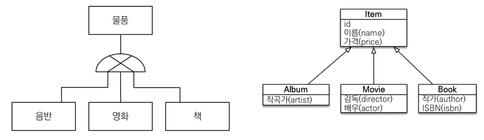
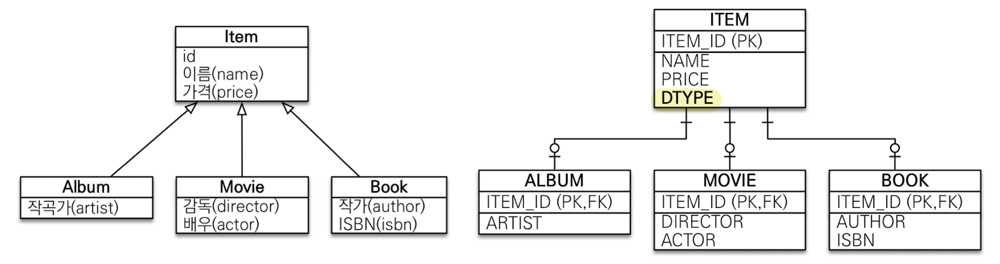
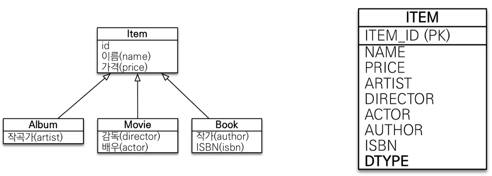
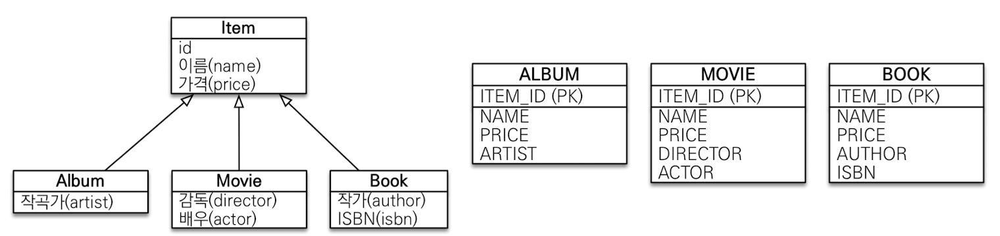
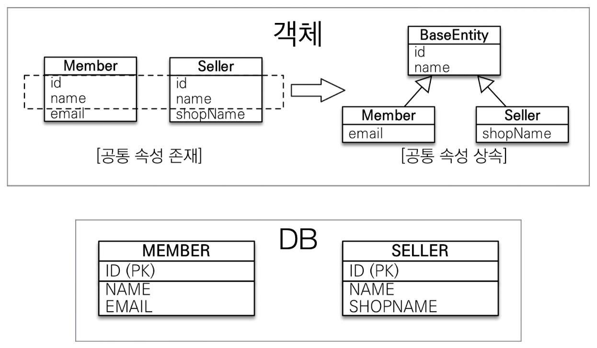
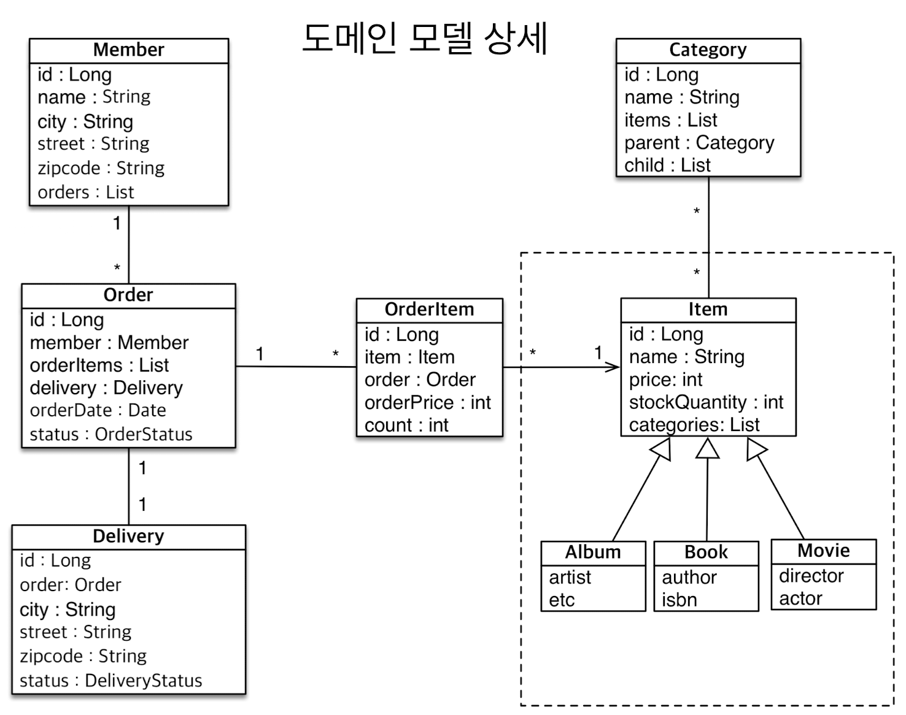
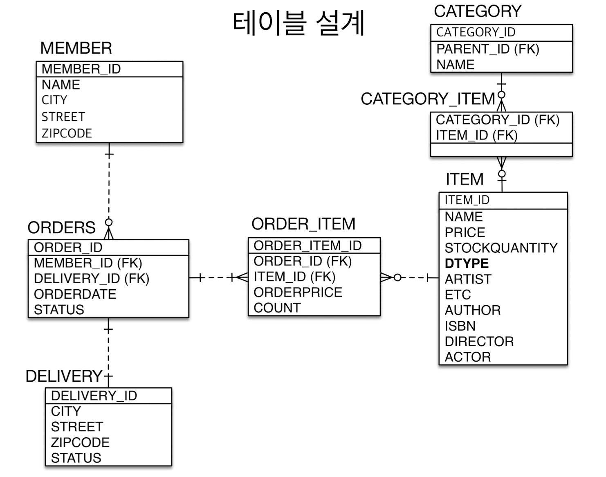

# 상속관계 매핑
- 관계형 데이터 베이서는 상속 관계 X
- 슈퍼 타입 서브 타입 관계라는 모델링 기법이 객체 상속과 유사
- 상속관계 매핑 : 객체의 상속 구조와 DB의 슈퍼 타입, 서브 타입 관계를 매핑

- 슈퍼 타입, 서브 타입 논리 모델을 실제 물리 모델로 구현하는 방법
	- 각각 테이블로 변환 -> 조인 전략
	- 통합 테이블로 변환 -> 단일 테이블 전략
	- 서브타입 테이블로 변환 -> 구현 클래스마다 테이블 전략

# 주요 어노테이션
**@Inheritance(strategy=InheritanceType.XXXX)**
- `JOINED` : 조인 전략
- `SINGLE_TABLE` : 단일 테이블 전략
- `TABLE_PER_CLASS` :  구현 클래스마다 테이블 전략
- 비즈니스적으로 단순한 경우 단일 테이블전략, 복잡한 경우 조인 전략을 사용한다.(구현 클래스전략은 아예 논외!)
**@DiscriminatorColumn(name="DTYPE")**
**@DiscriminatoreValue("XXX")**

# 조인 전략

- 부모 클래스(Item)에 `@Inheritance(stratege=InheritanceType.JOINED)`를 추가하면 조인전략으로 됨.
- 조회 시 `INNER JOIN`으로 조회해 옴
- `@DiscriminatorColumn`을 추가하면 어느 객체에서 넣은 건지 DTYPE을 추가해 줌
- `@DiscriminatorValue("A")`를 각 자식마다 바꿔서 넣으면 DTYPE에 들어가는 값을 바꿀 수 있음
- ⊕테이블 정규화
- ⊕외래 키 참조 무결성 제약조건 활용가능
- ⊕저장공간 효율화
- ⊖조회 시 조인을 많이 사용, 성능 저하
- ⊖조회 쿼리가 복잡함
- ⊖데이터 저장 시 insert SQL 2번 호출

# 단일 테이블 전략

- JPA default 전략 - 아무 옵션설정 없으면 상속한 객체는 한 테이블로 만들어서 적용함.
- ⊕조인이 필요 없으므로 일반적으로 조회 성능이 빠름
- ⊕조회 쿼리가 단순함
- ⊖자식 엔티티가 매핑한 컬럼은 모두 null 허용
- ⊖단일 테이블에 모든 것을 저장하므로 테이블이 커질 수 있다. 상황에 따라서 조회 성능이 오히려 느려질 수 있다.

# 구현 클래스마다 테이블 전략

- 부모 클래스를 추상클래스(abstract)로 만들고 `@Inheritance(strategy=inheritanceType.TABLE_PER_CLASS)`로 만들면 Item 테이블 없이 자식 테이블만 생성됨.
- 이 전략은 DBA와 ORM 전문가 둘 다 추천 안하는 전략 - 실무에서 사용하면 안되는 전략
- ⊕서브 타입을 명확하게 구분해서 처리할 때 효과적
- ⊕not null 제약조건 사용 가능
- ⊖여러 자식 테이블을 함께 조회할 때 성능이 느림(UNION SQL 필요)
- ⊖자식 테이블을 통합해서 쿼리하기 어려움

# @MappedSuperclass
공통 매핑 정보가 필요할 때 사용(ex : id, name) - 테이블은 다른데 객체에서 속성정보만 상속받아서 사용하고 싶을 경우

- 상속관계 매핑 X
- 엔티티 X, 테이블과 매핑 X
- 부모 클래스를 상속 받는 자식 클래스에 매핑 정보만 제공
- 조회, 검색 불가(em.find(BaseEntity) 불가)
- 직접 생성해서 사용할 일이 없으므로 추상 클래스 권장
- 테이블과 관계 없고, 단순히 엔티티가 공통으로 사용하는 매핑 정보를 모으는 역할
- 주로 등록일, 수정일, 등록자, 수정자 같은 전체 엔티티에서 공통으로 적용하는 정보를 모을 때 사용
- 참고 : `@Entity` 클래스는 엔티티나 `@MappedSuperclass`로 지정한 클래스만 상속 가능

# 실전 예제 - 상속관계 매핑
## 요구사항 추가
- 상품의 종류는 음반, 도서, 영화가 있고 이후 더 확장될 수 있다.
- 모든 데이터는 등록일과 수정일이 필수다.

