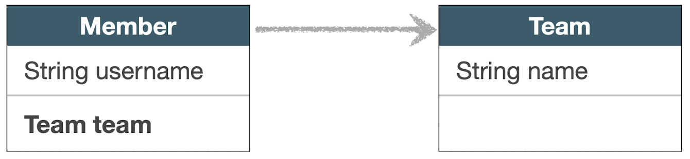
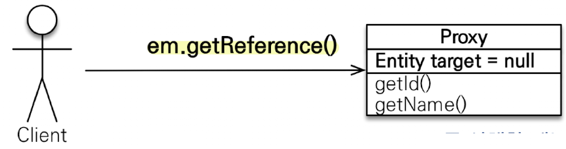
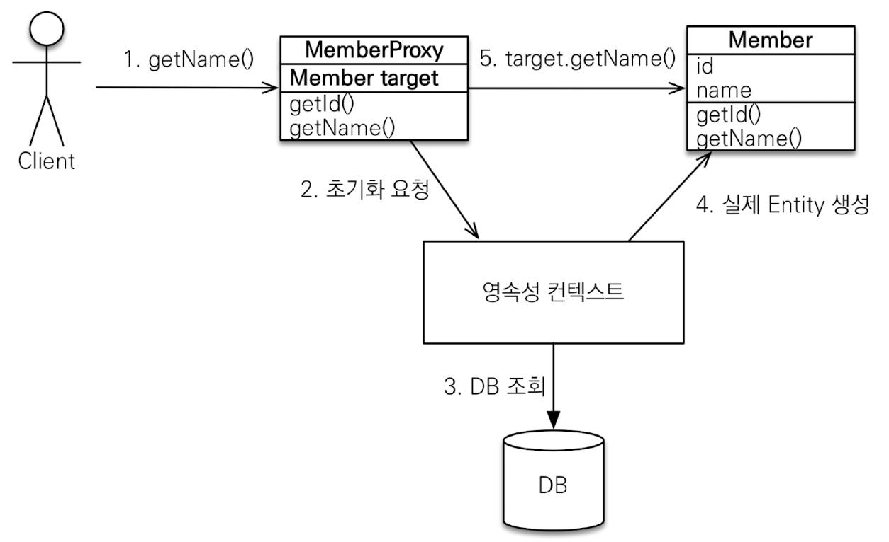
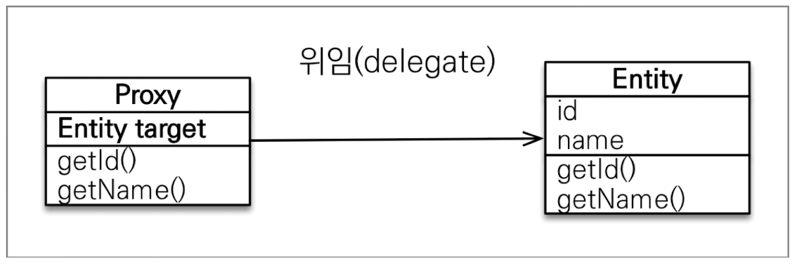
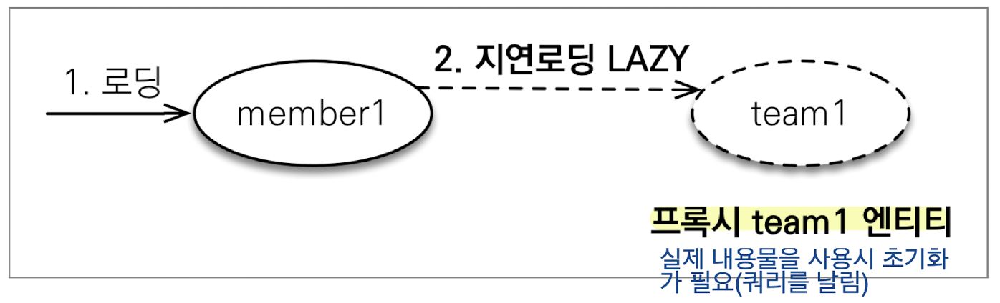
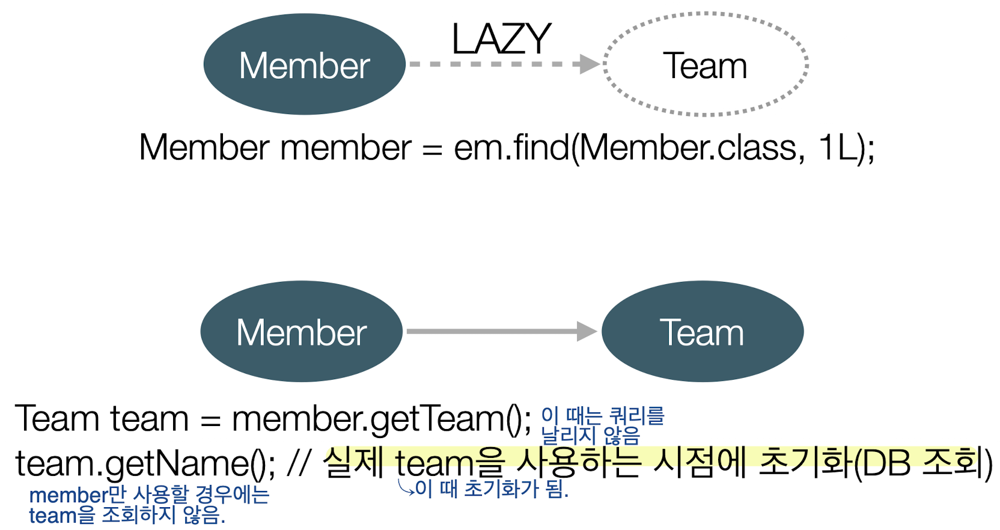
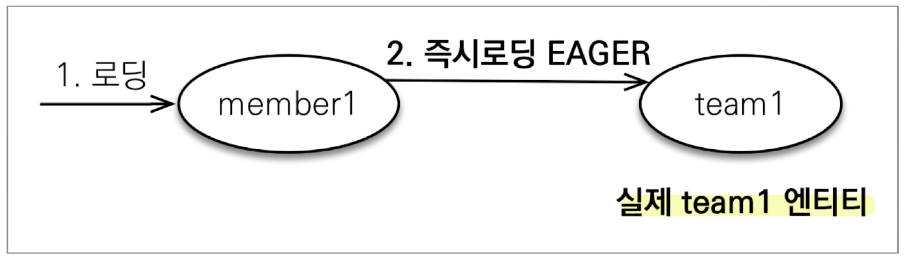
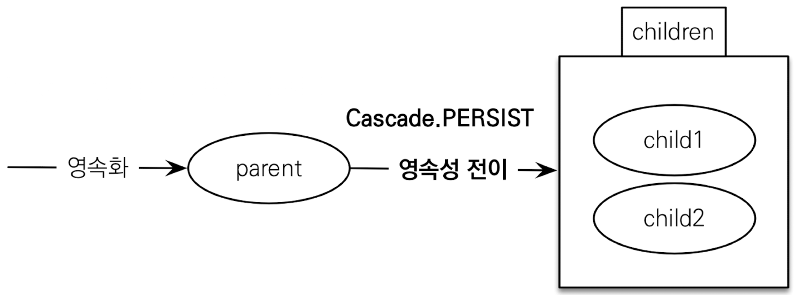

# 프록시
**Member를 조회할 때 Team도 함께 조회해야 할까?**



- 회원과 팀 함께 출력
	```java
	public void printUserAndTeam(Stirng memberId){
		Member member = em.find(Member.class, memberId);
		Team team = member.getTeam();
		System.out.println("회원 이름: " + member.getUsername());
		System.out.pringln("소속팀 : " + team.getName());
	}
	```
- 회원만 출력
	```java
	public void printUser(String memberId){
		Member member = em.find(Member.class, memberId);
		Team team = member.getTeam();
		System.out.println("회원 이름: " + member.getUsername());
	}
	```

## em.find() vs em.getReference()
- `em.find()` : 데이터 베이스를 통해서 실제 엔티티 객체 조회
- `em.getReferenc()` : 데이터 베이스 조회를 미루는 가짜(프록시) 엔티티 객체 조회(껍데기에 id 값만 들어있는 가짜가 반환된다.) ⇢ 쿼리는 안 나가는데 객체가 조회 됨.
	- select 쿼리는 나가지 않지만, `em.getReference()`로 받은 내용물을 사용하거나 출력하려고 할 때 select 쿼리가 나감.


## 프록시 객체의 초기화
```java
Member member = em.getReference(Member.class, "id1");
member.getName();
```



## 프록시 특징
- 실제 클래스와 상속 받아서 만들어짐
- 실제 클래스와 겉 모양이 같다.
- 사용하는 입장에서는 진짜 객체인지 프록시 객체인지 구분하지 않고 사용하면 됨(이론상
- 프록시 객체는 실제 객체의 참조(target)를 보관
- 프록시 객체를 호출하면 프록시 객체는 실제 객체의 메소드를 호출


- 프록시 객체는 처음 사용할 때 한 번만 초기화
- 프록시 객체를 초기화 할 때, 프록시 객체가 실제 엔티티로 바뀌는 것은 아님. 초기화되면 프록시 객체를 통해서 실제 엔티티에 접근 가능
	```java
		Member member = new Member();
		member.setUsername("hello");
	
		em.persist(member);
	
		Member findMember = em.getReference(MEmber.class, member.getId());
		System.out.println("before findMember = " + findMember.getClass());
		System.out.println("findMEmber.username = " + findMember.getUsername());
		System.out.println("after findMember = " + findMember.getClass());
	```
	- before, after 출력되는 객체는 같음. 프록시 객체가 교체되는게 아니라 프록시는 유지되고 내부에 타겟에만 값이 채워지는 거임.
- 프록시 객체는 원본 엔티티를 상속받음. 따라서, 타입 체크 시 주의해야함(`==` 비교 시 false, 대신 `instance of` 를 사용해서 비교해야 함.) - 프록시를 쓸지 안쓸지 모르니 JPA에서 타입 비교 시 웬만하면 `==` 대신 `instance of`를 사용해야 한다.
- 영속성 컨텍스트에 찾는 엔티티가 이미 있으면 `em.gerReference()`를 호출해도 실제 엔티티 반환.
- 영속성 컨텍스트의 도움을 받을 수 없는 준영속 상태일 때, 프록시를 초기화하면 문제 발생(하이버네이터는 `org.hibernate.LazyInitializationException` 예외를 발생시킴.)


## 프록시 확인
- 프록시 인스턴스의 초기화 여부 확인
	```java
	PresistenceUnitUtil.isLoaded(Object entity);
	em.getPersistenceUnitUtil().isLoaded(refMember);
	```
- 프록시 클래스 확인 방법(강제 초기화 효과도 있음)
	```java
	entity.getClass().getName();
	```

- 프록시 강제 초기화(하이버네이트에서 제공하는 효과)
	```java
	org.hiberanate.Hibernate.initialize(entity);
	```

- 참고 : JPA 표준은 강제 초기화 없음


# 즉시 로딩과 지연 로딩
## 지연 로딩 `LAZY`을 사용해서 프록시로 조회
```java
@Entity
public class Member{
	@Id
	@GeneratedValue
	private Long id;

	@Column(name = "USERNAME")
	private String name;

	@ManyToOne(fetch = FetchType.LAZY)
	@JoinColumn(name = "TEAM_ID")
	private Team team;
}
```



## Member와 Team을 자주 함께 사용한다면 → 즉시 로딩 `EAGER`를 사용해서 함께 조회
```java
@Entity
public class Member{
	@Id
	@GeneratedValue
	private Long id;

	@Column(name = "USERNAME")
	private String name;

	@ManyToOne(fetch = FetchType.EAGER)
	@JoinColumn(name = "TEAM_ID")
	private Team team;
}
```

- Member 조회 시 항상 Team도 조회.
- JPA 구현체는 가능하면 조인을 사용해서 SQL 한 번에 함께 조회

### 프록시와 즉시로딩 주의
- 실무에서는 가급적 지연 로딩만 사용 - 즉시 로딩 사용 시 여러 테이블의 JOIN이 발생하여 성능저하 발생
- 즉시 로딩을 적용하면 예상하지 못한 SQL이 발생
- 즉시 로딩으로 가져온다는 것은 가져올 때 무조건 다 값이 있어야 한다는 것을 의미.
- 즉시 로딩은 JPQL에서 N+1 문제를 일으킨다.
	- N+1 문제 : 예를 들어 Member를 select하는 한 개 쿼리의 결과로 10개의 member 데이터가 반환되면 각 member에 해당되는 team 정보를 가져오는 쿼리가 10번 실행되어야 하므로 쿼리 하나의 결과 N번 만큼 쿼리가 실행되어야한다 해서 N+1문제라고 함.
- `@ManyToOne`, `@OneToOne`은 Default가 즉시 로딩이므로 `LAZY`로 설정해줘야 한다.


## 지연 로딩 활용
- Member와 Team은 자주 함께 사용 ⇢ **즉시 로딩**
- Member와 Order는 가끔 사용 ⇢ **지연 로딩**
- Order와 Product는 자주 함께 사용 ⇢ **즉시 로딩**
=> 이론상 그렇다는 거지 실무에서는 지연로딩만 사용해야 함.


# 영속성 전이 : CASCADE
- 특정 엔티티를 영속 상태로 만들 때 연관된 엔티티도 함께 영속 상태로 만들고 싶을 때
- 예 : 부모 엔티티를 저장할 때 자식 엔티티도 함께 저장
```java
@OneToMany(mappedBy="pareent", casdcade=CascadeType.PERSIST)
```


## 주의
- 영속성 전이는 연관관계를 매핑하는 것과 아무 관련이 없음
- 엔티티를 영속화할 때 연관된 엔티티도 함께 영속화하는 편리함을 제공할 뿐
- 해당 객체는 하나만 연관되었을 경우에만 사용(소유자가 하나일 경우 - 라이프 사이클이 같으므로). 다른 것과 같이 사용하는 것은 사용하면 복잡해지니 안사용하는게 좋음.


## CASCADE의 종류
- `ALL` : 모두 적용.
- `PERSIST` : 영속
- `REMOVE` : 삭제
- `MERGE` : 병합
- `REFRESH` : refresh
- `DETACH` : detach


# 고아 객체
- 고아 객체 제거 : 부모 엔티티와 연관관계가 끊어진 자식 엔티티를 자동으로 삭제
- `orphanRemoval = true`
```java
Parent parent1 = em.find(Parent.class, id);
parent1.getChildren().remove(0); // 자식 엔티티를 컬렉션에서 제거
//Delete from child where id=?;
```


## 주의
- 참조가 제거된 엔티티는 다른 곳에서 참조하지 않는 고아 객체로 보고 삭제하는 기능
- 참조하는 곳이 하나일 때 사용해야 함.
- 특정 엔티티가 개인 소유할 때 사용
- `@OneToOne`, `@OneToMany`만 가능
- 참고 : 개념적으로 부모를 제거하면 자식은 고아가 된다. 따라서 고아 객체 제거 기능을 활성화하면, 부모를 제거할 때 자식도 함께 제거된다. 이것은 `CascadeType.REMOVE`처럼 동작한다.


# 영속성 전이 + 고아 객체, 생명주기
- `CascadeType.ALL` + `orphanRemoval=true`
- 스스로 생명주기를 관리하는 엔티티는 `em.persist()`로 영속화, `em.remove()`로 제거
- 두 옵션을 모두 활성화하면 부모 엔티티를 통해서 자식의 생명주기를 관리할 수 있음.(DAO, Repository가 없어도 됨)
- 도메인 주도 설계(DDD)의 Aggregate Root개념을 구현할 때 유용
>Repository는 Aggregate Root만 생성하고 나머지는 만들지 않는 것이 더 유용하다. Aggregate Root 밑에 애들은 Aggregate Root를 통해 관리하는 것이 좋다.


# 실전 예제 - 연관관계 관리
## 글로벌 페치 전략 설정
- 모든 연관관계를 지연 로딩으로
- `@ManyToOne`, `@OneToOne`은 Default가 즉시 로딩이므로 지연 로딩으로 변경


## 영속성 전이 설정
- Order -> Delivery 를 영속성 전이 `ALL` 설정
- Order -> OrderItem을 영속성 전이 `ALL` 설정


