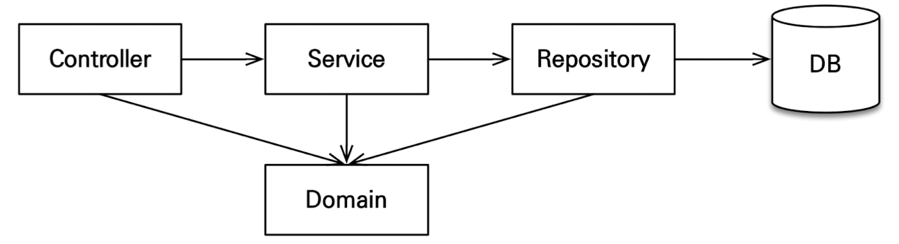

# 기능 목록
- 회원 기능
	- 회원 등록
	- 회원 조회
- 상품 기능
	- 상품 등록
	- 상품 수정
	- 상품 조회
- 주문 기능
	- 상품 주문
	- 주문 내역 조회
	- 주문 취소
- 기타 요구사항
	- 상품은 재고 관리가 필요하다
	- 상품의 종류는 도서, 음반, 영화가 있다.
	- 상품은 카테고리로 구분할 수 있다.
	- 상품 주문시 배송 정보를 입력할 수 있다.

# 도메인 모델과 테이블 설계


- **회원, 주문, 상품의 관계** : 회원은 여러 상품을 주문할 수 있다. 한 번 주문할 때 여러 상품을 선택할 수 있으므로 주문과 상품은 다대다 관계이다. 하지만 이런 다대다 관계는 관계형 데이터베이스는 물론이고 엔티티에서도 거의 사용하지 않는다. 따라서 그림처럼 주문상품이라는 엔티티를 추가해서 다대다 관계를 일대다, 다대일 관계로 풀어냈다.

- **상품 분류** : 상품은 도서, 음반, 영화로 구분되는데 상품이라는 공통 속성을 사용하므로 상속 구조로 표현했다.


## 회원 엔티티 분석


- **회원(Member)** : 이름과 임베디드 타입인 주소(Address), 그리고 주문(orders) 리스트를 가진다.
- **주문(Order)** : 한 번 주문시 여러 상품을 주문 할 수 있으므로 주문과 주문상품(OrderItem)은 일대다 관계다. 주문은 상품을 주문한 회원과 배송 정보, 주문 날짜, 주문 상태(status)를 가지고 있다. 주문 상태는 열거형을 사용했는데 주문(ORDER), 취소(CANCEL)을 표현할 수 있다.
- **주문상품(OrderItem)** : 주문한 상품 정보와 주문 금액(orderPrice), 주문 수량(count) 정보를 가지고 있다. (보통 `OrderLine`, `LineItem`으로 많이 표현한다.)
- **상품(Item)** : 이름, 가격, 재고수량(stockQuantity)을 가지고 있다. 상품을 주문하면 재고수량이 줄어든다. 상품의 종류로는 도서, 음반, 영화가 있는데 각각은 사용하는 속성이 조금씩 다르다.
- **배송(Delivery)** : 주문시 하나의 배송 정보를 생성한다. 주문과 배송은 일대일 관계이다.
- **카테고리(Category)** : 상품과 다대다 관계를 맺는다. parent, child로 부모, 자식 카테고리를 연결한다.
- **주소(Address)** : 값 타입(임베디드 타입)이다. 회원과 배송(Delivery)에서 사용한다.

## 회원 테이블 분석

- **MEMBER** : 회원 엔티티의 Address 임베디드 타입 정보가 회원 테이블에 그대로 들어갔다. 이것은 DELIVERY테이블도 마찬가지이다.
- **ITEM** : 앨범, 도서, 영화 타입을 통합해서 하나의 테이블로 만들었다. DTYPE 컬럼으로 타입을 구분한다.  - `SINGLE_TABLE` 전략을 사용함

## 연관관계 매핑 분석
- **회원과 주문** : 일대다, 다대일의 양방향 관계이다. 따라서 연관관계의 주인을 정해야 하는데, 외래 키가 있는 주문을 연관관계의 주인으로 정하는 것이 좋다. 그러므로 `Order.member`를 `ORDERS.MEMBER_ID` 외래 키와 매핑한다.
- **주문상품과 주문** : 다대일 양방향 관계다. 외래 키가 주문상품에 있으므로 주문상품이 연관관계의 주인이다. 그러므로 `OrderItem.order`를 `ORDER_ITEM.ORDER_ID` 외래 키와 매핑한다.
- **주문상품과 상품** : 다대일 단방향 관계다. `OrderItem.item`을 `ORDERS.DELIVERY_ID` 외래 키와 매핑한다.
- **주문과 배송** : 일대일 양방향 관계다. `Order.delivery`를 `ORDERS.DELIVERY_ID` 외래 키와 매핑한다. 
- **카테고리와 상품** : `@ManyToMany`를 사용해서 매핑하다.(`@ManyToMany` 실무에서는 사용하지 말자.)

>💡  **외래 키가 있는 곳을 연관관계의 주인으로 정해라.** 
>연관관계의 주인은 단순히 외래 키를 누가 관리하냐의 문제이지 비즈니스상 우위에 있다고 주인으로 정하면 안된다. 예를 들어 자동차와 바퀴가 있으면, 일대다 관계에서 항상 '다'쪽에 외래 키가 있으므로 외래 키가 있는 바퀴를 연관관계의 주인으로 정하면 된다. 물론 자동차를 연관관계의 주인으로 정하는 것이 불가능 한 것은 아니지만, 자동차를 연관관계의 주인으로 정하면 자동차가 관리하지 않는 바퀴 테이블의 외래 키 값이 업데이트 되므로 관리와 유지보수가 어렵고, 추가적으로 별도의 업데이트 쿼리가 발생하는 성능 문제도 있다. 주인이 아닌 쪽은 단순 조회용으로만 사용해야하 한다.

# 엔티티 클래스 개발
실무에서는 가급적 Getter는 열어두고, Setter는 꼭 필요한 경우에만 사용하는 것을 추천한다.

## 회원 엔티티
```java
package jpabook.jpashop.domain;  
  
import jakarta.persistence.*;  
import lombok.Getter;  
import lombok.Setter;  
  
import java.util.ArrayList;  
import java.util.List;  
  
@Entity  
@Getter @Setter  
public class Member {  
  
    @Id  
    @GeneratedValue    @Column(name = "member_id")  
    private Long id;  
  
    private String name;  
  
    @Embedded  
    private Address address;  
  
    @OneToMany(mappedBy = "member")  
    private List<Order> orders = new ArrayList<>();  
  
}
```

>💡 엔티티의 식별자는 `id`를 사용하고 PK 컬럼명은 `member_id`를 사용했다. 엔티티는 타입(여기서는 `Member`)이 있으므로 `id` 필드만으로 쉽게 구분할 수 있다. 테이블은 타입이 없으므로 구분이 어렵다. 그리고 테이블은 관례상 `테이블명 + id`를 많이 사용한다. 참고로 객체에서 `id` 대신에 `memberId`를 사용해도 된다. 중요한건 일관성이다. 

## 주문 엔티티
```java
package jpabook.jpashop.domain;  
  
import jakarta.persistence.*;  
import lombok.Getter;  
import lombok.Setter;  
  
import java.time.LocalDateTime;  
import java.util.ArrayList;  
import java.util.List;  
  
@Entity  
@Table(name = "orders")  
@Getter  
@Setter  
public class Order {  
  
    @Id  
    @GeneratedValue    @Column(name = "order_id")  
    private Long id;  
  
    @ManyToOne(fetch = FetchType.LAZY)  
    @JoinColumn(name="member_id")  
    private Member member;  
  
    @OneToMany(mappedBy = "order", cascade = CascadeType.ALL)  
    private List<OrderItem> orderItems = new ArrayList<>();  
  
    @OneToOne(fetch = FetchType.LAZY, cascade = CascadeType.ALL)  
    @JoinColumn(name = "deliver_id")  
    private Delivery delivery;  
  
    private LocalDateTime orderDate; // 주문시간  
  
    @Enumerated(EnumType.STRING)  
    private OrderStatus status; // 주문상태 [ORDER, CANCEL] 
     
    //==연관관계 편의 메서드==//  
    public void setMember(Member member) {  
        this.member = member;  
        member.getOrders().add(this);  
    }  
  
    public void addOrderItem(OrderItem orderItem) {  
        orderItems.add(orderItem);  
        orderItem.setOrder(this);  
    }  
  
    public void setDelivery(Delivery delivery) {  
        this.delivery = delivery;  
        delivery.setOrder(this);  
    }  
}
```
- `cascde = CascadeType.ALL` : Order를 저장하면 OrderItem에서 같이 저장이 됨. cascade는 persist를 전파함. `ALL`로 설정해서 delete할 때도 같이 제거됨.

>💡 **양방향 매핑시 연관관계 편의 메소드를 생성하자**
> 양방향 매핑시 데이터를 추가할 때 양쪽 모두 추가를 해줘야 한다.
> 
>이런 식으로 추가를 해줘야 하지만, 번거롭고 누락될 것을 대비해 연관관계용 편의 메소드를 만들어둔다.
>연관관계 편의 메소드는 양쪽 중에 핵심저으로 컨트롤하는 쪽에 있는 것이 좋다.
>`setMember()` 보다는 `addOrderItem()`등으로 메소드 명을 설정해서 set로직에는 영향을 미치지 않고 좀 더 중요한 작업을 하는 것처럼 보이도록 한다.

## 주문상태
```java
package jpabook.jpashop.domain;  
  
public enum OrderStatus {  
    ORDER, CANCEL  
}
```

## 주문상품
```java
package jpabook.jpashop.domain;  
  
import jakarta.persistence.*;  
import jpabook.jpashop.domain.item.Item;  
import lombok.Getter;  
import lombok.Setter;  
  
@Entity  
@Getter  
@Setter  
public class OrderItem {  
  
    @Id @GeneratedValue  
    @Column(name="order_item_id")  
    private Long id;  
  
    @ManyToOne(fetch = FetchType.LAZY)  
    @JoinColumn(name = "item_id")  
    private Item item;  
  
    @ManyToOne(fetch = FetchType.LAZY)  
    @JoinColumn(name = "order_id")  
    private Order order;  
  
    private int orderPrice; // 주문 가격  
    private int count; // 주문 수량  
  
}
```

## 상품 엔티티
```java
package jpabook.jpashop.domain.item;  
  
import jakarta.persistence.*;  
import jpabook.jpashop.domain.Category;  
import lombok.Getter;  
import lombok.Setter;  
  
import java.util.ArrayList;  
import java.util.List;  
  
@Entity  
@Inheritance(strategy = InheritanceType.SINGLE_TABLE)  
@DiscriminatorColumn(name = "dtype")  
@Getter  
@Setter  
public abstract class Item {  
  
    @Id  
    @GeneratedValue    @Column(name = "item_id")  
    private Long id;  
  
    private String name;  
    private int price;  
    private int stockQuantity;  
  
    @ManyToMany(mappedBy = "items")  
    private List<Category> categories = new ArrayList<>();  
}
```

>💡 `Inheritance Type`에는 3가지 전략이 있음
>- `SINGLE_TABLE` : 한 테이블에 다 합쳐서 넣는 것
>	- `@DiscriminatorColumn(name = "dtype")` : 상속 객체 구분용 컬럼명
>- `TABLE_PER_CLASS` : 각각의 자식 테이블이 다 생성되는 것
>- `JOINED` : 가장 정규화된 스타일

### 상품 - 도서 엔티티
```java
package jpabook.jpashop.domain.item;  
  
import jakarta.persistence.DiscriminatorValue;  
import jakarta.persistence.Entity;  
import lombok.Getter;  
import lombok.Setter;  
  
  
@Entity  
@DiscriminatorValue("B")  
@Getter  
@Setter  
public class Book extends Item {  
    private String author;  
    private String isbn;  
}
```

### 상품 - 음반 엔티티
```java
package jpabook.jpashop.domain.item;  
  
import jakarta.persistence.DiscriminatorValue;  
import jakarta.persistence.Entity;  
import lombok.Getter;  
import lombok.Setter;  
  
@Entity  
@DiscriminatorValue("A")  
@Getter  
@Setter  
public class Album extends Item{  
    private String artist;  
    private String etc;  
  
}
```

### 상품 - 영화 엔티티
```java
package jpabook.jpashop.domain.item;  
  
import jakarta.persistence.DiscriminatorValue;  
import jakarta.persistence.Entity;  
import lombok.Getter;  
import lombok.Setter;  
  
@Entity  
@DiscriminatorValue("M")  
@Getter @Setter  
public class Movie extends Item {  
    private String director;  
    private String actor;  
}
```


## 배송 엔티티
```java
package jpabook.jpashop.domain;  
  
import jakarta.persistence.*;  
import lombok.Getter;  
import lombok.Setter;  
  
@Entity  
@Getter  
@Setter  
public class Delivery {  
  
    @Id  
    @GeneratedValue    @Column(name = "delivery_id")  
    private Long id;  
  
    @OneToOne(mappedBy = "delivery", fetch = FetchType.LAZY)  
    private Order order;  
  
    @Embedded  
    private Address address;  
  
    @Enumerated(EnumType.STRING)  
    private DeliveryStatus status; //ENUM (READY[준비], COMP[배송])  
  
}
```

>💡 **일대일 관계에서 `FK`를 어느 객체에 것인가?**
>일대일 관계에서 `FK`를 어디에 두누냐에 따라 장단점이 있지만, 영한쌤은 access를 많이 하는 곳. 즉, 조회를 많이 하는 곳에 `FK`를 설정한다. `Delivery`는 직접 조회하는 것보다 `Order`를 조회해서 가져오는 경우가 더 많기 때문에 `Order`에 `FK`를 둠.따라서 연관관계 주인은 `FK`가 있는 `Order`를 주인으로 잡아주면 됨.

>💡 **Enum 설정 시 주의할 점**
>Enum 설정 시 default가 `ORDINAL`인데 이렇게 설정될 경우 Enum 옵션을 추가할 경우 숫자가 밀리는 경우가 발생해 데이터의 일관성이 저해될 수 있다. 그러한 경우를 방지하기 위해 꼭 `STRING`으로 설정을 해줘야한다. `STRING`은 중간에 새로운 옵션을 추가해도 기존 값에 영향이 없다.


## 카테고리 엔티티
```java
package jpabook.jpashop.domain;  
  
import jakarta.persistence.*;  
import jpabook.jpashop.domain.item.Item;  
import lombok.Getter;  
import lombok.Setter;  
  
import java.util.ArrayList;  
import java.util.List;  
  
@Entity  
@Getter  
@Setter  
public class Category {  
  
    @Id  
    @GeneratedValue    @Column(name = "category_id")  
    private Long id;  
  
    private String name;  
  
    @ManyToMany  
    @JoinTable(name = "category_item",  
    joinColumns = @JoinColumn(name = "category_id"),  
    inverseJoinColumns = @JoinColumn(name = "item_id"))  
    private List<Item> items = new ArrayList<>();  
  
    @ManyToOne(fetch = FetchType.LAZY)  
    @JoinColumn(name = "parent_id")  
    private Category parent;  
  
    @OneToMany(mappedBy = "parent")  
    private List<Category> child = new ArrayList<>();  
  
    //==연관관계 편의 메서드==//  
    public void addChildCategory(Category child) {  
        this.child.add(child);  
        child.setParent(this);  
  
    }  
  
}
```
>💡 **실무에서 `@ManyToMany`를 사용하지 말자.**
>중간 테이블(`CATEGORY_ITEM`)에 컬럼을 추가할 수 없고, 세밀하게 쿼리를 실행하기 어렵기 때문에 실무에서 사용ㅁ하기에는 한계가 있다. 중간 엔티티(`CategoryItem`을 만들고 `@ManyToOne`, `@OneToMany`로 매핑해서 사용하자. 즉, 다대다 매핑은 일대다, 다대일 매핑으로 풀어내서 사용하자.)

## 주소 값 타입
```java
package jpabook.jpashop.domain;  
  
import jakarta.persistence.Embeddable;  
import lombok.Getter;  
  
@Embeddable  
@Getter  
public class Address {  
  
    private String city;  
    private String street;  
    private String zipcode;  
  
    protected Address() {  
    }  
  
    public Address(String city, String street, String zipcode) {  
        this.city = city;  
        this.street = street;  
        this.zipcode = zipcode;  
    }  
}
```

>💡 **값 타입은 변경 불가능하게 설계해야 한다.**
>`@Setter`를 제거하고, 생성자에서 값을 모두 초기화해서 변경 불가능한 클래스를 만들자. JPA 스펙상 엔티티나 임베디드 타입(@Embeddable)은 자바 기본 생성자(default constructor)를 `public` 또는 `protected`로 설정해야 한다. `public`으로 두는 것 보다는 `protected`로 설정하는 것이 그나마 더 안전하다.
>JPA가 이러한 제약을 두는 이유는 JPA 구현 라이브러리가 객체를 생성할 때 리플랙션 같은 기술을 사용할 수 있도록 지원해야 하기 때문이다.


# 엔티티 설계시 주의점
## 엔티티에는 가급적 Setter를 사용하지 말자
Setter가 모두 열려있다면 변경 포인트가 너무 많아서, 유지보수가 어렵다. 위 예제는 나중에 리펙토링으로 Setter 제거할 것.

## 모든 연관관계는 지연로딩으로 설정
- 즉시로딩(`EAGER`)은 예측이 어렵고, 어떤 SQL이 실행될지 추축하기 어렵다. 특히 JPQL을 실행할 때 N+1 문제가 자주 발생한다.
- 실무에서 모든 연관관계는 지연로딩(`LAZY`)으로 설정해야 한다.
- 연관된 엔티티를 함께 DB에서 조회해야 하면, fetch join 또는 엔티티 그래프 기능을 사용한다.
- `@XToOne(OneToOne, ManyToOne)` 관계는 기본이 즉시로딩이므로 직접 지연로딩으로 설정해야 한다.
  (`@XToMany(OneToMany, ManyToMany)` 관계는 기본이 지연로딩(`LAZY`)임.)
- 지연로딩(`LAZY`) 설정으로 트렌젝션 에러가 날 경우. 트랜잭션을 조금 빨리 가져오거나 상황에 따라 오프세션 인 뷰를 사용하거나 fetch join으로 해결 가능함. 대부분 fetch join으로 해결가능. (즉시로딩(`EAGER`) X) 

## 컬렉션 필드에서 초기화 하자.
컬렉션은 필드에서 바로 초기화 하는 것이 안전하다.
- `NullPointException` 문제에서 안전하다.
- 하이버네이트는 엔티티를 영속화 할 때, 컬랙션을 감싸서 하이버네이트가 제공하는 내장 컬렉션으로 변경한다. 만약 `getOrders()`처럼 임의의 메서드에서 컬렉션을 잘못 생성하면 하이버네이트 내부 메커니즘에 문제가 발생할 수 있다. 따라서 필드레벨에서 생성하는 것이 가장 안전하고, 코드도 간결하다.
```java
Member meber = new Member();
System.out.println(member.getOrders().getClass());
em.persist(member);
System.out.println(member.getOrders().getClass());

//==출력 결과==//
class java.util.ArrayList
class org.hibernate.collection.internal.PersistentBag
```

## 테이블, 컬럼명 생성 전략
스프링 부트에서 하이버네이트 기본 매핑 전략을 변경해서 실제 테이블 필드명은 다름
하이버네이트 기존 구현 : 엔티티의 필드명을 그대로 테이블의 컬럼명으로 사용

스프링 부트 신규 설정(엔티티(필드) → 테이블(컬럼))
1. 카멜 케이스 → 언터스코어(memberPoint → member_point)
2. .(점) → \_(언더스코어)
3. 대문자 → 소문자

**적용 2단계**
1. 논리명 생성 : 명시적으로 컬럼, 테이블명을 직접 적지 않으면 ImplicitNamingStrategy 사용
   `spring.jpa.hibernate.naming.implicit-strategy` : 테이블이나, 컬러명을 명시하지 않을 때 논리명 적용.
2. 물리명 적용 : 
   `spring.jpa.hibernate.naming.physical-strategy` : 모든 논리명에 적용됨. 실제 테이블에 적용(username → usernm 등으로 회사 룰로 바꿀 수 있음)

스프링 부트 기본 설정
```
spring.jpa.hibernate.naming.implicit-strategy: org.springframework.boot.orm.jpa.hibernate.SpringImplicitNamingStrategy
spring.jpa.hibernate.naming.physical-strategy: org.springframework.boot.orm.jpa.hibernate.SpringPhysicalNamingStrategy
```

# 애플리케이션 아키텍처

## 계층형 구조 사용
유연하되 단방향으로 만들 것.
- controller, web : 웹 계층
- service : 비즈니스 로직, 트랜잭션 처리
- repository : JPA를 직접 사용하는 계층, 엔티티 매니저 사용
- domain : 엔티티가 모여 있는 계층 , 모든 계층에서 사용

## 패키지 구조
- jpabook.jpashop
	- domain
	- exception(공통 예외를 모아두는 곳)
	- repository
	- service
	- web


