## ROWID란

> `ROWID` : 행의 물리적 주소를 나타냄. `file번호 + block번호 + row번호`로 이루어짐. 모든 테이블에 다 있음.
> `select rowid, 컬럼명 from 테이블명` : `ROWID`는 감춰진컬럼(shadow column)이여서 직접 특정해야 볼 수 있다.

>index가 많아지게 되면 DML의 성능이 느려진다.
## 숫자형 컬럼의 인덱스

>`index` : 쿼리문의 검색속도를 높이는 DB object이다.

- 오름차순으로 정렬되어 있어서 바로 찾을 수 있음

## 문자형 컬럼의 인덱스

- 알파벳 순으로 정렬되어 있어서 바로 찾을 수 있음


## 날짜형 컬럼의 인덱스

- 오름차순으로 정렬되어 있어서 바로 찾을 수 있음

<br>

---
# 실습

## 예제1. [숫자형 컬럼]월급에 인덱스를 생성하고 인덱스의 구조를 확인해라.

```sql
create index emp_sal
on emp(sal);

select sal, rowid
from emp
where sal >= 0;    -- 숫자형 컬럼을 인덱스에서 불러오려면 0보다 크다는 조건을 추가해야함.
```
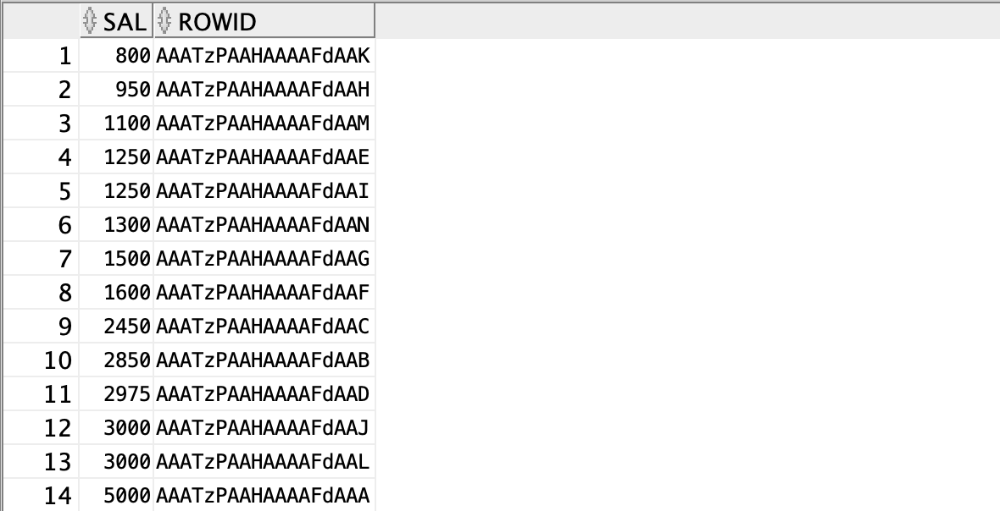
⇒인덱스에서 읽어와서 오름차순으로 정렬이 되어있음.

```sql
select sal, rowid
from emp;
```
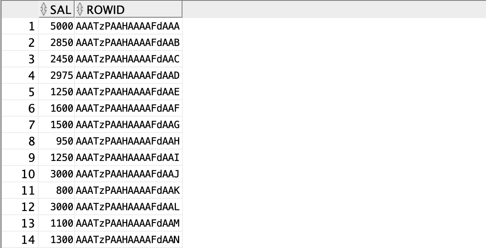
⇒테이블에서 읽어와서 정렬되어 있지 않은채로 출력됨.

## 예제2. [문자형 컬럼]이름에 인덱스를 생성하고 인덱스의 구조를 확인해라.

```sql
create index emp_ename
on emp(ename);

select ename, rowid
from emp
where ename > ' ';   -- 문자를 인덱스에서 불러오려면 빈칸보다 크다는 조건을 추가해야함.
```
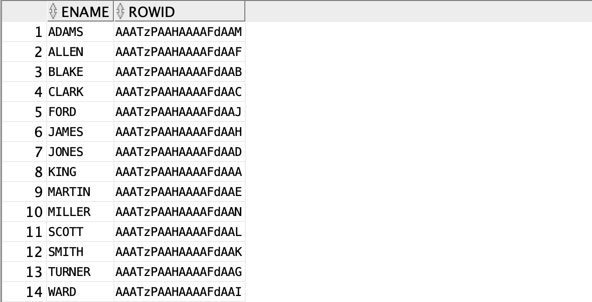

- index에서 불러왔는지 확인하는 방법
```sql
select /*+ gather_plan_statistics */ ename, rowid
from emp
where ename > ' ';

select * 
from table(dbms_xplan.display_cursor(null,null, 'ALLSTATS LAST'));
```
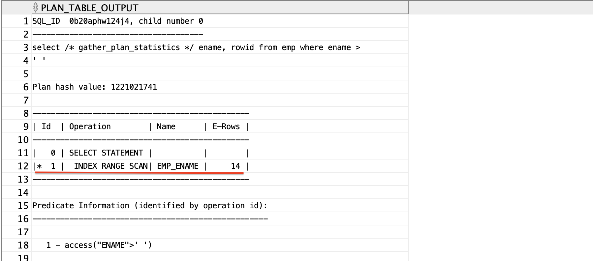

- 테이블에서 읽어온 경우
```sql
select /*+ gather_plan_statistics */ ename, rowid
from emp;

select * 
from table(dbms_xplan.display_cursor(null,null, 'ALLSTATS LAST'));
```
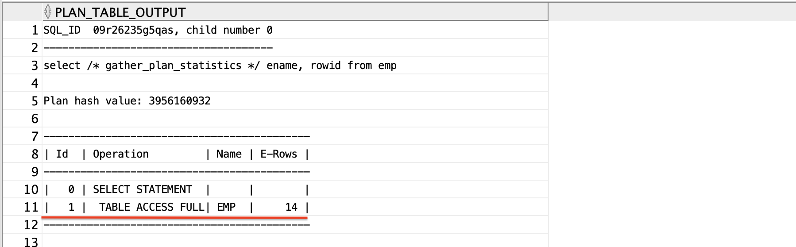


## 예제3. [날짜형 컬럼]입사일에 인덱스를 생성하고 인덱스의 구조를 확인해라.

```sql
create index emp_hiredate
on emp(hiredate);

select /*+ gather_plan_statistics */ hiredate, rowid
from emp
where hiredate < to_date('9999/12/31', 'RRRR/MM/DD');
--날짜형 컬럼을 인덱스에서 불러올 때는 위와 같은 조건을 걸어줘야함.

select * from table(dbms_xplan.display_cursor(null,null, 'ALLSTATS LAST'));
```
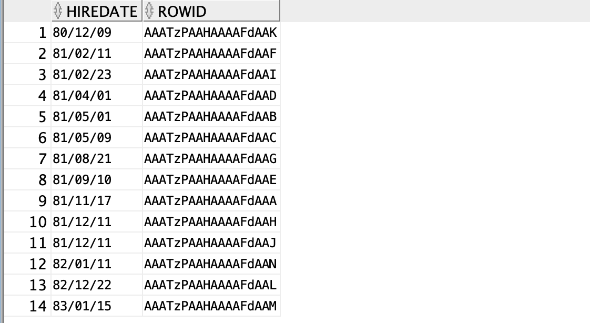
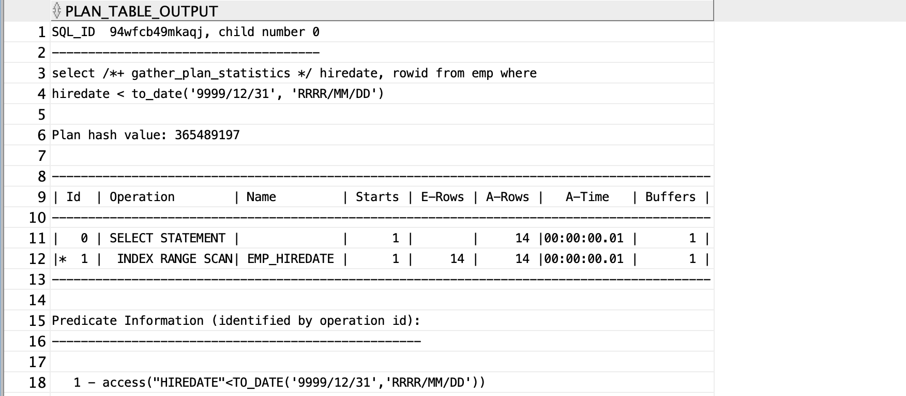


- 테이블에서 날짜형 데이터를 읽어오는 경우(insert된 순서대로 출력됨)
```sql
select /*+ gather_plan_statistics */ hiredate, rowid
from emp;

select * 
from table(dbms_xplan.display_cursor(null,null, 'ALLSTATS LAST'));
```
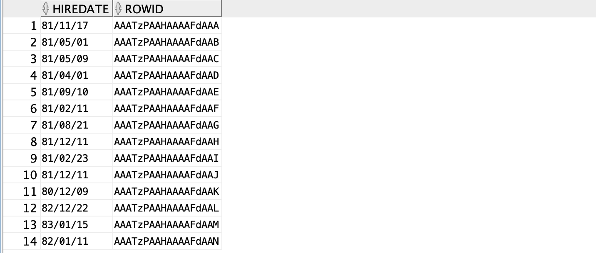
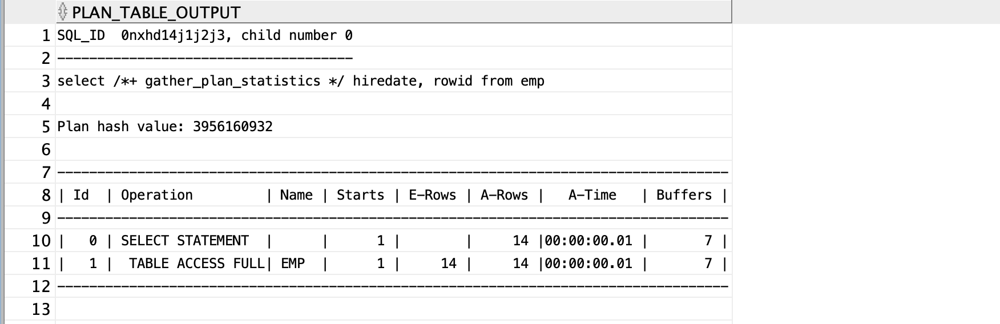


## 문제1) dept 테이블에 loc에  인덱스를 생성하고 인덱스의 구조를 확인해라.

```sql
create index dept_loc
on dept(loc);

select /*+ gather_plan_statistics */ loc, rowid
from dept
where loc> ' ';

select * 
from table(dbms_xplan.display_cursor(null,null, 'ALLSTATS LAST'));
```
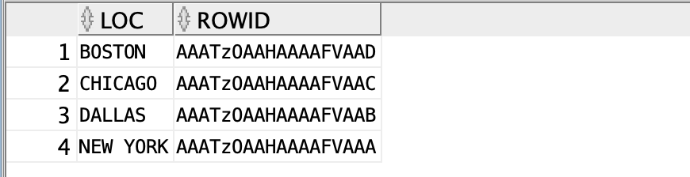
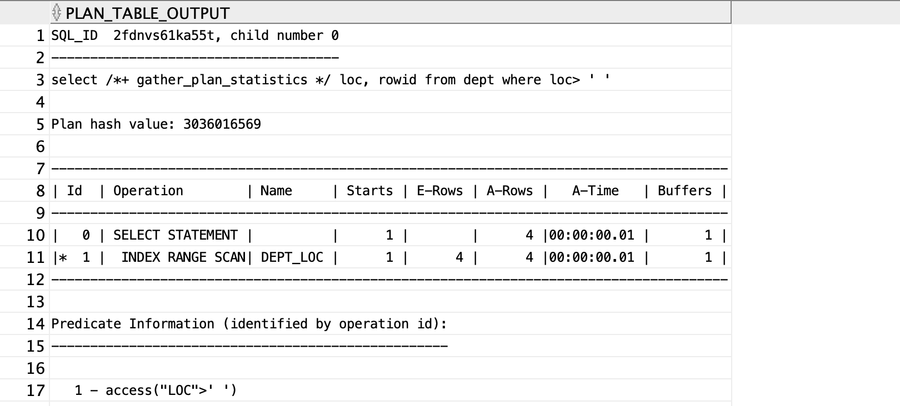

