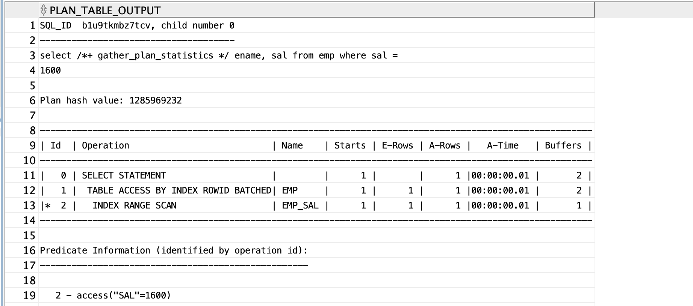
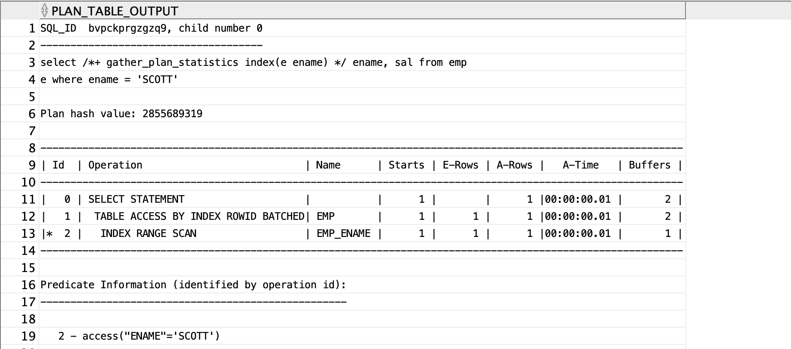
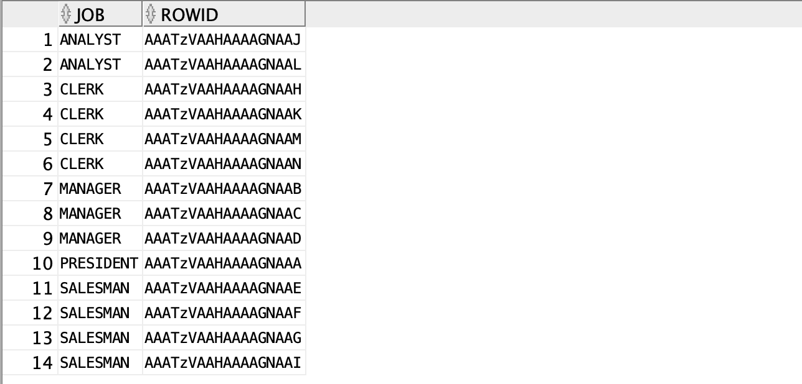
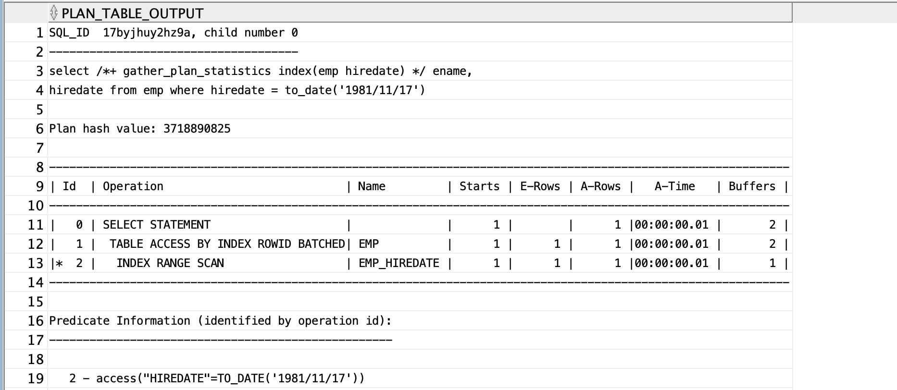

## 인덱스 스캔 7가지 방법

| 인덱스 엑세스 방법                | 관련 힌트           |
| ------------------------- | --------------- |
| `index range scan`        | `index`         |
| `index unique scan`       | `index`         |
| `index skip scan`         | `index_ss`      |
| `index full scan`         | `index_fs`      |
| `index fast full scan`    | `index_ffs`     |
| `index merge scan`        | `and_equal`     |
| `index bitmap merge scan` | `index_combine` |


## index range scan

> 검색 조건에 맞는 데이터를 찾은 후 검색조건에 맞는 데이터가 있는지 한번 더 읽음
>해당 컬럼에 `unique`라는 값이 유일하다는 제약이 없으면 한번더 읽음 .
>`select /*+ index(테이블명 인덱스명) */ ~`
>`from 절`에서 테이블 별칭을 사용했다면 `hint`에서도 테이블 별칭을 사용해야함.

```sql
select /*+ index(emp emp_sal) */ ename, sal
from emp
where sal = 1600;

--테이블 별칭 사용
select /*+ index(e emp_ename) */ ename, sal
from emp e
where ename='SCOTT';
```


## 중복된 데이터가 있는 컬럼의 index range scan

```sql
select /*+ index(emp emp_job) */ ename, sal
from emp
whre job='MANAGER';
```

<br>

---
# 실습

## 예제1. [숫자형 컬럼]월급이 1600인 사원들의 이름과 월급을 출력해라.

```sql
create index emp_sal
on emp(sal);

select /*+ gather_plan_statistics index(emp emp_sal) */ ename, sal
from emp
where sal = 1600;

select * 
from table (dbms_xplan.display_cursor(null,null, 'ALLSTATS LAST'));
```



## 예제2. [문자형 컬럼]이름이 SCOTT인 사원의 이름과 월급을 출력해라. 

```sql
create index emp_ename on emp(ename);

select /*+ gather_plan_statistics index(e ename) */ ename, sal
from emp e
where ename = 'SCOTT';

select * from table(dbms_xplan.display_cursor(null,null,'ALLSTATS LAST'));
```



## 예제3. [중복된 데이터가 있는 경우]직업이 MANAGER인 사원들의 이름과 월급을 출력해라.

```sql
create index emp_job
on emp(job);

select /*+ gather_plan_statistics index(emp job) */ ename, sal
from emp
where job = 'MANAGER';

select * 
from table(dbms_xplan.display_cursor(null,null,'ALLSTATS LAST'));
```

```sql
select job, rowid
from emp
where job > ' ';
```

⇒ 인덱스가 'MANAGER'를 찾고 'PRESIDENT'전까지 검색한 후 찾으러가는 것이 `index range scan`이다.


## 문제) 사원 테이블의 입사일에 인덱스를 생성하고 입사일이 81년 11월 17일에 입사한 사원들의 이름과 입사일을 출력해라.

```sql
create index emp_hiredate
on emp(hiredate);

select /*+ gather_plan_statistics index(emp hiredate) */ ename, hiredate
from emp
where hiredate = to_date('1981/11/17');

select * 
from table(dbms_xplan.display_cursor(null,null,'ALLSTATS LAST'));
```


