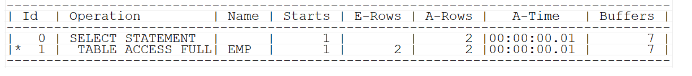
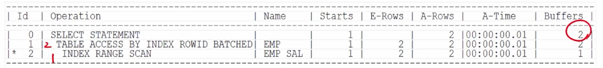
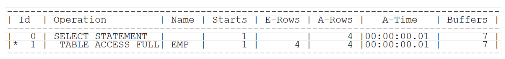
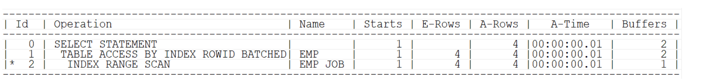
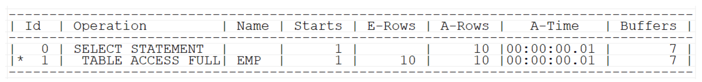
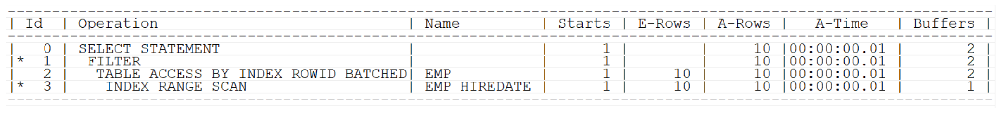

## 인덱스 컬럼은 가공하지 말자

>인덱스 컬럼이 가공되었을 경우에는 인덱스에서 찾지 못하고 full table scan을 해야해서 성능이 떨어지된다.

## 숫자형 인덱스 컬럼이 가공된 경우

```sql
create index emp_sal
on emp(sal);

select /*+ gather_plan_statistics index(emp sal) */ ename, sal * 12
from emp
where sal * 12 = 36000;
```

⇒인덱스가 설정된 컬럼을 검색해도 해당 컬럼이 가공되어 full table scan을 하게 됨.

- 튜닝 후
```sql
select /*+ gather_plan_statistics index(emp sal) */ ename, sal * 12
from emp
where sal = 36000/12;
```



## 문자형 인덱스 컬럼이 가공된 경우

```sql
select ename, job
from emp
where substr(job, 1, 5) = 'SALES';
```


- 튜닝 후
```sql
select ename, job
from emp
where job like 'SALES%';
```



## 날짜형 인덱스 컬럼이 가공된 경우

```sql
select ename, hiredate
from emp
where to_char(hiredate, 'RRRR') = '1981';
```


```sql
select ename, hiredate
from emp
where hiredate between to_date('1981/01/01', 'RRRR/MM/DD')
					and to_date('1981/12/31', 'RRRR/MM/DD')+1;
-- 날짜까지만 작성하면 00:00:00까지여서 1981/12/31이 포함되지 않으므로 +1해줘야함.
```


<br>

---
# 실습

## 예제1. 연봉(sal * 12)이 36000인 사원들의 이름과 연봉을 출력하는 sql을 튜닝해라.

```sql
create index emp_sal
on emp(sal);

select /*+ gather_plan_statistics index(emp sal) */ ename, sal * 12
from emp
where sal = 36000 /12;

select * from table(dbms_xplan.display_cursor(null,null,'ALLSTATS LAST'));
```


## 예제2. 직업의 첫번째부터 5번째의 자리가 SALES인 사원들의 이름과 직업을 출력하는 sql을 튜닝해라.

```sql
select ename, job
from emp
where job like 'SALES%';
```


## 예제3. 1981년도에 입사한 사원들의 이름과 입사일을 출력하는 sql을 튜닝해라

```sql
select ename, hiredate
from emp
where hiredate between to_date('1981/01/01', 'RRRR/MM/DD')
				and to_date('1981/12/31', 'RRRR/MM/DD')+1;
```


## 문제) 다음 sql을 튜닝해라

```sql
select ename, sal, job
from emp
where ename || sal = 'SCOTT3000'
```


```sql
select /*+ gather_plan_statistics */ ename, sal, job
from emp
where ename like 'SCOTT%' and sal = 3000;

select * 
from table(dbms_xplan.display_cursor(null,null,'ALLSTATS LAST'));
```


