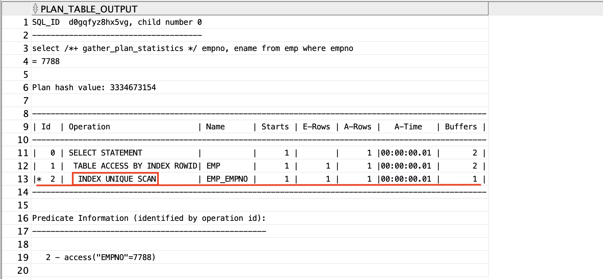
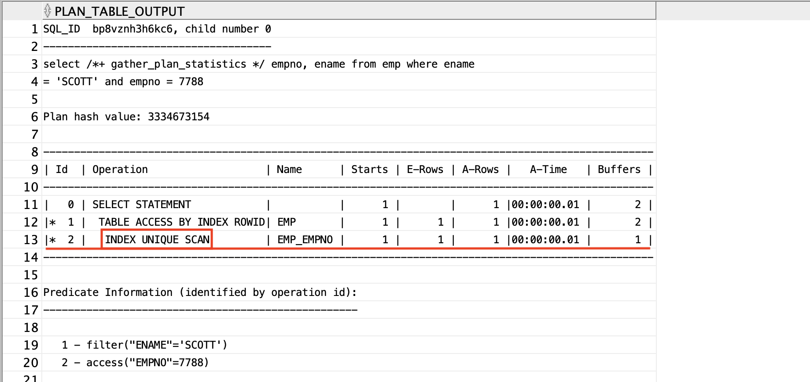
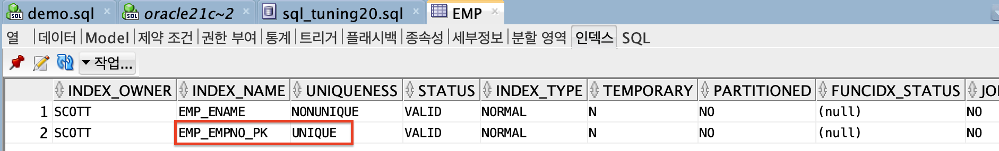
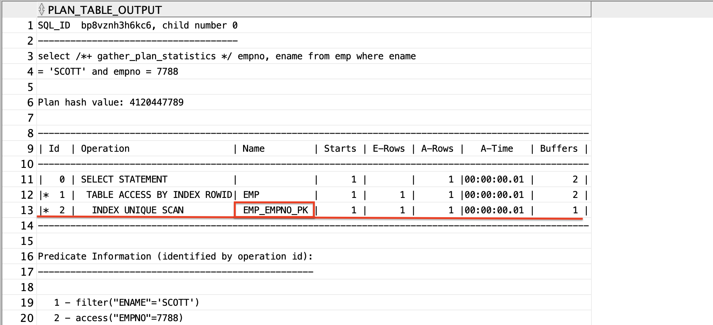
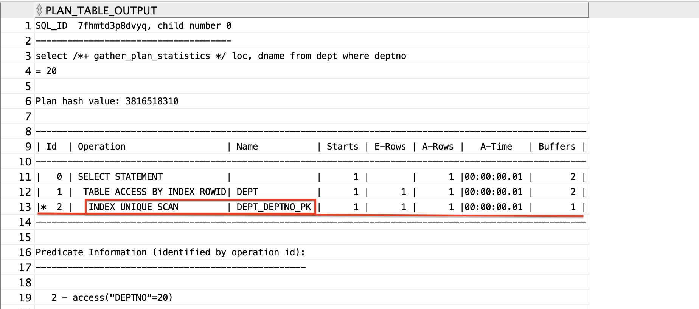

## index unique scan이란

>`create unique index 제약명`
>`on 테이블명(컬럼명);`
> index range scan처럼 데이터를 찾아도 한번더 scan하지 않음

- `empno`에만 `unique index`가 적용된 경우(`ename`은 non unique index)
```sql
select /*+ gather_plan_statistics */ empno, ename, sal
from emp
where ename = 'SCOTT' and empno = 7788;
```
⇒ `unique index`와 `non unique index`가 있을 경우 옵티마이저는 `unique index`를 선택해서 한번만 scan해서 찾음

## primary key, unique 제약을 걸면 자동으로 `unique index`가 생성된다.

```sql
alter table emp
add constraint emp_empno_pk primary key(empno);
```

<br>

---
# 실습

## 예제1. 사원번호가 7788번인 사원들의 사원번호와 이름과 월급을 출력해라.

```sql
create unique index emp_empno
on emp(empno);

select /*+ gather_plan_statistics */ empno, ename
from emp
where empno = 7788;

select * from table(dbms_xplan.display_cursor(null,null,'ALLSTATS LAST'));
```



## 예제2. unique index를 사용해라
- `unique index`와 `nonunique index`가 있을 경우 어떤 index를 사용하는지 확인
```sql
create unique index emp_empno
on emp(empno);

create index emp_ename
on emp(ename);

select /*+ gather_plan_statistics */ empno, ename
from emp
where ename = 'SCOTT' and empno = 7788;
```



## 예제3. 사원 테이블에 empno에 primary key제약을 걸고 사원번호가 7788번인 사원번호와 이름을 출력해라.

- `empno`컬럼 pk 설정
```sql
alter table emp
add constraint emp_empno_pk primary key (empno);
```


```sql
select /*+ gather_plan_statistics */ empno, ename
from emp
where ename = 'SCOTT' and empno = 7788;

select * 
from table(dbms_xplan.display_cursor(null,null,'ALLSTATS LAST'));
```



## 문제) 부서 테이블에 deptno에 primary key제약을 걸고 부서번호가 20번인 부서위치와 부서명을 출력해라.

```sql
alter table dept
add constraint dept_deptno_pk primary key (deptno);

select /*+ gather_plan_statistics */ loc, dname
from dept
where deptno = 20;

select * 
from table(dbms_xplan.display_cursor(null,null,'ALLSTATS LAST'));
```



