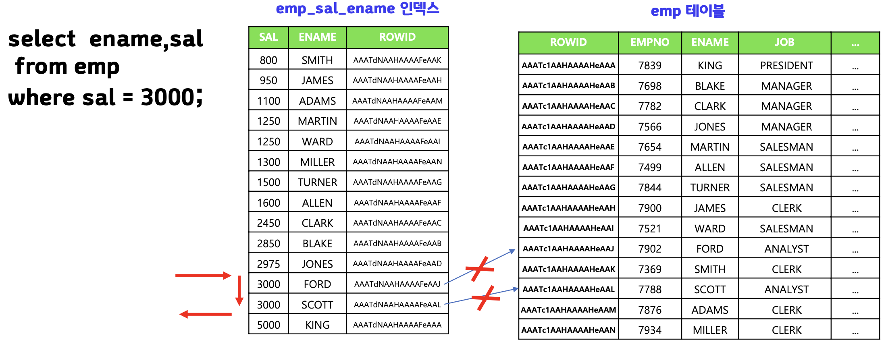
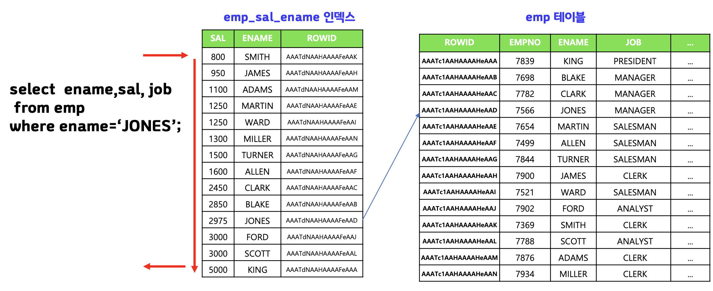
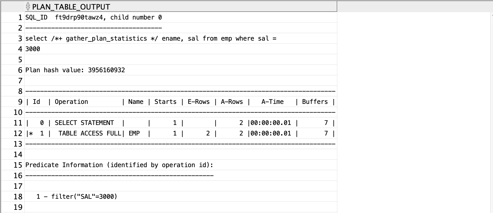
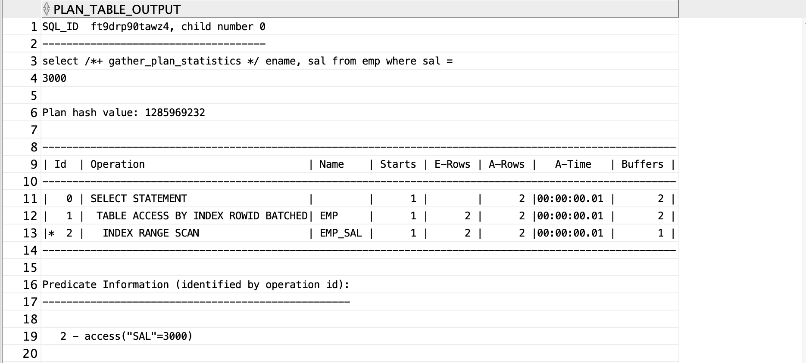
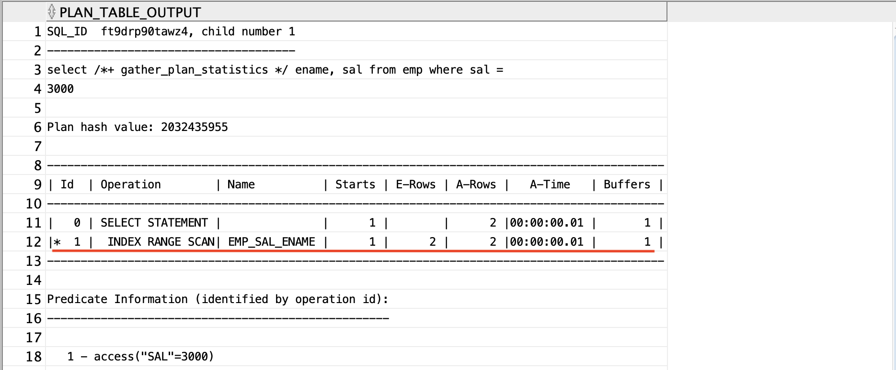
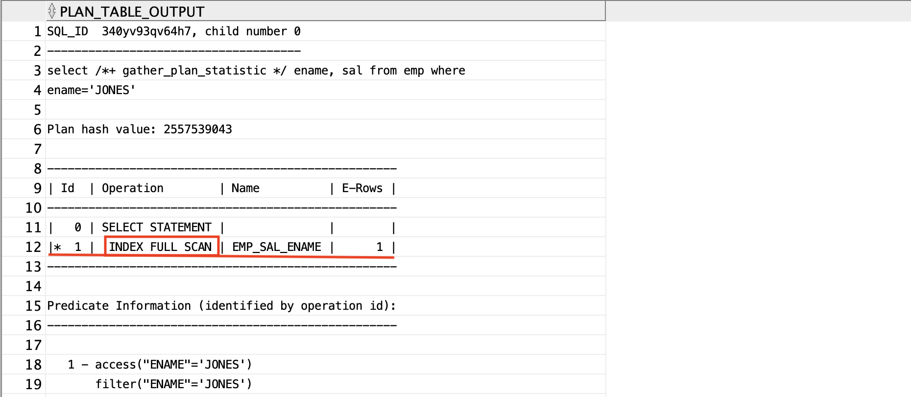
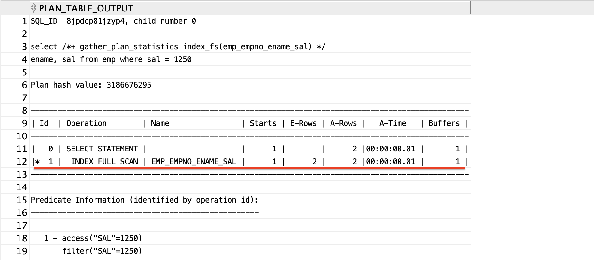

## table full scan이란

>테이블의 처음부터 끝까지를 다 스캔하면서 원하는 데이터를 찾는 검색 방법이다.
>`select /*+ gather_plan_statistics full(테이블명) ~` : full table scan 힌트

## [결합 컬럼 인덱스]검색하려는 데이터가 인덱스에 다 구성되어 있다면

>`결합 컬럼 인덱스` : 두개이상의 컬럼으로 인덱스 설정
>`create index 제약명`
>`on 테이블명(컬럼1, 컬럼2, ...)`

>검색하려는 데이터가 인덱스에 다 구성되어 있다면 테이블에 엑세스하지 않는다.



## index full scan 이란

> 결합 컬럼 인덱스의 첫번째 컬럼이 아닌 컬럼의 데이터를 검색할 때 인덱스 전체를 스캔하면서 원하는 데이터를 검색하는 스캔 방법이다. table full scan보다 더 성능이 좋다.
> `/*+ index_fs(테이블명 결합컬럼명) */`


⇒ 검색하고 있는게 결합 컬럼 인덱스 중 두번째 컬럼이여서 바로 'JONES'가 있는 인덱스로 갈 수가 없고 첫번째 인덱스 컬럼을 full scan 한뒤 두번째 인덱스 컬럼에서 'JONES'를 찾고 해당 주소 행으로 이동해서 검색 결과를 출력하게 된다. 그리고 또 다시 'JONES'가 있는지 한번 더 찾는다. 두번째 인덱스 컬럼은 알파벳 순으로 정렬된게 아니기 때문에 한번 더 스캔하게된다.

<br>

---
# 실습

## table full scan 이란

```sql
select /*+ gather_plan_statistics full(emp) */ ename, sal
from emp
where sal = 3000;

select * from table(dbms_xplan.display_cursor(null,null,'ALLSTATS LAST'));
```


## 단일 컬럼 인덱스만 있을 때

```sql
create index emp_sal
on emp(sal);

select /*+ gather_plan_statistics */ ename, sal
from emp
where sal = 3000;

select * from table(dbms_xplan.display_cursor(null,null,'ALLSTATS LAST'));
```



## 결합 컬럼 인덱스 생성하기

```sql
drop index emp_sal;

create index emp_sal_ename
on emp(sal,ename);

select /*+ gather_plan_statistics */ ename, sal
from emp
where sal = 3000;

select * 
from table(dbms_xplan.display_cursor(null,null,'ALLSTATS LAST'));
```

⇒ table access 하지 않고 index만 scan하고 끝냄.

- 검색 조건에 결합 컬럼 인덱스의 첫번째 컬럼이 있어야 `index range scan`이 가능함.


## index full scan 하기

> 검색 조건에 결합 컬럼 인덱스의 첫번째 컬럼이 없으면`index range scan`이 불가능하여
>  `index full scan`해야함.

```sql
select /*+ gather_plan_statistic index_fs(emp emp_sal_ename) */ ename, sal
from emp
where ename='JONES';

select * 
from table(dbms_xplan.display_cursor(null,null,'ALLSTATS LAST'));
```



## 문제) 사원 테이블에 사원번호+사원이름+월급으로 결합 컬럼 인덱스를 생성하고 월급이 1250인 사원의 이름과 월급을 출력하는데 지금 생성한 인덱스를 사용하겠습 힌트를 주고 실행해라.

```sql
create index emp_empno_ename_sal
on emp(empno, ename, sal);

select /*+ gather_plan_statistics index_fs(emp_empno_ename_sal) */ ename, sal
from emp
where sal = 1250;


select * 
from table(dbms_xplan.display_cursor(null,null,'ALLSTATS LAST'));
```



<br>

---
# 정리

>1. 테이블 엑세스를 피하고 좀 더 빨리 데이터 검색을 하려면 인덱스에 해당 컬럼을 구성하여 결합 컬럼 인덱스를 생성하면 된다.
>2. 결합 컬럼 인덱스의 첫번째 컬럼이 쿼리문의 where 절에 존재해야 인덱스를 엑세스 사용할 수 있게 된다.
>3. 결합 컬럼 인덱스의 첫번째 컬럼이 검색하는 쿼리문의 where 절에 존재하지 않는다면 해당 인덱스를 사용하지 못하거나 index full scan으로 수행 되게 된다.
>4. index full scan이 table full scan보다 대체로 더 좋은 성능을 보인다.

