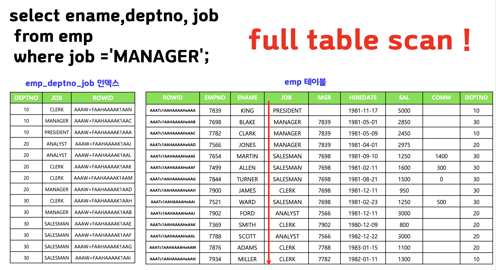
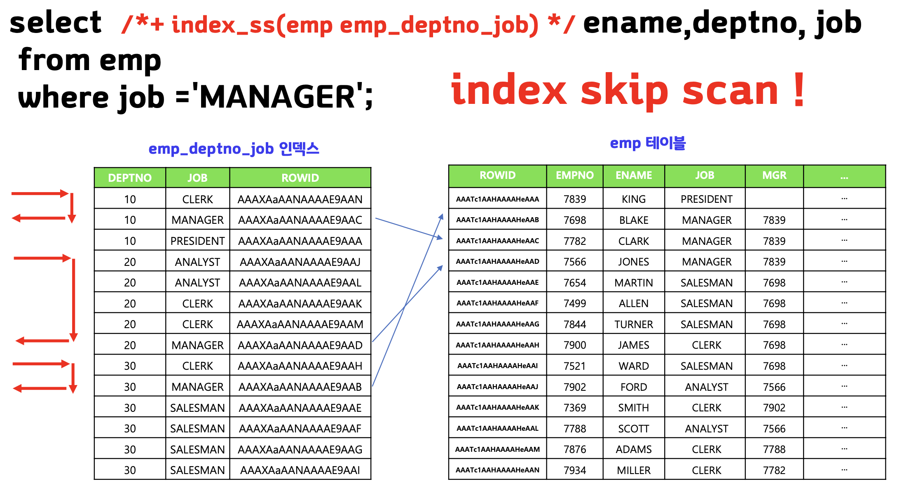
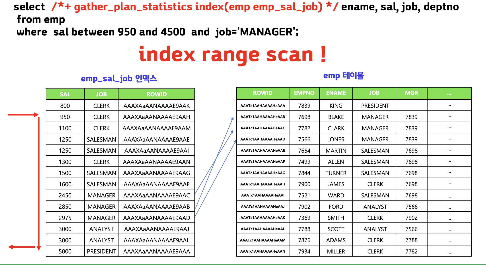
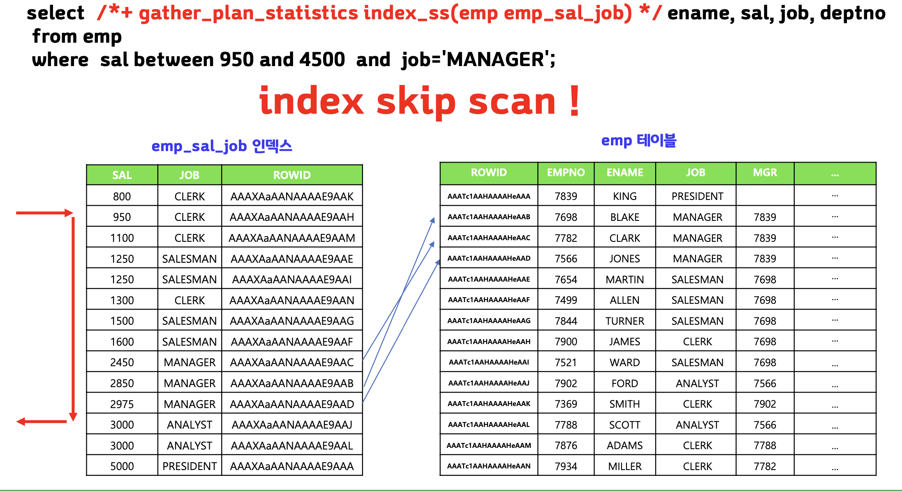
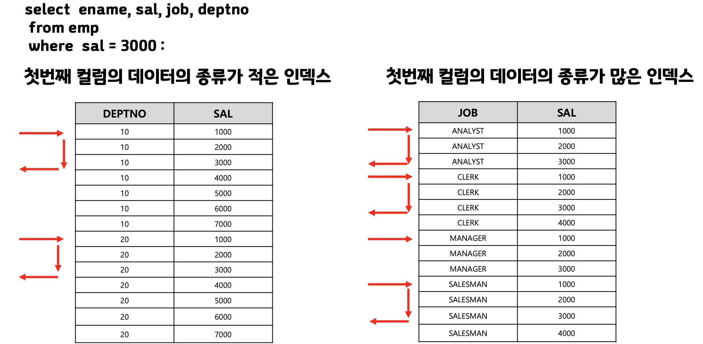
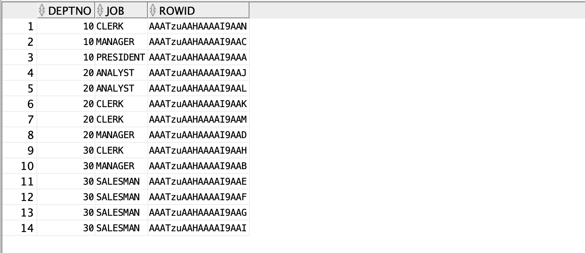
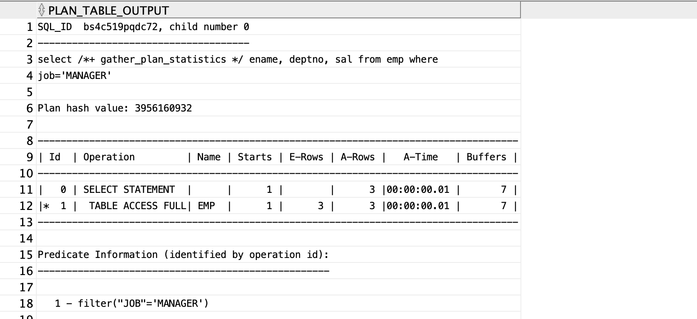
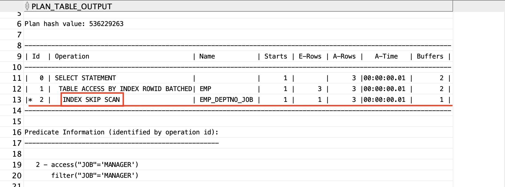

## index skip scan 이란

> 인덱스 스킵 스탠은 결합 컬럼 인덱스의 첫 번째 컬럼이 where 조건에 존재하지 않아도 인덱스를 이용할 수 있는 인덱스 액세스 방식


⇒job컬럼이 인덱스에 오름차순으로 정렬된게 아니여서 결국 full table scan을 하게됨.


⇒ 인덱스 첫번째 컬럼별로 skip하면서 스캔하면  table full scan보다 성능이 좋은


## 결합 컬럼 인덱스의 첫번째 컬럼이 범위 조건일 때

결합 컬럼 인덱스의 첫번째 조건이 where절에 존재하긴 하는데 등치조건(`=`)으로 사용된게 아니라 범위조건(`between ~ and ~`)으로 사용된 경우에 튜닝 방법
- 결합 컬럼 인덱스의 첫번째 컬럼이 범위 조건이면 결합 컬럼 인덱스를 사용하더라고 index range scan 검색 성능이 느려질 수 있다. 이 때 `index skip scan`으로 유도하면 더 성능이 좋아진다.






## index skip scan의 효과를 높이는 결합 컬럼 인덱스

> 결합 컬럼 인덱스의 첫번째 컬럼은 데이터의 종류가 적은 인덱스가 더 성능에 좋다.




<br>

---
# 실습

>`f.sql`, `m.sql`을 실행해라

```sql
create index emp_deptno_job
on emp(deptno, job);

select deptno, job, rowid
from emp
where deptno > 0;
```


```sql
select /*+ gather_plan_statistics */ ename, deptno, sal
from emp
where job='MANAGER';

select * 
from table(dbms_xplan.display_cursor(null,null,'ALLSTATS LAST'));
```



## index skip scan

```sql
select /*+ gather_plan_statistics index_ss(emp emp_deptno_job) */
        ename, deptno, sal
from emp
where job='MANAGER';

select * 
from table(dbms_xplan.display_cursor(null,null,'ALLSTATS LAST'));
```



## 월급이 800에서 4500 사이이고 직업이 ANALYST인 사원들의 이름과 월급과 직업과 부서번호를 출력해라.

>`m.sql` 실행

```sql
drop index emp_deptno_job;

create index emp_sal_job
on emp(sal,job);

select sal, job, rowid
from emp
where sal >0;
```


```sql
select /*+ gather_plan_statistics index(emp emp_sal_job) */ 
		ename, sal, job, deptno
from emp
where sal between 950 and 3000
and job='MANAGER';

select * 
from table(dbms_xplan.display_cursor(null,null,'ALLSTATS LAST'));
```


- index skip scan으로 유도(더 빠름)
```sql
select /*+ gather_plan_statistics index(emp emp_sal_job) */ ename, sal, job, deptno
from emp
where sal between 950 and 3000
and job='MANAGER';

select * 
from table(dbms_xplan.display_cursor(null,null,'ALLSTATS LAST'));
```


## 문제 다음 쿼리를 튜닝해라

- 튜닝 전
```sql
select /*+ gether_plan_statistics index(emp) */
		ename, sal
from emp
where hiredate between to_date('1980/01/01', 'RRRR/MM/DD')
					and to_date('1981/12/31', 'RRRR/MM/DD')
	and job='MANAGER';
```


- 튜닝 후
```sql
select /*+ gether_plan_statistics index_ss(emp) */
		ename, sal
from emp
where hiredate between to_date('1980/01/01', 'RRRR/MM/DD')
					and to_date('1981/12/31', 'RRRR/MM/DD')
	and job='MANAGER';

select * from table(dbms_xplan.display_cursor(null,null,'ALLSTATS LAST'));
```


# 정리

>1. 결합 컬럼 인덱스의 첫번째 컬럼이 where 절에 없으면 full table scan을 수행되거나 index full scan으로 수행된다.
>2. 결합 컬럼 인덱스의 첫번째 컬럼이 where 절에 없을 때 index skip scan으로 유도하면 좋은 결과를 얻을 수 있다.
>3. index skip scan의 검색 속도는 결합 컬럼 인덱스의 첫번째 컬럼은 데이터의 종류가 적을수록 빠르다.
>4. index skip scan의 힌트는 `index_ss(테이블명 인덱스 이름)`이다.

