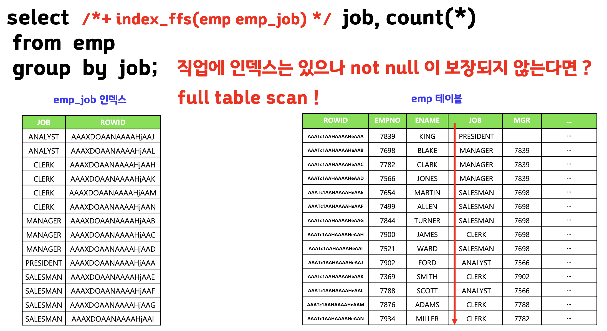
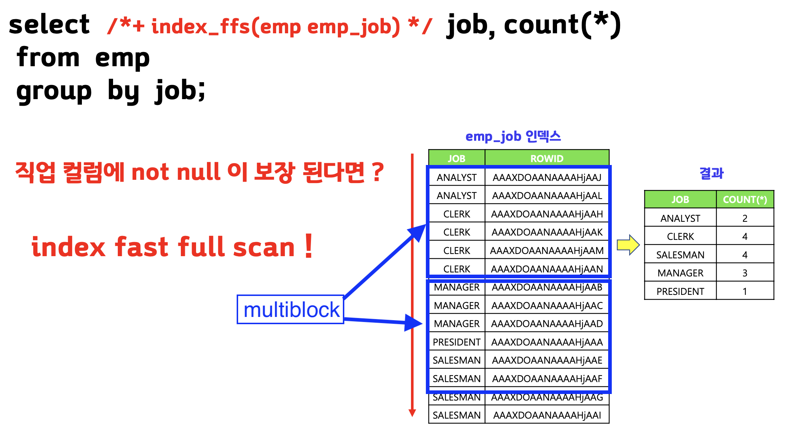
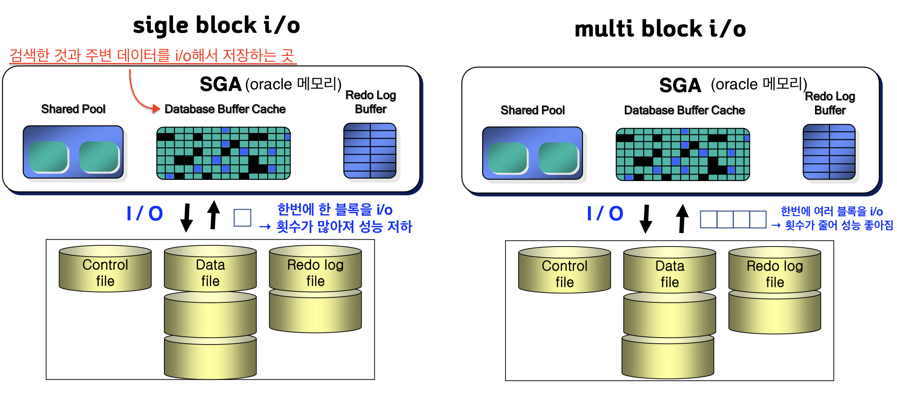
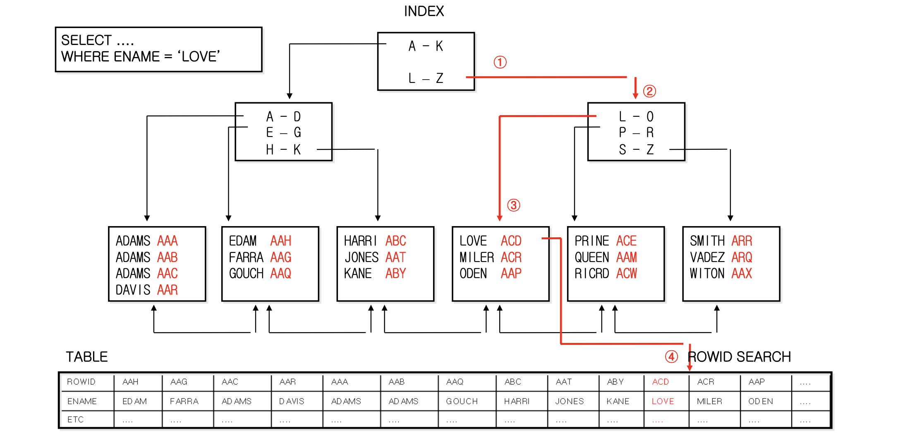
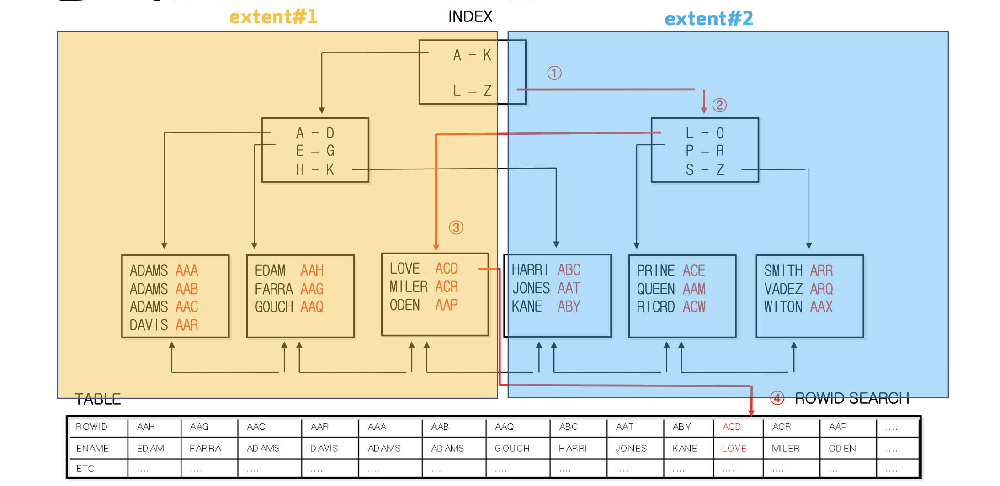
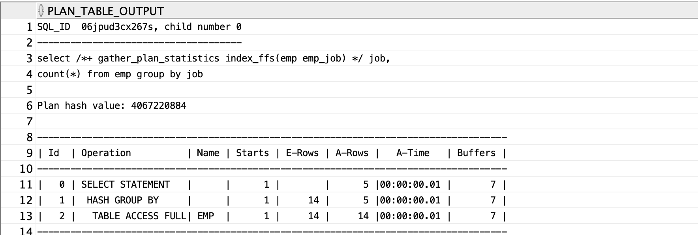
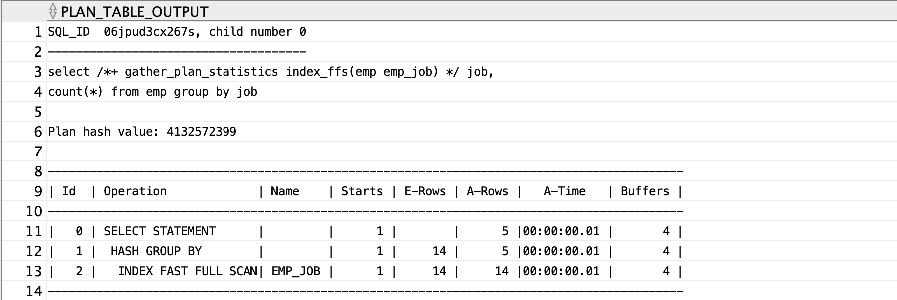
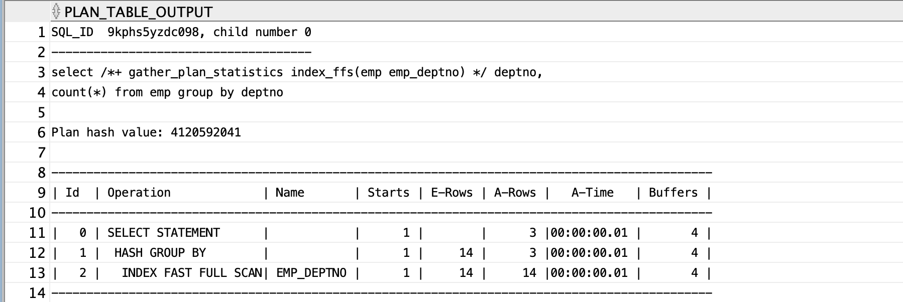

## index fast full scan 이란

> 인덱스 트리 구조를 무시하고 인덱스 세그먼트 전체를 multiblock i/o 방식으로 스캔하는 방법이다.
> hint : `index_ffs(테이블명 인덱스명)`


⇒인데스 컬럼에 `not null`제약이 있어야 `index fast full scan`이 가능함.

>※ 컬럼에 `not null`을 보장하는 방법
>1. 테이블에 직접 `not null`제약을 걸어준다.
>	`alter table emp modify job not null;`
>2. where절에 `is not null`을 사용한다.
>	`select /*+ index_ffs(emp emp_job) */ job, count(*)`
>	`from emp`
>	`where job is not null`
>	`group by job;`



⇒ 한 번에 여러 블씩 읽는 `multiblock i/o`방식을 사용함.

## `index full scan`과 `index fast full scan`의 차이점

|          | `index full scan` | `index fast full scan`                              |
| -------- | ----------------- | --------------------------------------------------- |
| I/O 방식 | single block i/o  | multi block i/o                                     |
| 정렬     | 정렬 보장         | 정렬 안됨<br>(정렬 하려면 따로 `order by` 작성필요) |
| 속도     | 느림              | 빠름                                                |
| 병렬읽기         | 지원 안됨                  |    지원됨                                                 |


## single block i/o와 multi block i/o의 차이
 



## 논리적인 순서에 따라 배치된 index 구조


⇒ 알파벳 순서에 따라 생성

## 물리적인 순서에 따라 배치된 index 구조


⇒ 데이터 들어오는 순서에 따라 생성

<br>

---
# 실습

## index fast full scan 실행하기

```sql
create index emp_job
on emp(job);

select job, rowid
from emp
where job> ' ';

select /*+ gather_plan_statistics index_ffs(emp emp_job) */ job, count(*)
from emp
group by job;
```

⇒`job` 컬럼에 `not null`제약이 없어서 table full scan을 함.

- `job`컬럼에 `not null`제약 설정
```sql
-- 컬럼에 직접 not null 제약 걸기
alter table emp
modify job constraint emp_job_nn not null;

select /*+ gather_plan_statistics index_ffs(emp emp_job) */ job, count(*)
from emp
group by job;

-- where 조건으로 not null 제약 걸기
select /*+ gather_plan_statistics index_ffs(emp emp_job) */ job, count(*)
from emp
where job is not null
group by job;
```



## index fast full scan과 index full scan의 차이 확인하기

```sql
create index emp_deptno
on emp(deptno);

alter table emp
modify deptno constraint emp_deptno_nn not null;
```

- **`index fast full scan`**
```sql
select /*+ gather_plan_statistics index_ffs(emp emp_deptno) */ 
	deptno, count(*)
from emp
group by deptno;
```


- **`index full scan`**
```sql
select /*+ gather_plan_statistics index_fs(emp emp_deptno) */ 
	deptno, count(*)
from emp
group by deptno;
```


## 문제) index fast full scan을 유도해라

```sql
alter table emp
add telecom varchar2(10);

update emp
set telecom='SK'
where job in ('ANALYST', 'CLERK');

update emp
set telecom='LG'
where job in ('PRESIDENT', 'SALESMAN');

update emp
set telecom='KT'
where job in ('MANAGER');

commit;

select * from emp;

create index emp_telecom
on emp(telecom);

select /*+ gather_plan_statistics index_ffs(emp emp_telecom) */ 
        telecom, count(*)
from emp
where telecom is not null
group by telecom;
```


# 정리

>1. `index fast full scan`이 가능하려면 스캔하려는 인덱스 컬럼에 `not null`이 보장되어야 한다.
>2. `index full scan`보다 `index fast full scan`이 빠른 이유는 물리적인 저장소에 있는 데이터를 그대로 읽어오기 때문이다.(여러 블록을 한번에 읽어온다. - `multiblock I/O`)
>3. `index full scan`은 정렬된 결과를 보장하지만 `index fast full scan`은 정렬된 결과를 보장하지 않는다.
>4. `index fast full scan`의 힌트는 `index_ffs(테이블명 인덱스명)`이다.

