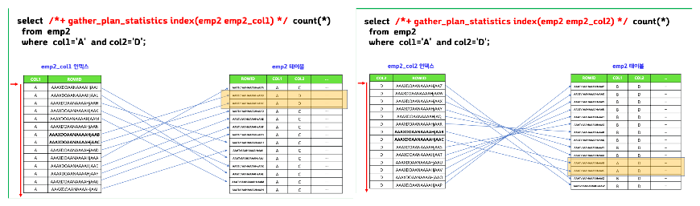
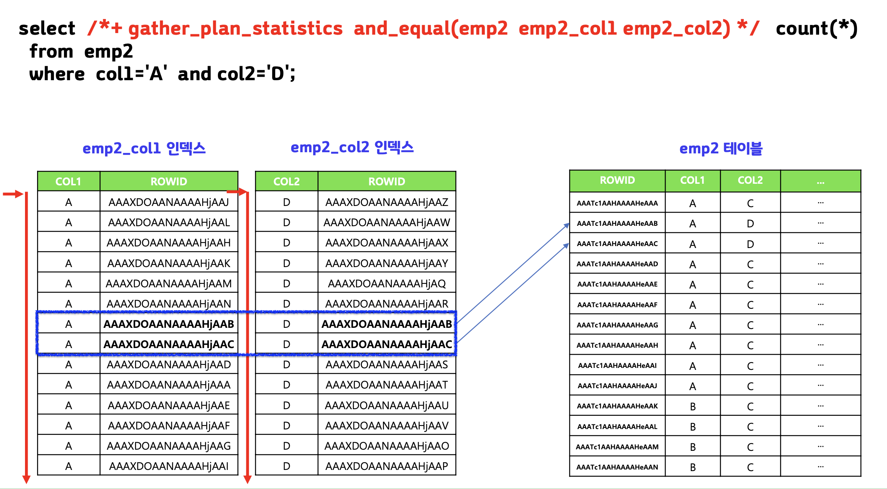
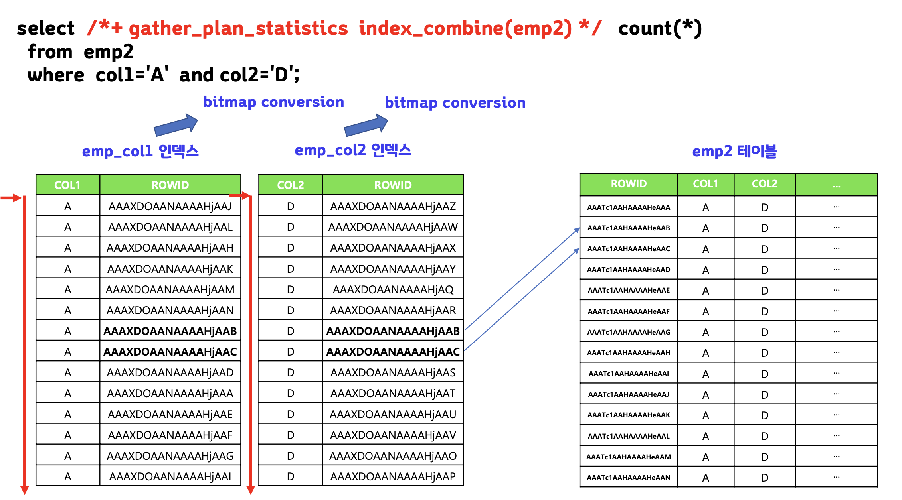

## index merge scan 이란

> 여러개의 인덱스를 같이 사용하여 하나의 인덱스만 사용했을 때 보다 테이블 엑세스를 줄일 수 있는 인덱스 스캔방법




⇒ 여러번 테이블에 access하지 않고 조건에 맞는 곳에만 접근

## index bitmap merge scan 이란

> 일반 인덱스를 크기가 아주 작은 비트맥 인덱스로 변환하고 비트맵 인덱스들을 하나로 합쳐서 스캔하는 스캔방법

- 오라클 옵티마이저가 자동으로 해줌


<br>

---
# 실습

```sql
create table emp2
as select rownum as num1, e.*
from emp e;

select * from emp2 where rownum <10;

alter table emp2
add col1 varchar2(10);

alter table emp2
add col2 varchar2(10);

update emp2
set col1='A'
where num1 between 1 and 917504;

update emp2
set col1='B'
where num1 between 917505 and 1835008;

update emp2
set col2='C'
where num1 between 1 and 917404;

update emp2
set col2='D'
where num1 between 917405 and 1835008;

commit;

create index emp2_col1 on emp2(col1);
create index emp2_col2 on emp2(col2);

select /*+ gather_plan_statistics */ count(*)
from emp2
where col1='A' and col2='D';

select * from table(dbms_xplan.display_cursor(null,null,'ALLSTATS LAST'));

select * from emp2;
```


```sql
select count(*) from emp2 where col1='A';  -- 917504
select count(*) from emp2 where col1='B';  -- 917504
select count(*) from emp2 where col2='C';  -- 917404
select count(*) from emp2 where col2='D';  -- 917604
```

## index merge scan 실행하기

```sql
select /*+ gather_plan_statistics and_equal(emp2 emp2_col1 emp2_col2)*/ count(*)
from emp2
where col1='A' and col2='D';
```


```sql
select /*+ gather_plan_statistics and_equal(emp2 emp2_col1 emp2_col2)*/ 
		ename, sal, deptno
from emp2
where col1='A' and col2='D';
```


## index bitmap merge scan 실행하기

```sql
select /*+ gather_plan_statistics index_combine(emp2)*/ count(*)
from emp2
where col1='A' and col2='D';
```


```sql
select /*+ gather_plan_statistics index_combine(emp2)*/ 
	ename, sal, deptno
from emp2
where col1='A' and col2='D';
```


## 문제

```sql
create index emp_job on emp(job);
create index emp_deptno on emp(deptno);

select /*+ gather_plan_statistics index_combine(emp) */ 
	empno, ename, job, deptno
from emp
where deptno = 30 and job='SALESMAN';
```


```sql
select /*+ gather_plan_statistics and_equal(emp emp_job emp_deptno) */ 
	empno, ename, job, deptno
from emp
where deptno = 30 and job='SALESMAN';
```


# 정리

>1. 하나의 인덱스를 사용했을 때 보다 여러개의 인덱스를 동시에 사용했을 때 테이블 엑세스를 줄일 수 있다면 더 좋은 검색 성능을 보인다.
>2. where 절에 사용된 여러개의 인덱스를 동시에 이용하려면 and_equal 힌트를 사용하면 된다.
>3. index bitmap merge scan은 b-tree 인덱스를 bitmap 인덱스로 변환하여 수행한다.
>4. index bitmap merge scan 의 힌트는 index_combine(테이블명)이다.


